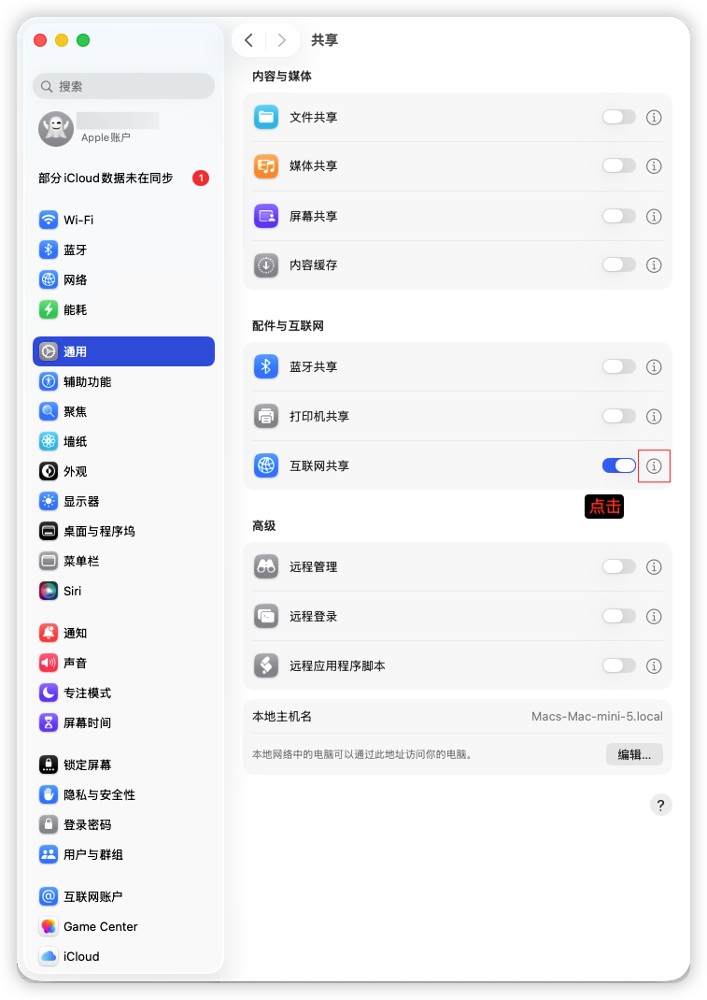
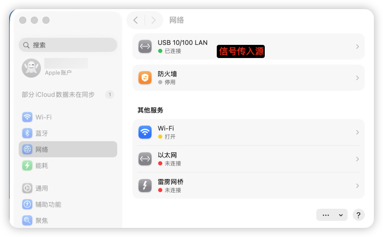
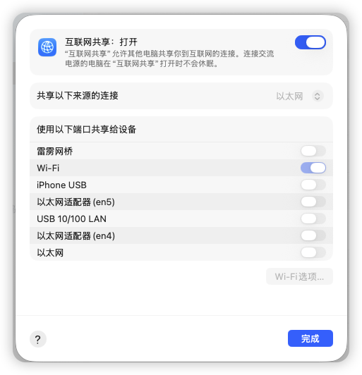
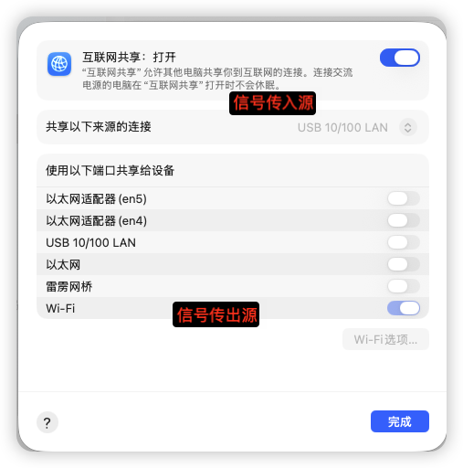

# MacOS配置个人热点🛜

## 一、写在前面

* 如果MacOS当前信号输入源是**Wi-Fi**，则无法配置个人热点

* 必须打开**Wi-Fi**

* 成功标志

  

## 一、系统设置👉通用👉共享👉配件与互联网👉互联网共享

## 二、查看信号源

### 三、按照图示进行配置
> 共享以下来源的连接（信息入口）
> 使用以下端口共享给设备（信息出口）

* 如果是网线直接插入Mac电脑（一般会显示以太网）
	

* 如果网线是通过**USBHubber**进行桥接
	

