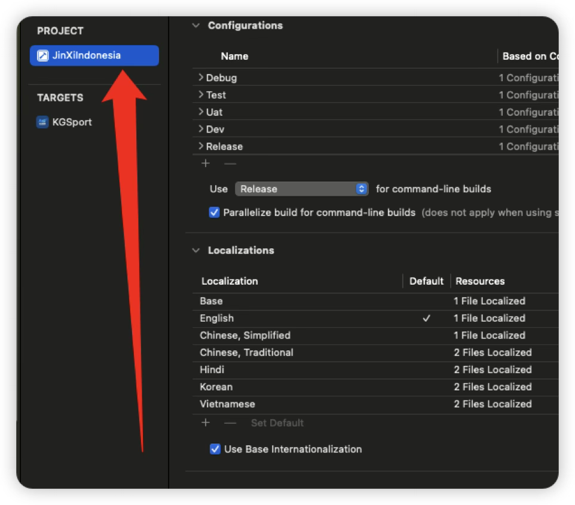
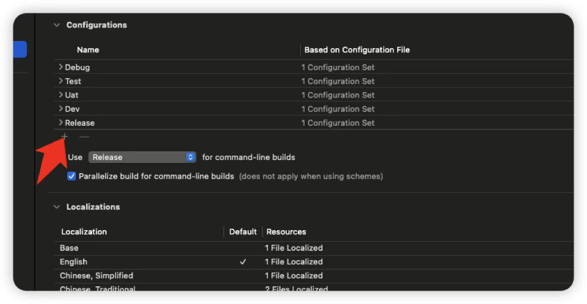
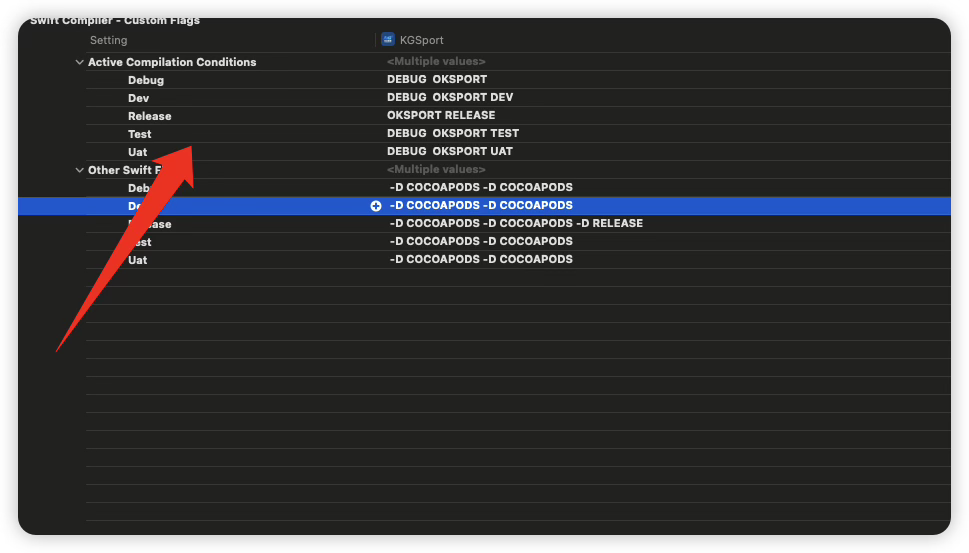
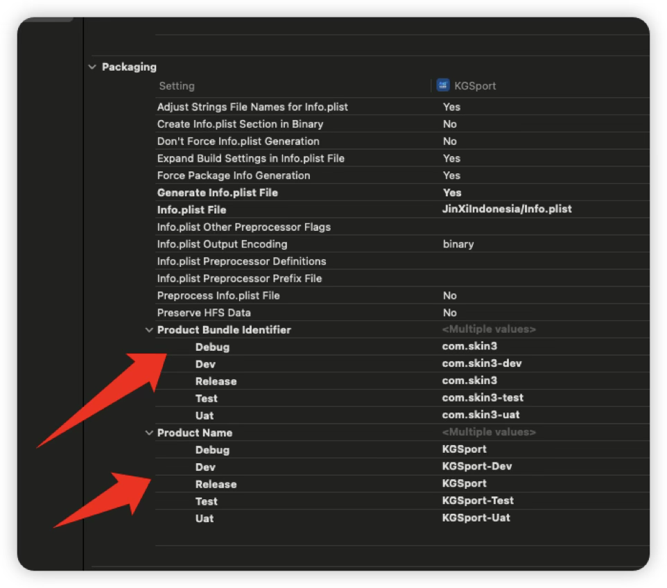

# <font id=iOS项目多环境配置 color=red>**iOS项目多环境配置**</font>

[toc]

## 一、打开项目并找到 <a href="#iOS项目多环境配置" style="font-size:17px; color:green;"><b>🔼</b></a> <a href="#🔚" style="font-size:17px; color:green;"><b>🔽</b></a>

<table>
  <tr>
    <td></td>
    <td></td>
  </tr>
</table>

* 找到`build setting` 👉搜索 `Swift Compiler - Custom Floags` 。这里就是第一步添加的环境，然后在里面添加宏定义变量

  

## 三、代码中使用 <a href="#iOS项目多环境配置" style="font-size:17px; color:green;"><b>🔼</b></a> <a href="#🔚" style="font-size:17px; color:green;"><b>🔽</b></a>

> 一定要先判断自定义的宏定义，在判断系统的**`debug`**和**`release`**，系统的宏优先级更高，所以会每次都进入系统宏的条件中

```swift
import UIKit

open class PYBaseUrl: NSObject {}
extension PYBaseUrl {
    #if DEV
    //MARK: 开发环境
    public static var base_dev = "https://XXX"
    #elseif TEST
    //MARK: 测试环境
    public static var base_dev = "https://XXX"
    #elseif UAT
    //MARK: UAT环境
    public static var base_dev = "https://XXX"
    #else
        #if DEBUG
        //MARK: 测试环境
        public static var base_dev = "https://XXX"
        #else
        // 生产环境的正式域名
        public static var base_dev = "https://XXX"
        #endif
    #endif
}
```

## 四、配置 `Podfile` <a href="#iOS项目多环境配置" style="font-size:17px; color:green;"><b>🔼</b></a> <a href="#🔚" style="font-size:17px; color:green;"><b>🔽</b></a>

> 修改对接的环境： 然后`pod install`一次

```ruby
# 👇 新增：指定 Xcode 项目文件和配置映射（特别重要）
project 'JinXiIndonesia.xcodeproj',
  'Debug'   => :debug,
  'Release' => :release,
  'Uat'     => :debug,
  'Dev'     => :debug,
  'Test'    => :debug
```

## 五、如果需要安装多个app包 <a href="#iOS项目多环境配置" style="font-size:17px; color:green;"><b>🔼</b></a> <a href="#🔚" style="font-size:17px; color:green;"><b>🔽</b></a>



<a id="🔚" href="#iOS项目多环境配置" style="font-size:17px; color:green; font-weight:bold;">我是有底线的👉点我回到首页</a>
