# 区块链

[toc]

## 1、<font id=前言摘要>前言摘要</font>

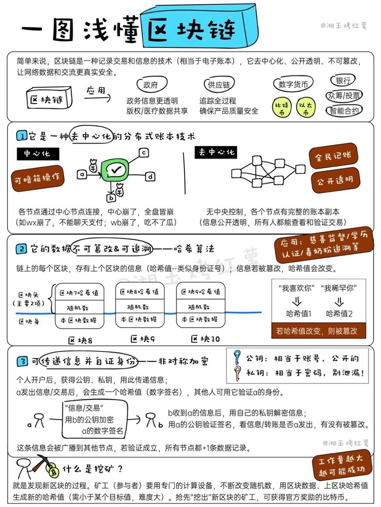

* *资料来源*
  
  * [CSDN/公钥/私钥/数字签名/数字证书及 RSA加解密数学原理](https://blog.csdn.net/wteruiycbqqvwt/article/details/106121134)  
  * [稀土掘金/关于公钥与私钥的理解](https://juejin.cn/post/6978872809388769287)  
  * [博客园/公钥与私钥](https://www.cnblogs.com/igoodful/p/9646095.html)  
  * [RSA 算法介绍与演示](https://www.quchao.net/RSA.html)  
  * [知乎/理解公钥和私钥](https://zhuanlan.zhihu.com/p/113522792)  
  * [阿里云/什么是公钥和私钥？](https://help.aliyun.com/document_detail/42216.html)  
  * [理解公钥与私钥](https://songlee24.github.io/2015/05/03/public-key-and-private-key/)  
  * [华为云/公钥、私钥、数字证书的关系是什么？](https://support.huaweicloud.com/intl/zh-cn/ccm_faq/ccm_01_0122.html)  
  * [知乎/密码学浅谈（1）：非对称加密与 RSA 算法](https://zhuanlan.zhihu.com/p/543705396)  
  * [小菜学编程/非对称加密算法简介及编程实践](https://fasionchan.com/network/cryptography/asymmetric-encryption/)  
  * [稀土掘金/RSA 数学原理](https://juejin.cn/post/6844903729397760013)  
  * [腾讯云/开发者社区/公钥可以解密吗?](https://cloud.tencent.com/developer/article/1415048)  
  * [进入币圈必学干货！名词解释100条！](https://zhuanlan.zhihu.com/p/465671414)
  
  | 区块链术语 | 现实世界类比   |
  | ---------- | -------------- |
  | **TXID**   | 银行转账流水号 |
  | 地址       | 银行卡号       |
  | 区块       | 银行记账本     |
  | 链上记录   | 银行交易明细   |

>- **以太坊是交易所平台，交易所平台可以有多个链；**
>- **ETH、BTC、USDT 这些是加密数字货币，币依托于链而存在；**
>- **交易所平台的存在允许不同币之间的兑换；**
>- **通过链和 ID 可以找到该 ID 的历史交易记录，但因非实名制，无法确认交易者身份，只能知道有该交易存在；**
>- **共识原则：满足 51% 的节点认可你这笔交易，则该交易成功；若节点离线，上线时会自动同步历史区块数据；**
>- **每种加密货币的共识机制可能不同，但底层数学逻辑一致：**
>  - 关键词：质数、密码学、非对称加密（公钥/私钥）；
>  - 非对称加密常用椭圆函数等算法。
>- **目前 Tron 是唯一支持开设商户的合约平台，商户内互转无手续费，但转出到公链需支付手续费；**
>- **汇旺使用 Tron 链，但可能拥有多个商户；**
>- **在欧洲区块链已合法化并受法律监管；部分来路不明的 USDT 被称为“黑U”，市面上有人专门收购黑U；**
>- **最关键的是助记词和私钥，它们可以转为离线死数据进行存储（即冷钱包）：**
>  - 汇旺不提供私钥和助记词，有一定风险；
>  - 汇旺虽友好适合普通用户，但因无私钥控制，对专业用户而言风险高；
>  - 市面已有冷钱包硬件（如U盘形式）专门存储私钥。
>- **各种币随着时间推移会越来越少，因为部分用户会遗失私钥和助记词，导致资产永远无法找回；**
>- **加密方式分为对称加密与非对称加密：**
>  - 对称加密效率高但安全性低；
>  - 非对称加密安全性高但效率低；
>  - 效率体现于算力、能耗、耗时。
>- **区块链主打去中心化，但像汇旺这种平台属于中心化：**
>  - 先归集，再转向链上，实现半中心化；
>  - 效率高但风险集中，可能遭遇封号；
>  - 安全性与效率始终是一种辩证关系。
>- **私钥可以推出公钥，但公钥无法反推出私钥；**
>- **公钥与私钥具有可互相加/解密的特性：**
>  - 用公钥加密的信息只能用私钥解密；
>  - 用私钥加密的信息可用公钥验证（如 CA 数字证书中的签名验证）；
>- **区块链本质类似数据库，但其数据在验证写入后不可修改；**
>- **区块链上不仅可存文字，也可以存储视频、图像、语音等任意二进制数据。**

## 2、底层的数学依托 <a href="#前言摘要" style="font-size:17px; color:green;"><b>🔼</b></a>

### 2.1、对称加密 vs 非对称加密「核心算法」<a href="#前言摘要" style="font-size:17px; color:green;"><b>🔼</b></a>

#### 2.1.1、对称加密 <a href="#前言摘要" style="font-size:17px; color:green;"><b>🔼</b></a>

**用同一把钥匙加密和解密**（常用算法:DES、3DES、AES）

* 优势：传统、性能高效、低耗能
* 劣势：不安全

#### 2.1.2、「核心算法」非对称加密 <a href="#前言摘要" style="font-size:17px; color:green;"><b>🔼</b></a>

* *资料来源*
  * [维基百科/哥德巴赫猜想](https://zh.wikipedia.org/wiki/%E5%93%A5%E5%BE%B7%E5%B7%B4%E8%B5%AB%E7%8C%9C%E6%83%B3)  
  * [维基百科/后量子密码学](https://zh.wikipedia.org/wiki/%E5%90%8E%E9%87%8F%E5%AD%90%E5%AF%86%E7%A0%81%E5%AD%A6)  
  * [百度百科/哥德巴赫猜想](https://baike.baidu.com/item/%E5%93%A5%E5%BE%B7%E5%B7%B4%E8%B5%AB%E7%8C%9C%E6%83%B3/72364)  
  * [陈景润研究的“1+1”是什么，他又是如何证明“1+2”的](https://www.sohu.com/a/470304343_121116754)  
  * [CSDN/ssh用私钥生成公钥](https://blog.csdn.net/lxfHaHaHa/article/details/86619714)  
  * [知乎/图文彻底搞懂非对称加密（公钥密钥）](https://zhuanlan.zhihu.com/p/436455172)  

##### 2.1.2.1、非对称加密的相关数论基础 <a href="#前言摘要" style="font-size:17px; color:green;"><b>🔼</b></a>

* RSA算法的原理是基于这样的数学事实：两个大质数相乘得到的大数难以被因式分解。即一个大数很难被因式分解

* 虽然现在有大量的数据事实作为依据，但是底层尚未完全证明，而非定理，所以目前仅仅是猜想

* [<font color=red>**哥德巴赫猜想**</font>](https://baike.baidu.com/item/%E5%93%A5%E5%BE%B7%E5%B7%B4%E8%B5%AB%E7%8C%9C%E6%83%B3/72364)（尚未证明）：<font color=red>**任一大于2的偶数，都可表示成两个素数之和**</font>
  
  * 1966年陈景润证明了"1+2"成立。即，任一充分大的偶数都可以表示成二个素数的和，或是一个素数和一个半素数的和。
  
  * 研究偶数的哥德巴赫猜想的四个途径
  
    | 研究途径                            | 描述                                                         |
    | ----------------------------------- | :----------------------------------------------------------- |
    | **1. 殆素数方向（a + b 问题）**     | 殆素数是素因子个数不多的正整数。<br>若不能证明某偶数是两个素数之和，但可以证明其是两个殆素数之和，则为哥德巴赫猜想的近似形式，即“N = A + B”，其中 A 和 B 的素因子个数不超过 a 和 b。<br>例如：<br>1920年 布朗 → 9+9<br>1924年 拉特马赫 → 7+7<br>1932年 埃斯特曼 → 6+6<br>1937年 蕾西 → 5+7、4+9、3+15、2+366<br>1938年 布赫夕太勃 → 5+5<br>1940年 布赫夕太勃 → 4+4<br>1956年 王元 → 3+4，后续 3+3、2+3<br>1948年 瑞尼 → 1+c<br>1962年 潘承洞、巴尔巴恩 → 1+5，王元 → 1+4<br>1965年 布赫夕太勃、小维诺格拉多夫、朋比利 → 1+3<br>1966年 陈景润 → 1+2 |
    | **2. 例外集合法**                   | 定义 E(x)：小于 x 的所有哥德巴赫猜想“失败”的偶数个数。<br>目标：证明 E(x) = 1（即除了 2 都成立）<br>若能证明 E(x)/x → 0，则称“例外集合为零密度”，意味着几乎所有偶数都满足哥德巴赫猜想。<br>该思路由维诺格拉多夫三素数定理启发，1938年开始有成果。<br>华罗庚于1938年已完成概率意义下的严密证明。 |
    | **3. 小变量三素数定理**             | 假如能证明“任一奇数为三个素数之和”中有一个素数非常小，则间接证明偶数为两个素数之和。<br>1959年 潘承洞 → 证明 θ = 1/4 成立（小素数不超过 N 的 1/4 次方）<br>1995年 展涛推进到 θ = 7/120，但仍未达 θ = 0（有界）。 |
    | **4. 哥德巴赫问题（几乎哥德巴赫）** | 林尼克 1953 年提出。<br>“存在某个固定 k，使任一大偶数为两个素数 + k 个 2 的幂之和。”<br>虽然不是完全的哥德巴赫猜想，但逼近度由 k 决定：k 越小越接近猜想。<br>1999年 廖明哲、王天泽等首次定出可接受的 k=54000<br>后续：李红泽、王天泽 → k=2000；Heath-Brown & Puchta → k=13（最优） |

##### 2.1.2.2、公钥和私钥 <a href="#前言摘要" style="font-size:17px; color:green;"><b>🔼</b></a>

*用不同的钥匙进行加密和解密*

```
优势:目前软硬件条件下的相对安全（在以目前2进制为基础的计算机构架上，很难去进行破解。除非量子计算机技术进行有效的突破。但是量子计算机目前尚又处于研发阶段，暂不能适用于商用，为了保证量子态也需要极高的物理环境，比如极低温，所以去进行正向暴力破解是一件高耗时耗能的操作）

劣势:高耗能、高耗时
```

*公钥密码体制根据其所依据的难题一般分为三类：*

* 大素数分解问题类
* 离散对数问题类
* 椭圆曲线类。有时也把椭圆曲线类归为离散对数类

*特点:*

* 通过私钥生成公钥，但是公钥不能生成私钥;类似于发光二极管，正向电阻极小，逆向电阻极大。
* 公钥私钥总是成对出现;
* 公钥和私钥通常有可以互相加解密的特性：
  * 将原始信息用公钥加密后，可以使用私钥解密；
  * 将原始信息用私钥加密后，通常可以使用公钥解密。

*数学依据:质数*

```
质数是指只能被1和自身整除的正整数，也称为素数。
质数在数学中有着重要的地位，因为它们是构成其他整数的基本元素，任何一个正整数都可以唯一地分解成若干个质数的乘积。质数在密码学中也有着广泛的应用，例如: RSA 加密算法就是基于质数的乘积分解难题而设计的。
```

**非对称加密算法是一类型加密算法的统称。主要算法：RAS（使用最广泛）、Elgamal（比较常用）、背包算法、Rabin、D-H、Ecc**

##### 2.1.2.3、非对称加密的相关算法 <a href="#前言摘要" style="font-size:17px; color:green;"><b>🔼</b></a>

###### 2.1.2.3.1、引入一个基础算法 <a href="#前言摘要" style="font-size:17px; color:green;"><b>🔼</b></a>

```
看一个小时候经常在《趣味数学》这类书里的一个数学小魔术：

让对方任意想一个3位数，
并把这个数和91相乘，
然后告诉我积的最后三位数，
我就可以猜出对方想的是什么数字啦！

比如：
对方想的是123，那么对方就计算出123 * 91等于11193，并把结果的末三位193告诉我。

看起来，这么做似乎损失了不少信息，让我没法反推出原来的数。不过，我仍然有办法：只需要把对方告诉我的结果再乘以11，乘积的末三位就是对方刚开始想的数了。

可以验证一下，193 * 11 = 2123，末三位正是对方所想的秘密数字！

其实道理很简单，91乘以11等于1001，而任何一个三位数乘以1001后，末三位显然都不变（例如123乘以1001就等于123123）。

知道原理后，我们可以构造一个定义域和值域更大的加密解密系统：
比方说，任意一个数乘以400000001后，末8位都不变，而400000001 = 19801 * 20201，于是你来乘以19801，我来乘以20201，又一个加密解密不对称的系统就构造好了。甚至可以构造得更大一些：4000000000000000000000000000001 = 1199481995446957 * 3334772856269093，这样我们就成功构造了一个30位的加密系统。

这是一件非常酷的事情，任何人都可以按照我公布的方法加密一个数，但是只有我才知道怎么把所得的密文变回去。其安全性就建立在算乘积非常容易，但是要把4000000000000000000000000000001分解成后面两个数相乘，在没有计算机的时代几乎不可能成功！但如果仅仅按照上面的思路，如果对方知道原理，知道我要构造出带很多0的数，根据19801和8位算法这2个条件非常容易穷举出400000001这个目标值。要解决这个问题，真实世界就不是使用乘法了，比如RSA算法使用的是指数和取模运算，但本质上就是上面这套思想。
```

###### 2.1.2.3.2、`RSA`算法 <a href="#前言摘要" style="font-size:17px; color:green;"><b>🔼</b></a>

```
假设有两个人，Alice 和 Bob，他们想要进行加密通信。他们可以使用非对称加密算法来保护他们的通信内容。
首先，Alice 需要生成一对公钥和私钥。她可以使用 RSA 算法来生成这对密钥。RSA 算法是一种非对称加密算法，它基于两个大质数的乘积难以分解的数学原理。
 Alice 生成公钥和私钥的过程如下：
随机选择两个大质数 p 和 q 。
计算它们的乘积 n = p * q。
计算欧拉函数 φ(n) = (p-1) * (q-1)。
随机选择一个整数 e，使得 1 < e < φ(n)，且 e 与 φ(n) 互质。
计算e关于φ(n)的模反元素d，即满足ed ≡ 1 (mod φ(n))的整数d。
公钥为(n, e)，私钥为(n, d)。
现在，Alice 已经生成了公钥和私钥。她将公钥发送给 Bob ，以便 Bob 可以使用它来加密他的消息。
Bob 想要向Alice发送一条消息m。他可以使用 Alice 的公钥来加密这条消息。加密的过程如下：
将消息 m 转换为一个整数 M。
计算 C ≡ M^e (mod n)。
C 就是加密后的密文。
Bob 将密文C发送给 Alice。 Alice 可以使用她的私钥来解密这个密文。
解密的过程如下:
计算 M ≡ C^d (mod n)。
M 就是解密后的明文。
将 M 转换回原始的消息 m。
这样，Alice 和 Bob 就可以安全地进行加密通信了。由于只有 Alice 拥有私钥，所以只有她能够解密 Bob 发送的消息。这就保证了通信的机密性。
```

###### 2.1.2.3.3、`ECC`椭圆加密算法 <a href="#前言摘要" style="font-size:17px; color:green;"><b>🔼</b></a>

* *资料来源*
  * [维基百科/椭圆函数](https://zh.wikipedia.org/wiki/%E6%A9%A2%E5%9C%93%E5%87%BD%E6%95%B8)  
  * [百度百科/椭圆函数](https://baike.baidu.com/item/%E6%A4%AD%E5%9C%86%E5%87%BD%E6%95%B0/7529829)

```
椭圆加密算法（ECC）是一种公钥加密体制，最初由 Koblitz 和 Miller 两人于1985年提出。
其数学基础是利用椭圆曲线上的有理点构成Abel加法群上椭圆离散对数的计算困难性。
```

*优势*

* 安全性高：
  * 有研究表示 160 位的椭圆曲线密钥，其安全性等同于 1024 位的 RSA 密钥。

* 处理速度快：
  * 私钥的加密解密速度上，ECC 算法比 RSA、DSA 更快；
  * 存储空间占用小；
  * 带宽要求低。

*`ECC`与`RSA`对比*

* RSA 算法：
  * 数学原理简单，工程应用中较易实现；
  * 单位安全强度相对较低；
  * 目前公认最有效的攻击方式是“一般数域筛（NFS）”方法，破解难度为**亚指数级**。

* ECC 算法（椭圆曲线密码算法）：
  * 数学理论复杂，工程实现相对困难；
  * 单位安全强度较高；
  * 最有效的攻击方式是“Pollard rho”方法，破解难度为**指数级**。

* 结论：
  * 若要达到相同安全强度，ECC 所需密钥长度远小于 RSA；
  * 有效解决了提高安全性所带来的密钥变长、实现难度升高的问题。

###### 2.1.2.3.4、`Diffie-Hellman`密钥协议算法（简称DH算法）<a href="#前言摘要" style="font-size:17px; color:green;"><b>🔼</b></a>

* *资料来源*
  * [维基百科/哥德巴赫猜想](https://zh.wikipedia.org/wiki/%E5%93%A5%E5%BE%B7%E5%B7%B4%E8%B5%AB%E7%8C%9C%E6%83%B3)  
  * [维基百科/后量子密码学](https://zh.wikipedia.org/wiki/%E5%90%8E%E9%87%8F%E5%AD%90%E5%AF%86%E7%A0%81%E5%AD%A6)  
  * [百度百科/哥德巴赫猜想](https://baike.baidu.com/item/%E5%93%A5%E5%BE%B7%E5%B7%B4%E8%B5%AB%E7%8C%9C%E6%83%B3/72364)  
  * [陈景润研究的“1+1”是什么，他又是如何证明“1+2”的](https://www.sohu.com/a/470304343_121116754)  
  * [CSDN/ssh用私钥生成公钥](https://blog.csdn.net/lxfHaHaHa/article/details/86619714)  
  * [知乎/图文彻底搞懂非对称加密（公钥密钥）](https://zhuanlan.zhihu.com/p/436455172)  

* 一种确保共享密钥 KEY 安全穿越不安全网络的方法；
* 它是 OAKLEY 的一个组成部分；
* 由 Whitefield 与 Martin Hellman 在1976年提出;

* 简而言之：可以如下定义离散对数：首先定义一个素数p的原根，为其各次幂产生从1 到 p-1 的所有整数根，也就是说，如果 a 是素数 p 的一个原根，那么数值 a mod p,a2 mod p,...,ap-1 mod p 是各不相同的整数，并且以某种排列方式组成了从1到 p-1 的所有整数。对于一个整数 b 和素数 p 的一个原根 a ，可以找到惟一的指数 i，使得 b = a^i mod p 其中0 ≤ i ≤ (p-1)指数i称为b的以a为基数的模p的离散对数或者指数。

* 基于原根的定义及性质，可以定义Diffie-Hellman密钥交换算法。该算法描述如下:
  * 有两个全局公开的参数，一个素数q和一个整数a，a是q的一个原根;
  * 假设用户A和B希望交换一个密钥，用户A选择一个作为私有密钥的随机数 XA(XA<q)，并计算公开密钥 YA = a^XA mod q。A对XA的值保密存放而使YA能被B公开获得。类似地，用户B选择一个私有的随机数XB<q，并计算公开密钥YB=a^XB mod q。B对XB的值保密存放而使YB能被A公开获得;
  * 用户A产生共享秘密密钥的计算方式是K = (YB)^XA mod q.同样，用户B产生共享秘密密钥的计算是K = (YA)^XB mod q。这两个计算产生相同的结果： K = (YB)^XA mod q = (a^XB mod q)^XA mod q = (a^XB)^XA mod q （根据取模运算规则得到） = a^(XBXA) mod q = (a^XA)^XB mod q = (a^XA mod q)^XB mod q = (YA)^XB mod q 因此相当于双方已经交换了一个相同的秘密密钥;
  * 因为XA和XB是保密的，一个敌对方可以利用的参数只有 q , a , YA 和 YB 。因而敌对方被迫取离散对数来确定密钥。例如，要获取用户B的秘密密钥，敌对方必须先计算 XB = inda , q(YB) 然后再使用用户B采用的同样方法计算其秘密密钥K。Diffie-Hellman 密钥交换算法的安全性依赖于这样一个事实:虽然计算以一个素数为模的指数相对容易，但计算离散对数却很困难。对于大的素数，计算出离散对数几乎是不可能的;

* 下面给出例子：密钥交换基于素数 q = 97 和 97 的一个原根 a = 5。A 和 B 分别选择私有密钥 XA = 36 和 XB = 58。每人计算其公开密钥 YA = 5^36 = 50 mod 97 YB = 5^58 = 44 mod 97 在他们相互获取了公开密钥之后，各自通过计算得到双方共享的秘密密钥如下:K = (YB)^XA mod 97 = 44^36 = 75 mod 97 K = (YA)^XB mod 97 = 50^58 = 75 mod 97 从|50,44|出发，攻击者要计算出75很不容易。

* 优势:
  * 仅当需要时才生成密钥，减小了将密钥存储很长一段时间而致使遭受攻击的机会;
  * 除对全局参数的约定外，密钥交换不需要事先存在的基础结构;

* 劣势:
  * 没有提供双方身份的任何信息;
  * 它是计算密集性的，因此容易遭受阻塞性攻击，即对手请求大量的密钥。受攻击者花费了相对多的计算资源来求解无用的幂系数而不是在做真正的工作;
  * 没办法防止重演攻击;
  * 容易遭受中间人的攻击：
    * 第三方 C 在和 A 通信时扮演 B ;和 B 通信时扮演 A 。A 和 B 都与 C 协商了一个密钥，然后 C 就可以监听和传递通信量。中间人的攻击按如下进行：
      * B 在给 A 的报文中发送他的公开密钥;
      * C 截获并解析该报文。C将B的公开密钥保存下来并给A发送报文，该报文具有 B 的用户 ID 但使用 C 的公开密钥 YC，仍按照好像是来自B的样子被发送出去。A 收到 C 的报文后，将 YC 和 B 的用户 ID 存储在一块。类似地，C 使用 YC 向 B 发送好像来自 A 的报文;
      * B 基于私有密钥 XB 和 YC 计算秘密密钥 K1。A 基于私有密钥 XA 和 YC 计算秘密密钥 K2。C 使用私有密钥 XC 和 YB 计算 K1，并使用 XC 和 YA 计算 K2;
      * 从现在开始，C 就可以转发 A 发给 B 的报文或转发 B 发给 A 的报文，在途中根据需要修改它们的密文。使得A和B都不知道他们在和C共享通信。

###### 2.1.2.3.5、背包加密算法 <a href="#前言摘要" style="font-size:17px; color:green;"><b>🔼</b></a>

```
由 Ralph Merkle 和 Martin Hellman 在1978年提出

背包加密算法的基本思想是利用背包问题中的0/1背包问题，将明文转换为一个01序列，然后使用一个特殊的背包作为私钥，将01序列加密成一个大整数，再使用一个公钥对其进行解密。

背包加密算法的加密过程如下:
选择一个超递增背包作为私钥，即满足 w1 < w2 < … < wn，且对于任意的 i，都有 wi = w1 + w2 + … + wi-1。
将明文转换为一个01序列，即将明文中的每个字符转换为其对应的二进制数，并将二进制数的每一位作为01序列的一个元素。
将01序列与超递增背包进行加密，即将01序列中的每个元素与超递增背包中的每个元素相乘，然后将它们的和作为密文。

背包加密算法的解密过程如下:
使用私钥中的逆元素计算出一个新的背包，即将私钥中的每个元素乘以其逆元素。
将密文进行解密，即将密文与新的背包进行点积运算，得到一个01序列。
将01序列转换为明文，即将01序列中的每8个元素组成一个字节，然后将字节转换为对应的字符。

背包加密算法的安全性基于超递增背包的困难性问题，即在已知超递增背包的情况下，求解其逆元素的问题是一个NP完全问题。
```

###### 2.1.2.3.6、`ElGamal`加密算法 <a href="#前言摘要" style="font-size:17px; color:green;"><b>🔼</b></a> 

* 资料来源  
  * [维基百科/ElGamal加密算法](https://zh.wikipedia.org/wiki/ElGamal%E5%8A%A0%E5%AF%86%E7%AE%97%E6%B3%95)

###### 2.1.2.3.7、`Rabin`算法 <a href="#前言摘要" style="font-size:17px; color:green;"><b>🔼</b></a>

* 资料来源  
  * [RSA衍生算法—RABIN算法](https://co5mos.github.io/2018/09/14/rsa-rabin/)  
  * [CSDN/Rabin加密算法](https://blog.csdn.net/qq_43698421/article/details/107452334)  
  * [简书/RSA 衍生算法——Rabin 算法](https://www.jianshu.com/p/c18ee34058ed)  
  * [夏冰软件/简述Rabin加密算法](https://www.jiamisoft.com/blog/28727-rabin.html)

##### 2.1.2.4、量子计算机（对（非对称）算法体系的潜在威胁） <a href="#前言摘要" style="font-size:17px; color:green;"><b>🔼</b></a>

* *资料来源*

  * [百度百科 / 量子计算](https://baike.baidu.com/item/%E9%87%8F%E5%AD%90%E8%AE%A1%E7%AE%97/11035661)
  * [一种量子计算机（专利）](https://patents.google.com/patent/CN106529681A/zh)
  * [维基百科 / 量子计算机](https://zh.wikipedia.org/zh-my/%E9%87%8F%E5%AD%90%E8%AE%A1%E7%AE%97%E6%9C%BA)
  * [百度百科 / 量子计算机](https://baike.baidu.com/item/%E9%87%8F%E5%AD%90%E8%AE%A1%E7%AE%97%E6%9C%BA/363335#3_1)
  * [微软官网 / 量子计算中的量子比特](https://learn.microsoft.com/zh-cn/azure/quantum/concepts-the-qubit)

* <font color=red>**量子计算机**</font> vs 普通计算机

  | 分类             | 普通计算机                                                   | 量子计算机                                           |
  | ---------------- | ------------------------------------------------------------ | ---------------------------------------------------- |
  | **数据表示**     | 二进制（每位为 0 或 1）                                      | 量子比特（可为 0、1 或两者叠加）                     |
  | **运算单位**     | 比特（bit）                                                  | 量子比特（qubit）                                    |
  | **计算模型**     | 冯·诺依曼架构；串行处理为主                                  | 并行叠加计算，量子态演化                             |
  | **处理能力**     | 如 32 位 CPU 最多处理 32 位数据；<br>64 位 CPU 更强但仍为线性增长 | 多个 qubit 可形成 2ⁿ 态叠加，算力指数级提升          |
  | **内存寻址限制** | 32 位最多寻址 4GB 内存（2³²）；<br>64 位系统可寻址更大空间   | 不依赖传统内存寻址结构                               |
  | **系统架构**     | 必须匹配位数，如 32 位硬件配 32 位系统                       | 架构特殊，运行量子专用系统（如 Qiskit 等）           |
  | **加密破解能力** | 非对称加密（如 RSA/ECC）破解需天文时间，<br>现实中不可行     | 可用 Shor 算法高效破解非对称加密，<br>安全性面临挑战 |
  | **能耗与效率**   | 效率有限，能耗受散热和电压限制                               | 目前仍需极低温和极高稳定性，能耗大但理论效率高       |
  | **适用场景**     | 通用计算、图形处理、办公、游戏等                             | 模拟物理系统、量子化学、优化问题、密码学等前沿领域   |
  | **当前可用性**   | 技术成熟，广泛商用，成本低                                   | 处于科研阶段，部分企业已有原型，成本极高             |
  | **主要瓶颈**     | Moore 定律逐渐逼近极限；<br>制程与频率受限                   | 量子退相干、量子错误纠正、硬件实现极其困难           |
  | **代表技术**     | x86、ARM、GPU、FPGA 等                                       | 超导量子比特、离子阱、拓扑量子比特等                 |

* 量子计算机的量子位
  * **量子态极其脆弱，容易受到环境干扰（退相干）**，所以量子位需要维持在特定的物理环境中（如超导、离子阱、拓扑结构等）进行稳定控制。
    - **目前主流的量子位实现方式有以下几种：**
      - *超导量子比特*
        - 采用超导电路形成的量子比特（如 IBM 和谷歌）
        - 通常需要在接近绝对零度（约 15mK）的温度下，通过稀释制冷机维持环境稳定，降低热噪声
        - 控制方式为微波脉冲控制，依赖精确的时序和电磁干预
      - *离子阱量子比特*
        - 使用激光将单个带电原子固定在真空中的电磁场里形成“阱”，如 Honeywell、IonQ 所采用
        - 使用激光来控制其量子态、读取结果，并要求极高精度的光学系统和低噪音真空环境
      - *光量子比特*
        - 使用单光子或光的偏振态作为量子位
        - 控制方式为光路干涉、非线性晶体转换、光子探测器
        - 优点是抗干扰能力强、易于在常温下工作，但门操作效率低、光子源难以精确控制
      - *拓扑量子比特*（尚处理论和探索阶段）
        - 基于任意子或拓扑缺陷来编码量子信息
        - 天生抗退相干，理论上稳定性强，但工程上尚难以实现
    - **所有这些技术都必须解决以下关键挑战：**
      - *退相干时间（coherence time）* 要足够长，才能完成多次量子操作
      - *高保真读写能力*，即确保控制精度和测量精度足够高
      - *量子纠错机制*，如使用冗余量子位编码以检测和修正量子错误
    - **维护一个量子位需要综合系统工程：**
      - 低温环境（如超导量子位的稀释制冷机）
      - 超高真空系统（如离子阱技术）
      - 激光系统、微波系统、探测器阵列、高速 FPGA 控制器等
    - **总之：**量子位的维护是一项高度依赖物理、材料科学、工程技术融合的挑战，其核心目标是尽可能长时间保持量子叠加态和纠缠态不被破坏，并可控、可读。

### 2.2、「核心算法」Hash哈希算法（亦称：散列算法、摘要算法）<a href="#前言摘要" style="font-size:17px; color:green;"><b>🔼</b></a>

* *资料来源*
  * [华为云/什么是Hash哈希算法](https://www.huaweicloud.com/zhishi/bcs9.html)
  * [廖雪峰的官方网站/Hash哈希算法](https://www.liaoxuefeng.com/wiki/1252599548343744/1304227729113121)
  * [MBA智库百科/Hash哈希算法](https://wiki.mbalib.com/wiki/%E5%93%88%E5%B8%8C%E7%AE%97%E6%B3%95)
  * [CSDN/什么是hash？什么是Hash哈希碰撞？怎么处理Hash哈希碰撞？](https://blog.csdn.net/YOUYOU0710/article/details/108761052)
  * [阮一峰的网络日志/Hash哈希碰撞与生日攻击](https://www.ruanyifeng.com/blog/2018/09/hash-collision-and-birthday-attack.html)
  * [百度百科/彩虹表](https://baike.baidu.com/item/%E5%BD%A9%E8%99%B9%E8%A1%A8/689313)
  * [简书/安全防护 — Hash算法与碰撞](https://www.jianshu.com/p/9e9832006108)
  * [简书/iOS逆向一：数字签名&苹果应用双重签名原理&应用重签名](https://www.jianshu.com/p/120abb45dfea)
  * [百度百科/SHA家族-密码散列函数家族](https://baike.baidu.com/item/SHA%E5%AE%B6%E6%97%8F/9849595)

#### 2.2.1、Hash哈希简介 <a href="#前言摘要" style="font-size:17px; color:green;"><b>🔼</b></a>

*核心是求得文件指纹*

```
Hash哈希算法的作用:对任意一组输入数据进行计算，得到一个固定长度的输出摘要。
Hash哈希算法的目的:为了验证原始数据是否被篡改。
Hash哈希算法是一类型加密算法的统称，主要算法：MD4、MD5 和 SHA
```

*Hash哈希算法最重要的特点就是*

- **单向性（不可逆）：**
  - Hash（哈希）函数必须是单向的，即**不可反推**原始输入；
  - 不存在从哈希值**直接反推出原始数据**的算法；
  - **暴力破解**（如穷举）是唯一可能的方式之一；
  - **彩虹表**是预先计算好的哈希结果集合，是暴力破解的一种加速手段；
  - 彩虹表不能保证得到的就是原始数据，只是找到一个“可能相同哈希值”的输入。
- **抗篡改（敏感性）：**
  - 原始数据只要有**一丁点变化**，其哈希值就会发生**剧烈变化**；
  - 常用于文件完整性校验、防止中途篡改等场景；
  - 即使是改动一个字节，也会导致完全不同的哈希指纹。
- **抗碰撞（唯一性）：**
  - **相同输入 → 必定得到相同的输出**（确定性）；
  - **不同输入 → 大概率得到不同输出**；
  - 存在**哈希碰撞**的可能（即不同输入得出相同哈希），但概率极小；
  - 好的哈希算法要尽量避免出现碰撞，提高安全性（如 SHA256 比 MD5 更抗碰撞）。

如需继续整理哈希函数在区块链、签名或安全传输中的应用，也可以继续扩展。

*Hash哈希算法的应用*

* 用户密码的加密
* 搜索引擎
* 版权/云盘秒传功能
* 数字签名

#### 2.2.2、Hash哈希算法的危机：Hash哈希碰撞<a href="#前言摘要" style="font-size:17px; color:green;"><b>🔼</b></a>

```
如果不同的输入得到了同一个哈希值，就发生了"Hash哈希碰撞"

哈希碰撞的本质是把无限的集合映射到有限的集合时必然会产生碰撞。我们需要计算的是碰撞的概率。
很显然，碰撞的概率和输出的集合大小相关。
输出位数越多，输出集合就越大，碰撞率就越低。
```

#### 2.2.3、如何防止Hash哈希碰撞:扩大哈希值的取值空间 <a href="#前言摘要" style="font-size:17px; color:green;"><b>🔼</b></a>

```
16个二进制位的Hash哈希值，产生碰撞的可能性是 65536 分之一，
也就是说，如果有65537个用户，就一定会产生碰撞，
哈希值的长度扩大到32个二进制位，碰撞的可能性就会下降到 4,294,967,296 分之一。

更长的哈希值意味着更大的存储空间、更多的计算，将影响性能和成本。
开发者必须做出抉择，在安全与成本之间找到平衡。
```

#### 2.2.4、Hash算法之`SHA算法`家族 <a href="#前言摘要" style="font-size:17px; color:green;"><b>🔼</b></a>

```
由美国国家安全局（NSA）所设计，并由美国国家标准与技术研究院（NIST）发布；是美国的政府标准。

1.1、SHA-0:1993年发布，当时称做安全散列标准（Secure Hash Standard），发布之后很快就被NSA撤回，是SHA-1的前身。
1.2、SHA-1:1995年发布，在许多安全协定中广为使用，包括 TLS 和 SSL、GnuPG、PGP、SSH、S/MIME 和 IPsec
曾被视为是 MD5（更早之前被广为使用的杂凑函数）的后继者
2017年荷兰密码学研究小组 CWI 和 Google 正式宣布攻破了 SHA-1

以下算法并称 SHA-2
2001年发布
SHA-2目前没有出现明显的弱点，尚未出现对 SHA-2 有效的攻击
SHA-2 它的算法跟 SHA-1 基本上仍然相似;
因此有些人开始发展其他替代的杂凑算法。
2、SHA-224;
3、SHA-256;
4、SHA-384;
5、SHA-512;
6、SHA-512/224;
7、SHA-512/256;

SHA-3:
2015年正式发布
由于对MD5出现成功的破解，以及对SHA-0和SHA-1出现理论上破解的方法，NIST感觉需要一个与之前算法不同的，可替换的加密散列算法，也就是现在的SHA-3;
```

*SHA函数对比*

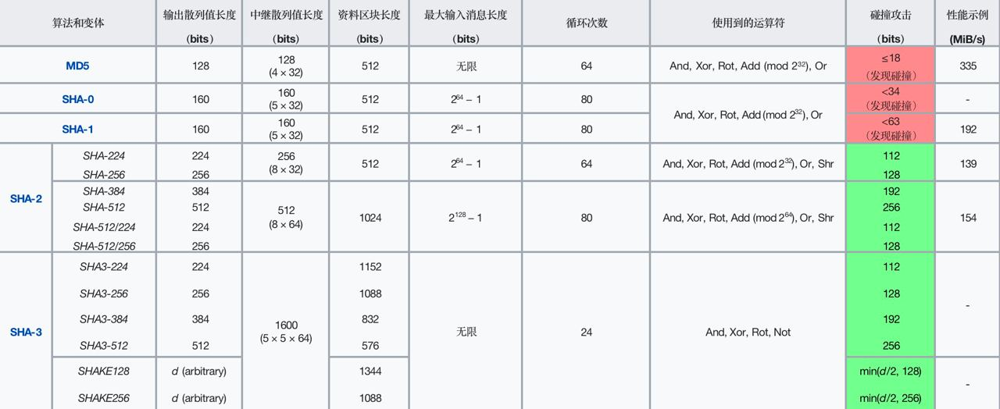

#### 2.2.5、Hash算法之 `MD4` 和 `MD5`(均不可靠，已被淘汰) <a href="#前言摘要" style="font-size:17px; color:green;"><b>🔼</b></a>

* *资料来源*
  * [维基百科/MD4](https://zh.wikipedia.org/wiki/MD4)
  * [维基百科/MD5](https://zh.wikipedia.org/wiki/MD5)

* ***MD4（不可靠，被淘汰）***
  * 麻省理工学院教授 Ronald Rivest 于1990年设计的一种信息摘要算法  
  * 是一种用来测试信息完整性的密码散列函数的实行  
  * 一般128位长的 MD4 散列被表示为32位的十六进制数字  
  * 这个算法影响了后来的算法如 MD5、SHA 家族和 RIPEMD 等  
  * 空文的散列：`MD4("") = 31d6cfe0d16ae931b73c59d7e0c089c0  `
  * 不可靠
    * 1991年 Den Boer 和 Bosselaers 发表了一篇文章指出MD4的短处
    * 2004年8月王小云（🇨🇳中国密码学家）报告在计算MD4时可能发生杂凑冲撞;

* ***MD5（不可靠，被淘汰）***
  * 🇺🇸美国密码学家 罗纳德·李维斯特（Ronald Linn Rivest）于1992年设计，用以取代 MD4 算法  
  * 在 RFC 1321 中被加以规范  
  * 由 MD4、MD3、MD2 改进而来  
  * 曾被用于文件校验、SSL/TLS、IPsec、SSH  
  * 产生一个128位（16个字符）的散列值  
  * 一般表示为32位十六进制数字  
  * 空文的散列：`MD5("") = d41d8cd98f00b204e9800998ecf8427e`  
  * 不可靠  
    * 1996年起被证实存在弱点，可被破解，不适合用于高安全性数据  
    * 2004年证实无法防止碰撞攻击，不适用于SSL证书或数字签名等  
      * 在CRYPTO 2004会议，王小云及其研究团队展示新方法可寻找MD5、SHA-0等散列函数的碰撞  
      * 所谓散列冲撞即两个不同消息计算得出相同散列值  
      * 鸽巢原理指出有长度限制的散列函数处理无限长度消息必然有冲撞可能  
      * 早期已有研究者在约束条件下找到多对哈希冲撞  
    * 2009年，中国科学院谢涛和冯登国用复杂度仅为2^20.96的碰撞算法，在普通计算机上几秒内破解MD5碰撞抵抗性  
  * 逐步被禁用  
    * 2011年，RFC 6151 明确禁止 MD5 用作密钥散列消息认证码（HMAC）  

#### 2.2.6、安全哈希算法 <a href="#前言摘要" style="font-size:17px; color:green;"><b>🔼</b></a>

```
还需要满足一个条件，就是输出无规律。
输入数据任意一个bit（某个字节的某一个二进制位）的改动，会导致输出完全不同。
从而让攻击者无法逐步猜测输入，只能依赖暴力穷举来破解;
```

#### 2.2.7、应用场景举例 <a href="#前言摘要" style="font-size:17px; color:green;"><b>🔼</b></a>

##### 2.2.7.1、文件指纹 <a href="#前言摘要" style="font-size:17px; color:green;"><b>🔼</b></a>

```
当我们从网站上下载一个非常大的文件时，我们如何确定下载到本地的文件和官方网站发布的原始文件是完全相同，没有经过修改的呢？
哈希算法就体现出了作用:我们只需要计算下载到本地的文件哈希，再和官方网站给出的哈希对比;
如果一致，说明下载文件是正确的，没有经过篡改，如果不一致，则说明下载的文件肯定被篡改过。

大多数软件的官方下载页面会同时给出该文件的哈希值，以便让用户下载后验证文件是否被篡改。
```

##### 2.2.7.2、在区块链当中的应用之`Merkle Hash` <a href="#前言摘要" style="font-size:17px; color:green;"><b>🔼</b></a>

*区块链首先要保证任何交易数据都不可修改*

* 在区块的头部，有一个 Merkle Hash 字段，用于记录本区块所有交易的 Merkle 根哈希值  
* Merkle Hash 是把一系列数据的哈希根据一个树形结构算法汇总成一个最终的哈希（也称为 Merkle Root）  
* 它是一种二叉树结构，将每笔交易的哈希逐层组合，最终生成一个根哈希  
* 优势包括：  
  * 可以快速验证某笔交易是否存在于区块中  
  * 减少数据传输量  
  * 增强数据完整性与安全性  

*假设一个区块有4个交易，我们对每个交易数据做 dhash，得到4个哈希值`a1`、`a2`、`a3`、`a4`*

```
a1 = dhash(tx1)
a2 = dhash(tx2)
a3 = dhash(tx3)
a4 = dhash(tx4)
```

*注意到哈希值也可以看做数据，所以可以把`a1`和`a2`拼起来，`a3`和`a4`拼起来，再计算出两个哈希值`b1`和`b2`*

```ascii
       ┌───────────────┐               ┌───────────────┐
       │b1=dhash(a1+a2)│               │b2=dhash(a3+a4)│
       └───────────────┘               └───────────────┘
               ▲                               ▲
       ┌───────┴───────┐               ┌───────┴───────┐
       │               │               │               │
┌─────────────┐ ┌─────────────┐ ┌─────────────┐ ┌─────────────┐
│a1=dhash(tx1)│ │a2=dhash(tx2)│ │a3=dhash(tx3)│ │a4=dhash(tx4)│
└─────────────┘ └─────────────┘ └─────────────┘ └─────────────┘
```

*最后，把`b1`和`b2`这两个哈希值拼起来，计算出最终的哈希值，这个哈希就是`Merkle Hash`*

```ascii
                     ┌───────────────────┐
                     │merkle=dhash(b1+b2)│
                     └───────────────────┘
                               ▲
               ┌───────────────┴───────────────┐
               │                               │
       ┌───────────────┐               ┌───────────────┐
       │b1=dhash(a1+a2)│               │b2=dhash(a3+a4)│
       └───────────────┘               └───────────────┘
               ▲                               ▲
       ┌───────┴───────┐               ┌───────┴───────┐
       │               │               │               │
┌─────────────┐ ┌─────────────┐ ┌─────────────┐ ┌─────────────┐
│a1=dhash(tx1)│ │a2=dhash(tx2)│ │a3=dhash(tx3)│ │a4=dhash(tx4)│
└─────────────┘ └─────────────┘ └─────────────┘ └─────────────┘
```

*如果交易的数量不恰好是4个怎么办？*

例如，只有3个交易时，第一个和第二个交易的哈希`a1`和`a2`可以拼起来算出`b1`，第三个交易只能算出一个哈希`a3`，这个时候，就把a3直接复制一份，算出`b2`，这样，我们也能最终计算出`Merkle Hash`

```ascii
                     ┌───────────────────┐
                     │merkle=dhash(b1+b2)│
                     └───────────────────┘
                               ▲
               ┌───────────────┴───────────────┐
               │                               │
       ┌───────────────┐               ┌───────────────┐
       │b1=dhash(a1+a2)│               │b2=dhash(a3+a3)│
       └───────────────┘               └───────────────┘
               ▲                               ▲
       ┌───────┴───────┐               ┌───────┴───────┐
       │               │               │               │
┌─────────────┐ ┌─────────────┐ ┌─────────────┐ ┌ ─ ─ ─ ─ ─ ─ ┐
│a1=dhash(tx1)│ │a2=dhash(tx2)│ │a3=dhash(tx3)│
└─────────────┘ └─────────────┘ └─────────────┘ └ ─ ─ ─ ─ ─ ─ ┘
```

如果有5个交易，我们可以看到，`a5`被复制了一份，以便计算出`b3`，随后`b3`也被复制了一份，以便计算出`c2`。

总之，在每一层计算中，如果有单数，就把最后一份数据复制，最后一定能计算出`Merkle Hash`

```ascii
                  ┌─────────┐
                  │ merkle  │
                  └─────────┘
                       ▲
           ┌───────────┴───────────┐
           │                       │
         ┌───┐                   ┌───┐
         │c1 │                   │c2 │
         └───┘                   └───┘
           ▲                       ▲
     ┌─────┴─────┐           ┌─────┴─────┐
     │           │           │           │
   ┌───┐       ┌───┐       ┌───┐       ┌ ─ ┐
   │b1 │       │b2 │       │b3 │        b3
   └───┘       └───┘       └───┘       └ ─ ┘
     ▲           ▲           ▲
  ┌──┴──┐     ┌──┴──┐     ┌──┴──┐
  │     │     │     │     │     │
┌───┐ ┌───┐ ┌───┐ ┌───┐ ┌───┐ ┌ ─ ┐
│a1 │ │a2 │ │a3 │ │a4 │ │a5 │  a5
└───┘ └───┘ └───┘ └───┘ └───┘ └ ─ ┘
```

从 ***Merkle Hash*** 的计算方法可以得出结论：

修改任意一个交易哪怕一个字节，或者交换两个交易的顺序，都会导致  ***Merkle Hash*** 验证失败，也就会导致这个区块本身是无效的。

所以，*Merkle Hash*记录在区块头部，它的作用就是保证交易记录永远无法修改。

##### 2.2.7.3、`Block Hash` <a href="#前言摘要" style="font-size:17px; color:green;"><b>🔼</b></a>

```
区块本身用 Block Hash ——也就是区块哈希来标识;
但是，一个区块自己的区块哈希并没有记录在区块头部，而是通过计算区块头部的哈希得到的;
区块头部的 Prev Hash 记录了上一个区块的 Block Hash ，这样，可以通过 Prev Hash 追踪到上一个区块;
由于下一个区块的Prev Hash又会指向当前区块，这样，每个区块的Prev Hash都指向自己的上一个区块，这些区块串起来就形成了区块链;
区块链的第一个区块（又称创世区块）并没有上一个区块，因此，它的Prev Hash被设置为00000000...000
```

### 2.3、相关中间件的应用之数字签名(亦称：数字签章) <a href="#前言摘要" style="font-size:17px; color:green;"><b>🔼</b></a>

* 资料来源  
  * [维基百科/数字签名](https://zh.wikipedia.org/wiki/%E6%95%B8%E4%BD%8D%E7%B0%BD%E7%AB%A0)  
  * [百度百科/数字签名](https://baike.baidu.com/item/%E6%95%B0%E5%AD%97%E7%AD%BE%E5%90%8D/212550)  
  * [阮一峰的网络日志/数字签名是什么？](https://www.ruanyifeng.com/blog/2011/08/what_is_a_digital_signature.html)  
  * [稀土掘金/iOS签名校验那些事儿](https://juejin.cn/post/7019129808961404936)  
  * [比特币新一代多签名方案MuSig2：提供更好的安全性、效率和隐私功能](https://www.panewslab.com/zh/articledetails/23q3l9fc.html)  
  * [雪球/为什么黎曼定理会与我们的钱包有关系——初识金融安全体系](https://xueqiu.com/8476758876/114728701)  
  * [runoob/HTTP 与 HTTPS 的区别](https://www.runoob.com/w3cnote/http-vs-https.html)

#### 2.3.1、数字签名的工作流程 <a href="#前言摘要" style="font-size:17px; color:green;"><b>🔼</b></a>

```
需要涉及到的算法（非对称加密的相关算法 + Hash哈希算法）

定义信息的发送方为 A
定义信息的接收方为 B
定义需要发送和接受的信息为 M
定义 B 的公钥为 BK
定义 B 的私钥为 bk

生成文件"指纹"的Hash哈希函数是公开的
B 的公钥 BK 亦是公开的

1、A 对信息进行 Hash哈希运算得出一个"指纹"，即：Hash（M）;
2、用 B 的公钥对信息和"指纹"进行打包加密，即:BK（Hash（M）+ M）;
3、A 发送加密讯息：BK（Hash（M）+ M）到 B;
4、B 拿到加密讯息：BK（Hash（M）+ M）以后，用 B 的私钥 bk 进行解密，得出讯息 M 和 M 对应的"指纹"Hash（M），即：bk（BK（Hash（M）+ M））= Hash（M） + M;
5、我们的目的是，验证此时的M是否被篡改。那么用公开的Hash哈希函数对此时接收到的M进行运算，以核对"指纹"是否一致。如果一致，则校验通过。

数字签名的作用:
不可抵赖:如果公钥能解密，则内容一定是与该公钥对应的私钥加密而来，即可证明来源。
数据完整性:数字签名的HASH值和自己计算出的HASH值一致，即可证明该内容是完整的未经修改过。
```

**但是数字签名不能确保"公钥"的真实性，第三方可偷换"公钥"，达到与伪服务器通信的目的，这样又产生了数字证书。**

#### 2.3.2、`CA`（certificate authority，简称 `CA` ） <a href="#前言摘要" style="font-size:17px; color:green;"><b>🔼</b></a>

**所有的信任感的发起源头就是CA中心**

```
由权威证书中心 CA（certificate authority，简称 CA）颁发，作用是证明"公钥"的真实信。
数字证书里面包含了服务器的公钥，服务器的域名以及服务器所属的公司信息等内容，并且该信息是用CA的私钥进行加密的。客户请求服务时，服务器会同时发送数字签名和数字证书给客户。

证书工作流程如下:
服务器向 CA 中心申请证书，CA 负责核实服务器的真实性，并在证书里内置服务器域名证书使用者信息;
客户浏览器或操作系统里内置有权威 CA 的公钥信息（即 CA 公钥不需要在网络中传输）;
客户请求服务时，服务器把自己申请的数字证书和内容的数字签名一同发给客户;
客户收到信息后在本地 CA 列表里查找 CA 公钥对数字证书解密，拿到真正的签名公钥，再用该公钥去解密数字签名，拿到 Hash哈希值去对比完整性;

漏洞：
CA 的公钥是存储在本地计算机列表的，如果手动往列表里面导入了不可信的 CA 公钥，那么 CA 就可以仿冒，失去了权威性。
```

## 3、相关概念的落地 <a href="#前言摘要" style="font-size:17px; color:green;"><b>🔼</b></a>

### 3.1、在一般的程序开发中的做法 <a href="#前言摘要" style="font-size:17px; color:green;"><b>🔼</b></a>

* 一般情况下，前端存放公钥，服务端存放私钥。私钥是不允许存放在前端程序
* 但是，涉及到具体的业务，可能会涉及到很多组（公钥/私钥），又因为（公钥/私钥）是成对出现的，故可以将每一对（公钥/私钥）映射为一个ID，然后专门建立一张密钥表来进行存放
* 出于安全方面的考虑，服务端对前端传过来的数据是采取保守的不信任态度，也就是前端存储公钥这种做法虽然可行但是欠缺考虑。那么，前端储存业务的（公钥/私钥）ID，服务端可以根据传过来的 ID，后端去遍历对应的私钥表，从而进行解密

### 3.2、`SSL`：从`http`到`https` = `对称加密`  + `非对称加密 ` <a href="#前言摘要" style="font-size:17px; color:green;"><b>🔼</b></a>

**原因：非对称加密在解密过程中，消耗的时间远远超过对称加密**

```
在非对称加密在第一阶段通讯的时候，传递适用于第二阶段过程的对称加密的密钥。即:非对称加密（对称加密）;
而在最终的实际数据传输中，用对称加密进行加密通讯
```

###  3.3、`Apple`校验机制 <a href="#前言摘要" style="font-size:17px; color:green;"><b>🔼</b></a>

```
对可执行文件或脚本进行数字签名，用来保证软件在签名后未被损害或者修改的措施;
确定 APP 来源并防止外部攻击，确定安装的 APP 有绝对的控制权，以实现苹果对其生态的控制（每年$99、$299这笔开发账号费用）
我们的 iPhone 中和苹果服务器中存在着一对RSA秘钥（iPhone 中存公钥 public key,苹果服务器中存私钥 private key ）

我们从苹果MC（Member Center）中获得的证书实际也是一个包含有证书链的证书，其中的根是苹果的 CA。我们获得的证书实际上是在告诉 iOS 设备:我们的证书是被苹果CA签过名的合法的证书。而 iOS 设备在执行 APP 前，首先要先验证 CA 的签名是否合法，然后再通过证书中我们的公钥验证程序是否的确是我们发布的，且中途没有对程序进行过篡改。
```

#### 3.3.1、双重签名(`multisig`) <a href="#前言摘要" style="font-size:17px; color:green;"><b>🔼</b></a>

*简介*

* 是一种安全功能，涉及在完成交易之前需要多个签名或批准（通常是两到三方）
* 每一方都有自己的私钥，所有的私钥都必须用于签署交易，然后才可以执行。这个过程确保没有一个人能够完全控制资产，减少了盗窃或欺诈的风险
* 作为一个加密货币投资者或交易商，如果你持有大量的数字资产，你应该关心multisig。它是一种先进的安全措施，可以大大降低盗窃或欺诈的风险。然而，multisig 确实需要额外的设置和维护，这对一些用户来说可能是很麻烦的
* 归根结底，使用 multisig 的决定应基于你的具体安全要求和风险承受能力。如果你关心你的数字资产的安全，并愿意付出额外的努力来设置多义词，它可以成为保护你的投资的一个有效途径。

*流程*

* 把 Mac 电脑中的公钥 M(M:代表Mac) 包装成 CSR 文件在 Member Center 中向苹果请求证书
* 苹果服务器把 CSR 中的公钥M取出来跟 Member Center 中的开发者账号信息一起打包并使用苹果服务器的私钥A（A:代表Apple）进行签名打包成证书
* 把证书包装成描述文件并使用私钥 A 签名
* 在开发时，编译完一个 APP 后，用本地的私钥 M(今后你导出的P12) 对这个 APP 进行签名，同时把第三步得到的证书一起打包进 APP 里，安装到手机上
* 在安装时，iOS 系统取得证书，通过系统内置的公钥 A，去验证证书的数字签名是否正确
* 验证证书后确保了公钥M 是苹果认证过的，再用公钥 M 去验证 APP 的签名，这里就间接验证了这个 APP 安装行为是否经过苹果官方允许

#### 3.3.2、`CSR` 文件 <a href="#前言摘要" style="font-size:17px; color:green;"><b>🔼</b></a>

```
CSR 文件（CertificateSigningRequest.certSigningRequest）这个文件是我们从钥匙串申请来的为后面申请证书准备的，在 Member Center 中提交该文件向苹果申请证书，这个文件主要包括以下内容:
1、申请者的信息，使用私钥 M 加密;
2、申请者的公钥 M，申请者使用的私钥M对应的公钥 M;
3、摘要算法(Hash哈希算法)，RSA 算法;

苹果的 Member Center 在拿到这个 CSR 文件后，将这个信息记录下来，并签发出相关的证书
这里，苹果实际无需验证我的信息，因为如果我不交钱就没办法上传这个文件，也就得不到证书
```

*利用`openssl`来查看`CSR`文件：文件包含了我的信息，并标明使用了`sha256`摘要算法和`RSA`公钥加密算法*

```bash
openssl asn1parse -i -in CertificateSigningRequest.certSigningRequest
    0:d=0  hl=4 l= 638 cons: SEQUENCE
    4:d=1  hl=4 l= 358 cons:  SEQUENCE
    8:d=2  hl=2 l=   1 prim:   INTEGER           :00
   11:d=2  hl=2 l=  57 cons:   SEQUENCE
   13:d=3  hl=2 l=  22 cons:    SET
   15:d=4  hl=2 l=  20 cons:     SEQUENCE
   17:d=5  hl=2 l=   9 prim:      OBJECT            :emailAddress
   28:d=5  hl=2 l=   7 prim:      IA5STRING         :xxx.com
   37:d=3  hl=2 l=  18 cons:    SET
   39:d=4  hl=2 l=  16 cons:     SEQUENCE
   41:d=5  hl=2 l=   3 prim:      OBJECT            :commonName
   46:d=5  hl=2 l=   9 prim:      UTF8STRING        :宋XX
   57:d=3  hl=2 l=  11 cons:    SET
   59:d=4  hl=2 l=   9 cons:     SEQUENCE
   61:d=5  hl=2 l=   3 prim:      OBJECT            :countryName
   66:d=5  hl=2 l=   2 prim:      PRINTABLESTRING   :CN
   70:d=2  hl=4 l= 290 cons:   SEQUENCE
   74:d=3  hl=2 l=  13 cons:    SEQUENCE
   76:d=4  hl=2 l=   9 prim:     OBJECT            :rsaEncryption
   87:d=4  hl=2 l=   0 prim:     NULL
   89:d=3  hl=4 l= 271 prim:    BIT STRING
  364:d=2  hl=2 l=   0 cons:   cont [ 0 ]
  366:d=1  hl=2 l=  13 cons:  SEQUENCE
  368:d=2  hl=2 l=   9 prim:   OBJECT            :sha256WithRSAEncryption
  379:d=2  hl=2 l=   0 prim:   NULL
  381:d=1  hl=4 l= 257 prim:  BIT STRING
```

#### 3.3.3、从 Member Center 中申请开发证书 <a href="#前言摘要" style="font-size:17px; color:green;"><b>🔼</b></a>

```
1、苹果取出 CertificateSigningRequest.certSigningRequest 中的公钥;
2、然后将我的 Member Center 账号信息和我提交的公钥封装在证书中;
3、并进行数字签名
```

*用`openssl`查看开发证书*

```bash
openssl x509 -inform der -in ios_development.cer -noout -text
Certificate:
    Data:
        Version: 3 (0x2)
        Serial Number: 8261114673414944075 (0x72a56006b5aa354b)
    Signature Algorithm: sha256WithRSAEncryption
        Issuer: C=US, O=Apple Inc., OU=Apple Worldwide Developer Relations, CN=Apple Worldwide Developer Relations Certification Authority
        Validity
            Not Before: Jun 15 06:59:13 2020 GMT
            Not After : Jun 15 06:59:13 2021 GMT
        Subject: UID=H34NZV9396, CN=iPhone Developer: shen dongqu (J4NH894YDN), OU=X8H9B4P8L2, O=ZhongChu NanJing ZhiHuiWuLiu KeJi CO.LTD, C=CN
        Subject Public Key Info:
            Public Key Algorithm: rsaEncryption
                Public-Key: (2048 bit)
                Modulus:
                    00:cd:58:f1:21:b2:82:95:e6:7a:4c:72:70:9d:06:
                    12:97:ed:a0:5c:d2:43:e0:f8:96:33:34:ef:a2:62:
                    6e:59:fc:e3:b0:08:5b:0b:9c:d6:4b:37:1e:22:46:
                    32:71:67:b4:ca:14:4a:94:a6:4f:46:b7:b6:f8:bd:
                    e6:8e:f9:f6:a5:0a:9a:24:7f:0d:71:d0:c7:c4:19:
                    be:f9:a4:de:42:1f:22:e2:17:ed:3c:13:00:9c:62:
                    d5:ea:6d:86:9d:6c:6c:90:ae:ea:55:24:f0:00:08:
                    ed:17:cd:d3:cf:40:6d:a7:11:22:c3:cc:24:e0:4a:
                    70:9a:36:8b:ea:f4:e0:42:4c:68:28:69:b0:fa:9b:
                    58:59:ae:58:c3:c2:25:2a:07:ac:c2:ad:53:55:f9:
                    3b:fe:ac:7d:9b:cf:e2:15:ff:c9:e7:eb:ec:27:9a:
                    e3:e9:34:47:d3:1f:68:92:28:14:26:68:0c:13:34:
                    53:ce:a3:03:a8:db:af:2b:3e:2f:45:59:73:6b:42:
                    23:f2:db:81:b3:e4:11:56:3f:2a:db:96:5e:a1:83:
                    32:75:b5:c9:be:1f:bb:9f:49:62:af:63:c8:11:f7:
                    a2:ae:a6:25:2e:69:c5:ff:73:6c:20:da:62:de:0a:
                    27:0d:24:af:da:30:37:ad:d1:7f:97:5a:06:4a:23:
                    fa:53
                Exponent: 65537 (0x10001)
        X509v3 extensions:
            X509v3 Basic Constraints: critical
                CA:FALSE
            X509v3 Authority Key Identifier:
                keyid:88:27:17:09:A9:B6:18:60:8B:EC:EB:BA:F6:47:59:C5:52:54:A3:B7

            Authority Information Access:
                OCSP - URI:http://ocsp.apple.com/ocsp03-wwdr01

            X509v3 Certificate Policies:
                Policy: 1.2.840.113635.100.5.1
                  User Notice:
                    Explicit Text: Reliance on this certificate by any party assumes acceptance of the then applicable standard terms and conditions of use, certificate policy and certification practice statements.
                  CPS: http://www.apple.com/certificateauthority/

            X509v3 Extended Key Usage: critical
                Code Signing
            X509v3 Subject Key Identifier:
                5C:FF:A1:74:3A:8C:64:9B:38:35:7A:D4:14:53:6E:05:F2:00:1A:55
            X509v3 Key Usage: critical
                Digital Signature
            1.2.840.113635.100.6.1.2: critical
                ..
    Signature Algorithm: sha256WithRSAEncryption
         79:99:29:82:ed:80:3b:5a:6f:f6:5f:53:d0:7b:79:29:0f:46:
         40:a2:e4:c8:3f:f5:c9:09:0b:7a:ec:f9:be:9e:50:6a:fa:83:
         9e:c0:78:74:77:eb:6d:7b:21:df:ca:36:91:79:9a:71:0e:bb:
         a6:41:fb:0a:71:58:b4:b7:b4:f5:00:a0:bb:ca:60:ef:4d:56:
         82:53:ce:38:8d:55:37:ec:65:b1:13:bd:2d:5c:5c:e9:59:65:
         58:d0:c7:bf:be:84:99:31:77:32:80:a2:57:e1:f4:54:46:7e:
         ad:f2:46:fe:6c:ed:d9:9f:e0:50:b8:91:a1:14:e2:48:dd:2f:
         37:80:02:93:db:93:50:27:07:c7:83:ae:b6:5b:4d:ab:dd:41:
         e4:bd:80:21:30:c1:c4:f8:bf:41:f3:e6:0f:5d:6a:39:56:cd:
         0a:d4:ab:27:d3:0f:ae:97:d1:a1:a4:b3:c7:8a:3b:d8:6a:28:
         49:92:76:6f:4c:06:75:96:73:4d:24:bf:50:65:31:80:73:08:
         dd:87:74:6e:b9:9e:e2:0a:0f:25:37:a5:4e:72:4a:e5:c6:93:
         9a:36:8c:ac:a6:1e:1f:74:58:e7:20:5b:1f:e5:31:6c:96:34:
         d8:50:b9:b3:92:72:1a:57:9a:e6:c3:dc:3c:c2:f9:53:27:90:
         2b:2b:60:39
```

```
Data 域即为证书的实际内容，与 Data 域平级的 Signature Algorithm 实际就是苹果的 CA 的公钥，而摘要的签名应该没有显示出来。
Data 域下一级的内容就是我的苹果账号信息，其中最为重要的是我的公钥，这个公钥与我本机的私钥是对应的。
当我们双击安装完证书后，KeyChain 会自动将这对密钥关联起来。

程序跑到真机上的时候就是用这个私钥 M 给程序包签名的，而公钥M会随着描述文件（.mobileprovision）一起打进 APP 中。
所以，就算你有证书，但是如果没有对应的私钥是没有用的。而团队开发则需要通过 .p12 文件把这个私钥分享给团队其他成员。
```

#### 3.3.4、 iOS 授权和描述文件 <a href="#前言摘要" style="font-size:17px; color:green;"><b>🔼</b></a>

```
有了证书苹果可以确保 APP 是自己授权的开发者提交的以及 APP 的完整性，但是这样只能确保本 APP 是安全的，并不能细化到 APP 所使用的某些服务是被苹果认可的，不如 APNS 推送，定位等，而且证书也无法限制调试版应用的装机规模，于是苹果推出了 mobileprovision 描述文件。
```

*可以使用命令查看`mobileprovision`*

```bash
security cms -D -I embedded.mobileprovision
```

*`mobileprovision`文件包含*

* 每个 APP 必须在 Member Center 中创建一个对应的 Apple ID。

* 不同类型的证书代表了不同的发布方式，同时也影响部分功能的可用性（如 APNs 推送）。

* 功能授权列表：
  * 比如是否启用推送、App Groups、Keychain Sharing 等；
  * 都需要在 Apple Developer 中进行配置并添加至描述文件（Provisioning Profile）。

* 可安装的设备列表：
  * 对于 AdHoc 发布或真机调试，必须配置允许安装的设备列表；
  * 设备通过 UDID 进行唯一标识；
  * 每台 iOS 设备的 UDID 都不同，可通过 iTunes 或网站如 http://fir.im/udid 获取；
  * 描述文件中只能添加有限数量的设备（100 台/种类/年，视具体类型而定）。

* 苹果的签名机制：
  * 苹果签名不是开发者自己的私钥签名；
  * `*.mobileprovision` 文件是由苹果签名生成的；
  * 我们只能从 Apple Member Center 下载获取，无法自行生成；
  * 下载后内容也不能被修改，如添加设备或更改权限；
  * 因此，上述的 1-4 所有内容都受到苹果的严格控制，所有规则必须遵循苹果的系统和策略。

### 3.4、❤️区块链❤️（`BlockChain`） <a href="#前言摘要" style="font-size:17px; color:green;"><b>🔼</b></a>

*资料来源*

* [Youtube/coinlife2835](https://www.youtube.com/@coinlife2835/videos)  
* [廖雪峰的官方网站/区块链教程](https://www.liaoxuefeng.com/wiki/1207298049439968)  
* [wiki.bsatoshi.com](https://wiki.bsatoshi.com/)  
* [【干货分享】你真的会用区块链浏览器吗](https://www.youtube.com/watch?v=b0AAclrwRWA)  
* [TokenPocket](https://help.tokenpocket.pro/cn/security-knowledge/protective-measures/about-approve)  
* [NFT](https://zh.wikipedia.org/wiki/NFT)  
* [CoinMarketCap](https://zh.wikipedia.org/wiki/CoinMarketCap)  
* [CoinMarketCap 是什么？八大功能教学全收录](https://chainee.io/what-is-coinmarketcap/)

#### 3.4.1、什么是区块链 ? <a href="#前言摘要" style="font-size:17px; color:green;"><b>🔼</b></a>

* 区块链是互联网的一部分，互联网数据与数据之间的传输方式，数据传输的应用模型

* 概念是由中本聪 2008 年率先提出：《比特币：一个点对点的电子现金系统》。

* 相关技术是来自 40 余年的积累和沉淀：
  * 1976 年，迪菲 + 赫尔曼提出《密码学的新方向》；
  * 1977 年，RSA 算法诞生；
  * 1980 年 & 1982 年，哈希树的数据结构和响应算法 + 拜占庭将军问题，分布式计算理论进入实质阶段；
  * 1985 年，椭圆曲线加密算法出现，非对称加密体系开始可用；
    * ⬅️ 至此，现代密码学基础完全确立；
  * 1997 年，智能合约的概念被提出；
  * 同年，第一代共识机制 PoW 出现（当时仅用于反垃圾邮件）；
    * ⬅️ 区块链四大核心技术基本成型，但仍有瓶颈；
  * 1999~2001 年，Napster、EDonkey2000、BitTorrent 等奠定了 P2P 网络基础；
  * 2001 年，SHA-2 系列算法诞生；
    * ⬅️ 区块链核心技术积累基本完成。

* 区块链本质是一个不可篡改和删除的数据库。
  * 数据上传过程中，会被打包形成“区块”；
  * 区块按时间顺序连接，构成“链”结构。

* 特点：去中心化
  * 所有节点参与记账，账本数据一致；
  * 节点下线不会导致数据丢失，上线后即可同步。

* 信任机制：必须满足**超过 51% 的节点同意**，数据才能写入区块链。

* 区块链的分类（按开放程度）：
  * 公有链：去中心化最强，适合公用型项目；
  * 私有链：去中心化弱，效率高，适合企业内部使用；
  * 联盟链：多中心化，适合多个组织协同使用；
    * ✅ 未来趋势：多链并行的时代。

* 区块链的分叉：一种独有的**版本升级机制**
  * 升级时从某个区块分裂为两条链，称为“分叉”；
  * 升级需达成共识；
  * 若共识达成，矿工向新链迁移，旧链逐渐废弃（软分叉）；
  * 若无法达成共识，则两个链长期并存（硬分叉）；
  * 每个区块都通过引用上一个区块的哈希值来形成链式结构。

#### 3.4.2、区块链的核心技术 = 密码学 + 分布式储存 + 智能合约 + 共识机制（算法） <a href="#前言摘要" style="font-size:17px; color:green;"><b>🔼</b></a>

* 智能合约：规则代码化后，由机器自动执行（1994 年，尼克·萨博提出）：
  * 任何支付行为本质上都是执行比特币脚本；
  * 只有脚本成功执行，支付才会真正完成；
  * 在以太坊中，智能合约运行于 EVM（以太坊虚拟机）中；
    * 任何人都可以编写合法的合约代码执行任意逻辑（但存在诸多限制）；
    * 可实现：定义新代币、抵押贷款、DAO 等复杂逻辑。

* 密码学在区块链中的应用：
  * 哈希算法（抗篡改 / 匿名性 / 抗碰撞）；
  * 非对称加密（公钥 / 私钥体系）。

* 共识机制：用于协调各节点对账本数据的一致性，确保区块链数据可信任、同步一致：
  * 拜占庭将军问题：如果某些节点发送错误信息，如何达成一致？
  * 拜占庭容错（BFT）：只要正确节点数量大于总数的 2/3，就能达成共识；
  * 主流共识机制有：
    * PoW（Proof of Work，工作量证明）：
      * 最初用于反垃圾邮件，后应用于解决拜占庭问题；
      * 每笔交易产生后，节点需凭算力竞争“记账权”；
      * 每 10 分钟左右，全网进行一次算力竞赛，寻找符合条件的 Nonce；
      * 谁先找到合格 Nonce 并广播获认可，即获得记账权；
      * 该节点可将交易打包入新区块并同步至全网，同时获得比特币奖励；
      * 安全性高，但资源消耗极大，效率低；
      * 若攻击者掌控全网超过 51% 的算力，理论上可篡改数据（但代价极高）。
    
    * PoS（Proof of Stake，权益证明）：
      * 提出于 2011 年，旨在解决 PoW 的能耗问题；
      * 权益越多的节点拥有越高的话语权；
      * 每个节点都可加入，但只有满足条件（如质押代币）才能成为候选验证节点；
      * 系统通过算法从中选出部分节点作为“出块者”；
      * 出块节点 = 有资格处理数据 / 参与记账 / 获得币的奖励；
      * 算法确保选举过程公平且不可预测；
      * 效率提升，但易出现“强者恒强”局面，去中心化程度不如 PoW；
      * 若某人掌握超 51% 的代币，其可主导网络，存在中心化风险。

#### 3.4.3、挖矿（比喻） <a href="#前言摘要" style="font-size:17px; color:green;"><b>🔼</b></a>

* 数字货币和区块链这两个概念是在 **2008 年同时出现**的。

* 在某一时间点，所有参与计算的计算机同时处理相同的数据任务：
  * 谁**最先完成任务**，谁就获得奖励；
  * 有些机器可能长期参与但**始终无法成功挖矿**，仅白白消耗电力；
  * 成功处理任务的第一名即可获得“矿”作为奖励（数字货币，最初为比特币 BTC）。

* 挖矿原理本质上是一个“**数据记录过程**”：
  * 所谓矿工，是指在处理尚未确认的交易数据；
  * 这个处理过程依赖**共识机制**，确保结果可信。

* 那么矿工这么多，谁的数据最终被采纳？
  * 4.1 所有矿工在处理交易时，必须加入 **Hash 值**（即文件指纹），并参与竞争；
  * 4.2 谁最先处理完成，并将结果广播给全网，同时被**大多数（至少超过 51%）节点认可**；
    * 该矿工即获得“记账权”；
    * 同时获得区块链网络的奖励（如比特币 BTC）。

* 挖矿的人越多：
  * 意味着参与数据验证的人越多；
  * 区块链的数据**就越安全**，**被攻击或篡改的可能性越低**。

#### 3.4.4、双花问题 <a href="#前言摘要" style="font-size:17px; color:green;"><b>🔼</b></a>

* `双花问题`其实包含以下2个子问题
  * 一笔钱因为同步延迟的问题，被**重复使用**
  * 一笔钱虽然只使用了一次，但是黑客攻击或者造假钱等方式，把这笔钱又复制了一次，**重复使用**

* `双花问题`在现实生活中的解决方案：目前主要通过第三方的机构来解决
* `双花问题`在区块链中的解决方案：**共识机制（解决12.1）** + **时间戳** + **UTXO账户模型**

#### 3.4.5、`UTXO`账户模型 <a href="#前言摘要" style="font-size:17px; color:green;"><b>🔼</b></a>

*对开发者友好（易于实现清结算的模型），但是对用户不友好（具有认知冲突：因为普通用户所认知的账户是一个账号、对应余额变动的模型）*

```
比特币的区块链由一个个区块串联构成，而每个区块又包含一个或多个交易。

如果我们观察任何一个交易，它总是由若干个输入（Input）和若干个输出（Output）构成，一个Input指向的是前面区块的某个Output;
只有Coinbase交易（矿工奖励的铸币交易）没有输入，只有凭空输出;
所以，任何交易，总是可以由Input溯源到Coinbase交易。

这些交易的Input和Output总是可以串联起来:
┌─────────────┐     ┌─────────────┐     ┌─────────────┐     ┌─────────────┐
│Block #1     │     │Block #2     │     │Block #3     │     │Block #4     │
│┌──┬────┬───┐│     │┌──┬────┬───┐│     │┌──┬────┬───┐│     │┌──┬────┬───┐│
││CB│50.0│OUT├┼──┐  ││CB│50.0│OUT├┼──┐  ││CB│50.0│OUT├┼──┐  ││CB│50.0│OUT││
│└──┴────┴───┘│  │  │└──┴────┴───┘│  │  │└──┴────┴───┘│  │  │└──┴────┴───┘│
│             │  │  │┌──┬────┬───┐│  │  │┌──┬────┬───┐│  │  │┌──┬────┬───┐│
│             │  │  ││  │8.70│OUT├┼──┼──>│IN│    │   ││  └──>│IN│25.0│OUT││
│             │  └──>│IN├────┼───┤│  │  │├──┤58.7│OUT││     │├──┼────┼───┤│
│             │     ││  │41.3│OUT├┼─┐└──>│IN│    │   ││  ┌──>│IN│66.3│OUT││
│             │     │└──┴────┴───┘│ │   │└──┴────┴───┘│  │  │└──┴────┴───┘│
└─────────────┘     └─────────────┘ │   └─────────────┘  │  └─────────────┘
                                    └────────────────────┘
```

*还没有被下一个交易花费的`Output`被称为**UTXO** = **U**nspent **TX** **O**utput。即，未花费交易输出*

* 本质：区块链是一种流水记账系统，会记录交易的全过程：
  * 包括账户资金变动、交易地址、转账金额、资金来源等信息。

* 钱包余额的计算方式：是钱包地址关联的所有 **UTXO（未花费交易输出）** 的金额总和。
  * 在区块链上，**并没有传统意义上的“账户”概念**；
  * 某个用户所持有的比特币，其实是其控制的一组 UTXO；
    * 这些 UTXO 可能属于相同地址（同一个私钥），也可能属于多个不同地址；
  * 想确认一个人拥有多少比特币，必须知道其**控制的所有 UTXO 的总和**；
  * 如果你刚装一个新钱包，导入私钥后，**在未扫描完全部区块链前无法得知余额**；
  * 因此，在链上查询前，钱包需要先**扫描整个区块链**，重建地址-余额映射关系；
  * 这个过程涉及解析每一笔交易，并逐步更新地址余额，才能得到当前状态。

* 区块链的设计使得可以**追溯交易的资金源头**，即交易溯源。

* 区块链只**记录交易的过程**（如转出/转入等），而**不直接记录交易的结果**（余额等）。

* 区块链业务流程：
  * 首先通过 UTXO 模型，验证交易的资金是否存在；
  * 追溯资金来源，确认无误；
  * 然后通过共识机制进行全网广播，最终写入公链，完成记账。

#### 3.4.6、时间戳（即，一个字符序列能唯一的标识某个时间） <a href="#前言摘要" style="font-size:17px; color:green;"><b>🔼</b></a>

* 对数据进行哈希运算获得数据指纹
* 对这个指纹加入时间戳

#### 3.4.7、侧链技术（即，建立一条新区块链（侧链）） <a href="#前言摘要" style="font-size:17px; color:green;"><b>🔼</b></a>

* 能够1对1的和原有的链产生联系，资产可以再两条链之间产生转移
* 通过双向锚定（一方要以另外一方的行动为标准），进而弥补原来那条链（主链）的不足
* 举例:双向锚定👇🏻
  * 当比特币（BTC）想要转移到它的侧链的时候，就会在其主链上对相应数量的比特币（BTC）进行锁定，然后再将等量价值的侧链代币进行释放;
  * 当比特币（BTC）想要转回主链的时候，就锁定该数量的侧链代币，释放相应的比特币即可;
  * 管理资产的锁定与释放方式 = 第三方机构进行单一托管（单一确认） + 进行联盟托管（多节点确认）
  * 解决4大核心技术无法解决问题 = 效率问题 + 可扩展性问题（随着时间的推移，系统的很多功能，没有办法到与之相对应的提升）
    * 主链上交易处理不过来的时候，转移压力到侧链进行分摊处理;
    * 应用主链的人较多，不方便去做较大改动。那么在侧链进行修改，对主链功能进行补充;

#### 3.4.8、跨链技术（侧链的升级版） <a href="#前言摘要" style="font-size:17px; color:green;"><b>🔼</b></a>

* 解决互操作性问题:区块链实际应用的时候，因为场景和行业不同以及参与企业不同，导致一个场景都需要一条链甚至多条链，且每条链都比较封闭（信息孤岛）
* 目前4种解决方案：
  * 公证技术：瑞波实验室提出一个协议，这个协议适用于各区块链的记账系统，并且能包容相互的差异。大家可以以此作为一个统一的支付标准
  * 中继:类似于侧链（作为中介桥梁 ）。建立一条新链，并使之于其他的链产生联系，其他链可以和这条链产生价值转移。就好像很多链拥有了一条共同的侧链（以此为中介）。OKChain 采用这种技术;
  * 分布式私钥控制
  * 哈希锁定

#### 3.4.9、历史遗留问题（比特币交易拥堵问题）<a href="#前言摘要" style="font-size:17px; color:green;"><b>🔼</b></a>

*最开始比特币的一个区块只有1M，到后期不够用。解决方案如下👇🏻*

* 早期解决方案：扩大比特币的区块容量。
  * 存在争议：会提高普通电脑的运行门槛，使普通用户难以参与区块验证；
  * 可能导致去中心化程度下降，影响整个比特币网络的算力分布和公平性。

* 当前主流方案：**不扩大比特币区块容量**，而通过链上 / 链下方式提升可扩展性。

* 链上解决方案：**隔离见证（SegWit）**
  * 通过技术手段将交易数据进行拆分；
  * 保留“交易核心信息”，将“非交易信息”剥离、转移；
  * 从而释放区块容量，提升处理效率；
  * 为“闪电网络”落地提供技术基础；
  * 属于区块链扩容中的“腾空间”方案。

* 链下解决方案：**闪电网络（Lightning Network）**
  * 提出于 2015 年，是当前解决可扩展性与互操作性问题的主流方案；
  * 原理是新建一个侧链（即链下支付通道）来处理交易；
  * 主链只记录最终结果，侧链记录所有中间过程；
  
* 闪电网络的流程：
  * 交易双方建立一个链下支付通道，先将资金锁定在一个共享账户中；
  * 该账户只有双方私钥共同签名才能解锁；
  * 在通道开启期间，所有交易通过智能合约在链下实时记录，不广播；
  * 等通道关闭时，将最终交易结果广播至主链，并写入公链；
  * 极大缓解主链拥堵问题，并具备一定的跨链能力。

#### 3.4.10、以太坊 <a href="#前言摘要" style="font-size:17px; color:green;"><b>🔼</b></a>

*里程碑式影响力，区块链 2.0 = 区块链当中的操作系统 ，为大家提供一套脚本语言 = 开源的，能让大家自由开发智能合约的区块链公共平台 = 以太坊*

* 以太坊是**第一个将区块链技术应用于除数字货币以外其他行业**的项目。

* 以太坊是一个基于区块链的**智能合约平台**：
  * 允许开发者在其平台上创建和部署各种去中心化应用（DApp）；
  * 打破传统中心化服务模式，实现开放、透明、自主运行的业务逻辑。

##### 3.4.10.1、`Gas` 机制 <a href="#前言摘要" style="font-size:17px; color:green;"><b>🔼</b></a>

* 用户编写的智能合约，必须通过虚拟机进行执行；
  * 这个虚拟机由全体“矿工”共同维护与运行；
  * 在以太坊中，这个虚拟机称为 **EVM（Ethereum Virtual Machine）**。

* 执行合约会消耗网络资源：
  * 网络资源的消耗 = 用户（甲方）所需支付的运行成本；
  * 这种成本被称为 **Gas**；
  * 每条合约执行操作（如存储、计算）都有对应的 Gas 费用；
  * 防止无限执行、恶意攻击等问题。

* 为了执行合约，用户需要向矿工“购买” Gas：
  * 类似比特币（BTC）中的矿工费；
  * 因此以太坊构建了一套独立的数字货币体系来支付 Gas —— **以太币（ETH）**；
  * 用户使用 ETH 作为“燃料”推动智能合约的执行；
  * 矿工获得 ETH 作为处理合约和交易的激励。

##### 3.4.10.2、以太坊的做法 <a href="#前言摘要" style="font-size:17px; color:green;"><b>🔼</b></a>

* 上方应用层面：
  * 以太坊提供了一套专用的编程语言（如 Solidity）；
  * 用户可以基于智能合约，**自由开发去中心化的应用程序（DApp）**；
  * 实现开放金融、NFT、DAO 等创新场景，不依赖中心服务器。

* 下方数据管理层面：
  * 以太坊通过 **PoS（权益证明）共识机制** 实现区块验证；
  * 构建了一个**去中心化的数据库**系统；
  * 用户的数据由区块链管理，真正实现**数据归用户所有**；
  * 避免被第三方机构垄断和滥用，增强隐私与控制权。

##### 3.4.10.2、以太坊分片技术（Ethereum Shardin） <a href="#前言摘要" style="font-size:17px; color:green;"><b>🔼</b></a>

*即解决，效率问题 + 可扩展性问题 = 以太坊可以实现更高的吞吐量、更低的交易费用*

* 以太坊 2.0（Eth2）升级的核心目标是提升以太坊网络的**扩展性与吞吐量**。

* 分片（Sharding）是以太坊 2.0 的关键组成：
  * 将整个以太坊网络划分为多个更小、独立的子链（称为**分片链**）；
  * 每个分片都能独立处理交易与执行智能合约。

* 分片网络的结构：
  * 包含一个主链和多个分片链；
  * 主链负责管理分片状态、维护分片间的协调及跨分片交易；
  * 每个分片链拥有自己的区块、验证者集合和交易历史；
  * 节点只需处理所属分片的数据，无需全网同步，极大降低了资源消耗。

* 分片验证机制：
  * 每个分片由一组验证者负责交易验证与打包；
  * 验证者可参与多个分片，增强安全性与可用性；
  * 验证者需质押一定数量的 ETH 才能参与，并有机会获得奖励。

* 跨分片通信机制：
  * 分片之间可进行状态传递与交易交互；
  * 以太坊引入“**分片间通信机制**”，实现智能合约跨分片调用。

* 分片部署采用**逐步升级策略**：
  * 分阶段实施与验证，确保网络稳定性与安全性；
  * 随着技术成熟，会逐步扩展分片数量和功能支持。

* 分片技术的设计需考虑多个关键要素：
  * 分片划分方式；
  * 分片间通信的高效与安全性；
  * 所用共识算法的兼容性与优化。

* 分片是以太坊在可扩展性方向的重要突破：
  * 能显著提高交易吞吐能力；
  * 减少 Gas 费用；
  * 扩大区块链应用场景，如大规模金融、数据存储、社交等。

#### 3.4.11、DeFi = 区块链 + 金融 <a href="#前言摘要" style="font-size:17px; color:green;"><b>🔼</b></a>

***De**centralized **Fi**nance = **去中心化金融** = **一种利用区块链技术和智能合约构建的金融系统***

```
旨在实现无需传统中介机构（如银行、券商等）的开放式金融服务。
在DeFi中，各种金融活动（如借贷、交易、投资等）可以通过智能合约进行自动化和执行。

DeFi的主要特点之一是其去中心化性质。
传统金融系统通常依赖中心化机构作为中介，而DeFi通过区块链技术和智能合约，使金融交易直接在网络上进行，参与者可以通过个人钱包和数字资产进行交互，而无需信任第三方。

DeFi生态系统中的一些常见应用包括借贷平台、去中心化交易所（DEX）、借贷协议、合成资产、农场、流动性挖矿、稳定币、预测市场等。
这些应用为用户提供了更多的金融自主权和灵活性，并在某种程度上降低了金融服务的门槛。

需要注意的是，虽然DeFi带来了许多创新和潜力，但也存在风险，如智能合约漏洞、不成熟的市场、市场操纵等。
因此，在参与DeFi时，用户应该了解相关风险，并谨慎评估自己的投资和参与行为。

DeFi的分支:借贷🔥、交易所、聚合器🔥、保险、衍生品、稳定币
```

##### 3.4.11.1、Defi.借贷 <a href="#前言摘要" style="font-size:17px; color:green;"><b>🔼</b></a>

* 对象是由代码编写的各种**智能合约借贷协议**。

* 用户可以使用以太坊等数字货币作为**抵押品**，通过智能合约平台获取等值的**美元稳定币**进行贷款。

* 归还贷款后：
  * 用户需要归还借出的美元稳定币；
  * 并支付一定的利息（通常以 MKR 等平台币支付）；
  * 之后即可**释放抵押的加密资产**。

* 智能合约自动完成：
  * 资产评估；
  * 抵押审核；
  * 贷款发放与清算；
  * 相比传统金融流程，大幅提升透明度与运作效率。

***CDP** = **C**ollateralized **D**ebt **P**ositions = **抵押债仓*** 

```
DAI ≈ 数字货币里面的美元（能和美元 1:1 进行兑换）
MKR = MakerDao 项目发行的数字货币。有 MKR 就能参与平台建设
MakerDao = 以太池 + 抵押债仓
```

*例：目前市面上头部项目——**MakerDao** 的抵押借贷流程：*

* 【借】
  * 用户将以太坊（ETH）存入以太池；
  * 智能合约对 ETH 进行估值；
  * 返回一定数量的 **PETH**（包装版 ETH），作为抵押凭证；
  * 用户将 PETH 存入**抵押债仓（CDP）**；
  * 智能合约进行审核，审核通过后释放等值的 **DAI 稳定币**；
  * 用户将 DAI 稳定币兑换为法币使用。
* 【还】
  * 用户用法币购买 **MKR**（平台代币）用于支付借贷利息；
  * 用户将 **DAI + MKR** 一起存入抵押债仓；
  * 智能合约读取还款数据，确认无误后释放用户抵押的 **以太坊（ETH）**。
  * 【还不起】出售抵押物：以太坊ETH;

##### 3.4.11.2、Defi.聚合器 <a href="#前言摘要" style="font-size:17px; color:green;"><b>🔼</b></a>

```
即，DeFi中的银行理财服务——基金产品
钱进聚合器，聚合器寻找收益最高的项目进行组合投资
聚合器本身并不提供借贷功能，但是可以连接到其他的借贷项目中
```

*例：目前市面上头部项目——yEarn Finance 的理财流程：*

```
收入来源 = DeFi借贷类项目 + DeFi交易类项目（交易手续费 + 代币）
```

##### 3.4.11.3、Defi.Dex <a href="#前言摘要" style="font-size:17px; color:green;"><b>🔼</b></a>

***DEX** = **D**ecentralized **EX**change = **去中心化交易所***

*流动性池*

```
准备金储备池，用户通过这个资金池进行数字资产的交换，进而确保交易的稳定性;
资金池内的资金，将有任何人提供，没有限制，随意提取（关键词:洗钱、黑U）;
为流动性提供者返还一定的手续费作为奖励（大家一起做局）

去中心化交易所:数据更加透明、规则更加公平
中心化交易所:高效与极致的服务体验
```

##### 3.4.11.3、Defi.保险 <a href="#前言摘要" style="font-size:17px; color:green;"><b>🔼</b></a>

* 基于：**不可篡改、强制执行**的一类智能合约（保险协议）。

* 应用场景：
  * 针对黑客攻击；
  * 针对智能合约漏洞导致的资产损失；
  * 提供链上保险解决方案。

* 每一个保险项目都拥有一个**独立的资金池**：
  * 用于赔付遭遇安全事件的受保人；
  * 保证保险合约具备充足的流动性支持。

* 任何人都可以参与成为**该项目的担保人**：
  * 通过将资金投入资金池；
  * 实际上是**一种链上对赌协议**：若无事故可获得分润，若出险需参与赔付。

#### 3.4.12、比特大陆 （硬件领域） <a href="#前言摘要" style="font-size:17px; color:green;"><b>🔼</b></a>

* 比特大陆（Bitmain）是一家以比特币硬件矿机为核心产品的全球区块链技术公司，成立于 2013 年。

* 公司总部位于中国北京，并在美国、以色列、荷兰、加拿大等国家和地区设有办事处。

* 比特大陆主要从事：
  * 比特币挖矿相关业务；
  * 大数据处理服务；
  * 旗下矿机产品 **Antminer** 在全球范围内被广泛使用，是挖矿行业的重要硬件设备之一。

* 公司联合创始人 **吴忌寒** 是比特币 ABC（Bitcoin ABC）新版的主要支持者之一；
  * Bitcoin ABC 是比特币现金（BCH）生态中的一个重要分支，致力于维持 BCH 的持续开发。

#### 3.4.13、区块链浏览器 <a href="#前言摘要" style="font-size:17px; color:green;"><b>🔼</b></a>

*作用*

```javascript
作用:类似搜索引擎，展示区块链全部消息，帮助追踪特定支付流程、查看地址余额和历史记录，任何人都可以通过它来查看区块链的所有交易
```

*功能*

* 查询钱包信息与转账记录：
  * 可查看地址余额、交易历史、接收与转出明细等。

* 查看 Gas 情况：
  * 实时了解当前以太坊网络的 Gas 费波动，用于评估转账成本或部署合约的花费。

* 解除授权（防止授权盗 U）：
  * 可查看并撤销对不可信 DApp 或合约的授权，保障钱包资产安全。

* 钱包点对点聊天：
  * 实现基于钱包地址的链上通信功能，支持私密加密聊天。

* 查看 NFT 与 Token 信息：
  * 支持读取钱包所持有的 NFT 和 ERC-20 等 Token 明细；
  * 显示图像、名称、持仓数量等。

* 合约 Mint 功能：
  * 允许用户直接与合约交互，进行 NFT 或代币的铸造操作；
  * 可输入参数调用合约的 mint 函数。

* 追踪大户地址动向：
  * 实时关注鲸鱼钱包或知名地址的交易行为；
  * 有助于发现趋势、跟踪市场风向。

* 防诈骗工具：
  * 包括钓鱼网站检测、空投骗局识别、黑名单地址过滤等；

#### 3.4.14、NFT授权(Approve) <a href="#前言摘要" style="font-size:17px; color:green;"><b>🔼</b></a>

[查询并撤销授权](https://revoke.cash/zh)

* 授权，就是允许另外一个账号（可以是普通的个人账号，也可以是智能合约账号），在不通知你的前提下，使用你的部分资产
* 使用 Uniswap 或 OpenSea 等去中心化应用程序，你必须授予它们花费代币和NFT的权限
* 如果你不撤销这些授权，dapp可以随时花费你的代币（因此，该操作存在非常大的安全隐患！）

*NFT == **N**on-**F**ungible **T**oken == **非同质化代币***

```
是一种众筹扶持项目方的方式，也是区块链（数位账本）上的一种数据单位，每个代币可以代表一个独特的数字资料，作为虚拟商品所有权的电子认证或证书。
由于其不能互换的特性，非同质化代币可以代表数字资产，如画作、艺术品、声音、视频、游戏中的项目或其他形式的创意作品。虽然作品本身是可以无限复制的，但这些代表它们的代币在其底层区块链上能被完整追踪，故能为买家提供所有权证明。诸如以太币、比特币等加密货币都有自己的代币标准以定义对NFT的使用
```

*为什么要授权（Approve）？*

```
用以太坊网络举例，由于ETH是原生资产，在向目标智能合约转账的时候，本身会携带ETH资产到目标合约中；而非原生资产ERC20代币在向目标合约转账时，只是更改ERC20代币合约本身的账本信息，目标合约不会收到任何通知，因此approve操作是告知ERC20代币合约，将来某授权账号可以划转我的资产。

而授权（Approve)操作广泛的存在于ETH，BSC，HECO，波场（Tron），Polygon（Matic），OEC，Fantom，以及所有地址格式与以太坊一致的区块链网络中（即EVM兼容公链）。
```

*在使用钱包的过程中都有哪些场景会用到授权（Approve）？* 

```
在使用钱包的过程中，普通的转账并不会用到approve操作； 一般情况下，只有涉及到和合约交互（DApp、DeFi等），需要对合约进行授权的时候，才会进行授权（Approve）操作。

所以，当你在使用钱包的过程中，出现以下界面的时候，就是在向你询问授权（Approve）操作，那就一定要多加小心，多次确认当前你访问的链接是否是安全、可信的，才可以继续操作！
```

#### 3.4.15、地址 <a href="#前言摘要" style="font-size:17px; color:green;"><b>🔼</b></a>

##### 3.4.15.1、钱包地址（Wallet Address）<a href="#前言摘要" style="font-size:17px; color:green;"><b>🔼</b></a>

```
钱包地址是用于接收、存储和发送加密货币或代币的地址。
它是由公钥通过哈希算法生成的字符串，通常以字母和数字的组合表示。
钱包地址是用户的身份标识，类似于银行账户号码，用于发送和接收资金。
用户可以使用钱包地址访问他们的余额，并对其进行操作。
```

##### 3.4.15.2、代币合约地址（Token Contract Address）<a href="#前言摘要" style="font-size:17px; color:green;"><b>🔼</b></a>

```
代币合约地址是一个用于管理特定代币的智能合约的地址。
在以太坊平台上，每种代币都有一个对应的智能合约，该合约定义了代币的发行总量，用于管理特定代币的规则和功能
```

#### 3.4.16、其他 <a href="#前言摘要" style="font-size:17px; color:green;"><b>🔼</b></a>

##### 3.4.16.1、**CoinMarketCap** (CMC) <a href="#前言摘要" style="font-size:17px; color:green;"><b>🔼</b></a>

```
CoinMarketCap (CMC) 是一个价格跟踪加密网站和加密数据提供商。
该网站发布实时加密资产和市场数据，包括价格跟踪、加密资产市值、比特币领先水平和加密货币交换量数据。
截至2021年1月，该网站提供8192种加密资产的数据。它是世界上较受欢迎的加密货币评级网站。

加密货币交易所的CMC排名细分为:
1、加密货币现货市场交易所;
2、加密衍生品交易所;
3、去中心化加密资产交易所（DEX）
```

### 3.5、数字货币 <a href="#前言摘要" style="font-size:17px; color:green;"><b>🔼</b></a>

* *资料来源*
  * [一文区分传销币，主流币，山寨币，空气币](https://m.163.com/dy/article/GL5CIF8Q0519UA0G.html?spss=adap_pc)  
  * [维基百科/比特币](https://zh.wikipedia.org/wiki/%E6%AF%94%E7%89%B9%E5%B8%81)  
  * [维基百科/泰达币](https://zh.wikipedia.org/wiki/%E6%B3%B0%E8%BE%BE%E5%B8%81)  
  * [维基百科/莱特币](https://zh.wikipedia.org/wiki/%E8%8E%B1%E7%89%B9%E5%B8%81)  
  * [维基百科/狗狗币](https://zh.wikipedia.org/zh-hans/%E7%8B%97%E7%8B%97%E5%B8%81)  
  * [维基百科/数字人民币](https://zh.wikipedia.org/wiki/%E6%95%B0%E5%AD%97%E4%BA%BA%E6%B0%91%E5%B8%81)  
  * [比特币官网](https://bitcoin.org/en/)  
  * [以太坊官网](https://ethereum.org/zh/)  
  * [泰达币官网](https://tether.to/)  
  * [狗狗币官网](https://dogecoin.com/zh-cn/)

#### 3.5.1、概念分类 <a href="#前言摘要" style="font-size:17px; color:green;"><b>🔼</b></a>

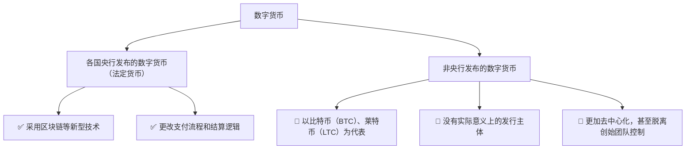

##### 3.5.1.1、传销币 <a href="#前言摘要" style="font-size:17px; color:green;"><b>🔼</b></a>

* 概念
  * 涉及拉人头，拉资金的币，至于是不是数字货币，不好说
  * 早年间的积分盘，本质来说也可称之为传销币，后来五行币，维卡币等基本上属于一类;
* 特点：拉人头返利润，宣传高大上，号称创始人无敌，国家扶持等，某些是内盘交易，无法提现到主流平台进行交易
* 风险
  * 价格完全项目方控盘，由于拉人头泡沫太大，一旦资金跟不上，崩盘跑路那是挥手间的事
  * 其次，由于币无法提到主流所，可能时刻归零跑路

##### 3.5.1.2、主流币 <a href="#前言摘要" style="font-size:17px; color:green;"><b>🔼</b></a>

* 概念  
  * 市面上大多数人认可的加密数字货币  
  * 典型代表有：比特币（BTC）、以太坊（ETH）、莱特币、泰达币（USDT）等  

* 特点  
  * 起步早，社区基础强，用户规模大，整体盘子相对稳定  
  * 技术成熟，一般不存在下架、跑路等风险  
  * 若非极端事件，价格波动一般较小  

* 风险  
  * 最大风险在于：频繁换仓、追涨杀跌、参与高杠杆合约等操作  
  * 此类币由于存量大、发展成熟，短期内价格拉升有限  
  * 想要通过这类币实现财富跃迁，往往需要时间沉淀与长期持有

##### 3.5.1.3、山寨币 <a href="#前言摘要" style="font-size:17px; color:green;"><b>🔼</b></a>

* 概念  
  * `山寨币`不等同于假币  
  * 山寨的意思是“模仿”，严格意义上来说，除了比特币之外的币种理论上都可以归类为山寨币  

* 特点  
  * 由于区块链代码大多开源，复制门槛低  
  * 很多山寨币通过“抄代码 + 改参数”快速上线，甚至自称“最强公链”  
  * 市场上山寨币数量庞大，其中也有做得出色的项目，比如以太坊就是从山寨中跑出来的代表  

* 风险  
  * 数量过多，质量参差不齐，很多项目缺乏真实应用场景  
  * 项目故事类似、包装雷同，普通投资者很难区分  
  * 建议选择**老牌且有一定技术与社区基础的项目**，提高避坑概率

##### 3.5.1.4、空气币 <a href="#前言摘要" style="font-size:17px; color:green;"><b>🔼</b></a>

* 概念  
  * 空气币是指没有实际应用场景支撑的加密货币  
  * 严格来说，目前市面上很多项目都属于空气币范畴  

* 特点  
  * 多为抄袭代码，白皮书内容简单空泛  
  * 缺乏真正的技术创新或落地应用场景支撑  

* 风险  
  * 币价可能随时归零，因缺乏实际共识与价值支撑  
  * 项目多数目的是“割韭菜”，上线即为收割  
  * 虽然也有如“波场”这样的成功逆袭案例，但属于极少数  
  * 从风险控制角度出发，**不建议普通用户轻易参与**

#### 3.5.2、相关代表 <a href="#前言摘要" style="font-size:17px; color:green;"><b>🔼</b></a>

* *资料来源*
  * [Github/比特币源代码](https://github.com/bitcoin/bitcoin)  
  * [Github/比特币源码研读](https://github.com/chaors/Bitcoin_read)  
  * [youtube/「比特币入门系列」第23期，Trc20和erc20有什么区别？erc20，Trc20都是什么链，能相互转账吗？Trc20和erc20怎么转账提现？](https://www.youtube.com/watch?v=8spgN7l7GJ0)  
  * [脚本之家-区块链_/USDT提币Trc20和ERC20有什么区别?](https://m.jb51.net/blockchain/784143.html)  
  * [反向冻结！中国用户收取黑 U 遭美执法机构划转资产](https://www.defidaonews.com/media/6804030)  
  * [知乎/什么是黑U？散户小白收到黑U怎么办？](https://zhuanlan.zhihu.com/p/565664059?utm_id=0)

##### 3.5.2.1、比特币（BTC） <a href="#前言摘要" style="font-size:17px; color:green;"><b>🔼</b></a>

```
起源于1992年"密码朋克"组织
1997~2007 出现了很多失败的数字货币产品:Hashcash、B-Money ===> 技术沉淀
2008、比特币
```

*MacOS 内置的比特币白皮书*

```bash
open /System/Library/Image\ Capture/Devices/VirtualScanner.app/Contents/Resources/simpledoc.pdf
```

```
比特币使用的哈希算法有两种：SHA-256 和 RipeMD160

比特币协议中通常被称为hash256或者dhash:对数据进行两次SHA-256计算
function hash256(data) {
    let h1 = standardHash('sha256', data);
    let h2 = standardHash('sha256', h1);
    return h2;
}
比特币协议中通常被称为hash160:先计算SHA-256，再计算RipeMD160
function hash160(data) {
    let h1 = standardHash('sha256', data);
    let h2 = standardHash('ripemd160', h1);
    return h2;
}
```

##### 3.5.2.2、莱特币（LTC）<a href="#前言摘要" style="font-size:17px; color:green;"><b>🔼</b></a>

* 概念  
  * 莱特币（LTC）最初的设计目的是为了对标比特币（BTC），并解决其网络拥堵与交易确认速度慢的问题  

* 特点  
  * 相较于比特币，莱特币可以通过**消费级硬件**高效挖矿，更加亲民  
  * 平均交易确认时间为 **2.5 分钟**，远快于比特币的 10 分钟  
  * 莱特币网络预计总发行量为 **8400 万枚**，是比特币上限（2100 万枚）的四倍  

* 角色定位  
  * 莱特币被认为是**比特币的辅助币**  
    * 新技术（如隔离见证）通常先在莱特币上测试、验证，再迁移到比特币主链  
    * 用于**处理更高频率的小额支付与转账**场景，减轻比特币主链负担  
  * 被称为：“**比特金，莱特银**”，形成互补关系

##### 3.5.2.3、泰达币（USD₮**或**USDT）<a href="#前言摘要" style="font-size:17px; color:green;"><b>🔼</b></a>

* 概念  
  * 泰达币（USDT）是一种资产支持的加密稳定币，于 2014 年由泰达公司（Tether Limited）推出  
  * 并非由政府或央行发行，而是由私人公司管理的数字资产  

* 背景  
  * Tether Limited 隶属于香港公司 iFinex，该公司同时拥有加密货币交易所 Bitfinex  
  * 泰达币被归类为**稳定币**，其特点是锚定美元 1:1 发行  
  * Tether 公司声称每发行 1 枚 USDT，就会保留 1 美元等值的资产储备  
  * 但由于缺乏透明审计，多次受到监管质疑，并曾被罚款处理  

* 优点  
  * 手续费低  
  * 交易效率高  
  * 保持一定程度的匿名性  

* USDT 当前支持的主流公链共三条：

  * **USDT-Omni（基于 BTC 网络）**  
    * 使用的是建立在比特币区块链之上的 **Omni Layer 协议**  
    * 币安上的 BTC 地址和 USDT-Omni 地址**不同**，充值地址错误将导致资产丢失  
    * 区块浏览器：[https://omniexplorer.info/asset/31](https://omniexplorer.info/asset/31)

  * **USDT-ERC20（基于 Ethereum 网络）**  
    * 走以太坊 ETH 网络，使用标准 ERC20 协议  
    * 币安上的 ETH 地址和 USDT-ERC20 地址**一致**  
    * 合约地址：[https://etherscan.io/address/0xdac17f958d2ee523a2206206994597c13d831ec7](https://etherscan.io/address/0xdac17f958d2ee523a2206206994597c13d831ec7)

  * **USDT-TRC20（基于 TRON 网络）**  
    * 使用 TRON 的 TRC20 协议  
    * 币安上的 TRX 地址和 USDT-TRC20 地址**一致**  
    * **提币无手续费**，因此被广泛使用  
    * 合约地址：[https://tronscan.org/#/contract/TR7NHqjeKQxGTCi8q8ZY4pL8otSzgjLj6t/code](https://tronscan.org/#/contract/TR7NHqjeKQxGTCi8q8ZY4pL8otSzgjLj6t/code)

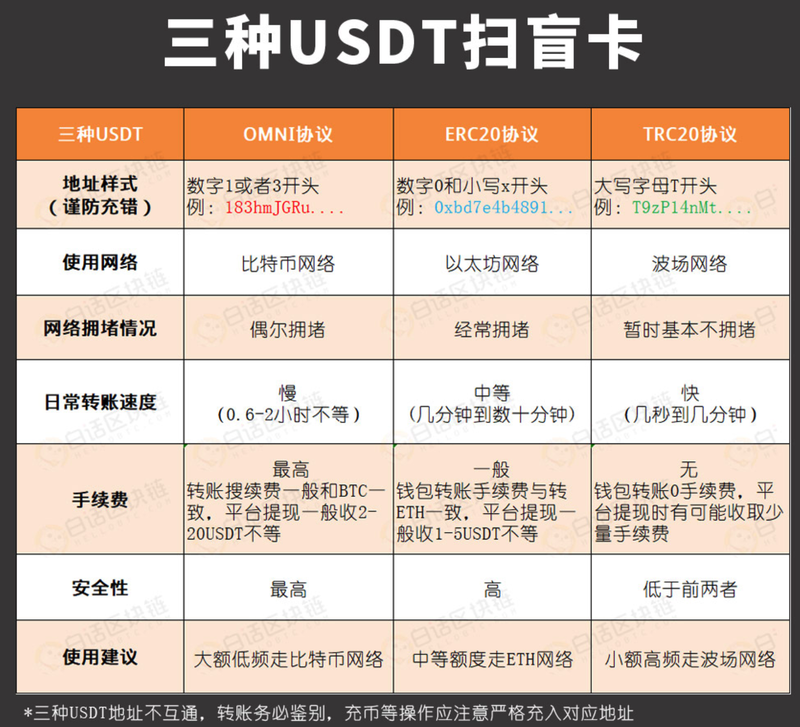

###### 3.5.2.3.1、黑U <a href="#前言摘要" style="font-size:17px; color:green;"><b>🔼</b></a>

*欧美地区法律法规是保护U的把U视为虚拟资产。*

```
黑U被标记了。充值进交易所就会被刑警组织申请锁定或者冻结

说白了，就是用正常的U干了违法的事，事件未公开，未被发觉，这U可能还是干净的。但是一旦被调查或者牵扯案子，U就会被标记，
```

*黑U为何会流入币安、火币等头部交易所呢？*

```
1、头部交易所有一个可以被不法分子利用的优点:交易量大！
2、不法分子所涉及的资金量一般较大，通过头部交易所可以快速出货，将手中的黑U洗白，不至于被查获后，竹篮打水一场空。
```

风险提示与交易建议：*如何避免收到黑U？*

* 不要碰项目方跑路地址流出的 U  
  * 很多项目方发币后直接割韭菜跑路  
  * 来自这类地址的 USDT 虽然未被标记，但风险极高  
  * 比如 6 月份爆发的某些“动物币”项目，就是典型“临时拉盘 + 快速跑路”式割韭菜行为

* 警惕“超低价 U”，避免贪便宜吃大亏  
  * 天上不会掉馅饼，价格异常便宜的 U 很可能涉及洗钱  
  * 不法分子为快速出货，低价抛售问题资产  
  * 贪图便宜，极易被牵连甚至冻卡

* 选择商家要谨慎  
  * 尽量选择**老商家**进行交易  
  * 优先选择**认证齐全、信誉度高**的平台商户或 OTC 个人

* 建议使用交易所购买 USDT 而非直接钱包收款  
  * 交易所具备风控机制，对交易行为有一层安全审核  
  * 通过钱包点对点接收，风险更高，极易被卷入洗钱、诈骗交易链条中

* 避免购买未上线主流交易所的币种  
  * 四大主流交易所：**币安、火币、OKEx、中币（ZB）**  
  * 未上线这些平台的币通常风险极高，缺乏审查机制  
  * 谨防项目“造假市”拉盘割韭菜，也要警惕其被洗钱者利用

###### 3.5.2.3.2、`ERC-20`和`Trc-20 ` <a href="#前言摘要" style="font-size:17px; color:green;"><b>🔼</b></a>

*ERC-20*

* 概念  
  * ERC-20 是一种以太坊（Ethereum）区块链上的代币标准接口  
  * "ERC" 代表 "Ethereum Request for Comments"，而 "20" 是该标准的编号  

* 特点  
  * ERC-20 为以太坊上的代币发行提供了统一接口标准  
  * 该标准确保了不同代币之间可以在以太坊网络中**兼容交换、自由转移**  
  * 具备基本功能接口：
    * 转账（transfer）  
    * 查询余额（balanceOf）  
    * 授权与转账权限控制（approve / transferFrom）  
    * 合约管理与总量查询等  

* 应用  
  * 当前以太坊上绝大多数代币都采用 ERC-20 标准  
  * 常见例子包括：**USDT、LINK、UNI** 等主流代币

*Trc-20*

* 概念  
  * TRC-20 是基于 **波场（TRON）区块链** 的数字代币协议标准接口  
  * 类似于以太坊的 ERC-20 标准  
  * 允许开发者在 TRON 网络上创建、发行自己的代币，并在生态系统中自由交易与流通

* 特点  
  * 支持高吞吐量，网络性能强，交易处理速度快  
  * 转账手续费极低，甚至为零  
  * 因此在日常交易中使用非常广泛，特别适合高频场景下的代币转账需求

* 应用  
  * 波场上的 USDT（稳定币）就是基于 TRC-20 协议发行的  
  * TRC-20 协议兼容 TRON 虚拟机，方便合约部署与集成

* 合约地址  
  * 基于 TRC-20 的 USDT 合约地址：  
    `TR7NHqjeKQxGTCi8q8ZY4pL8otSzgjLj6t`

*为什么 **Trc-20** 相比于 **ERC-20**，手续费成本更低，且耗费的处理时间更少?*

* 手续费优势  
  * 相对于以太坊网络，波场（TRON）网络的交易手续费通常较低  
  * 使用 TRC-20 代币进行交易时，用户需支付的手续费更少，适合高频小额转账

* 共识机制差异  
  * TRC-20 设计结构更加简洁，运行效率更高  
  * 波场采用 **DPoS（委托权益证明）** 共识机制，可实现：
    * 更高的交易吞吐量  
    * 更快的区块确认时间  
  * 相比之下，以太坊早期采用的是 **PoW（工作量证明）**，处理速度较慢，效率偏低

* 开发成本优势  
  * 在波场网络上开发 TRC-20 代币的成本相对较低  
  * TRON 官方提供了成熟的开发工具与框架  
  * 开发者更容易进行代币发行、部署和智能合约集成

* 注意事项  
  * 实际的手续费与处理时间仍可能受到网络拥堵、链上交易量等因素影响  
  * 在选择 ERC-20 还是 TRC-20 时，需综合考虑使用场景、用户群体与平台支持情况

##### 3.5.2.4、TRX <a href="#前言摘要" style="font-size:17px; color:green;"><b>🔼</b></a>

* Tron，又称"波场"，最初作为基于Ethereum的代币而创建，2018年5月正式上线主网。 
* 按照该过程的设计，投资者将Ethereum代币交易为Tron的TRX加密货币，又称"波场币"
* 与以太坊和比特币等基于 PoW 挖矿不同，Tron 采用 DPoS 机制，**用户通过投票选出 27 名验证人来维护 Tron 网络的安全，验证链上交易并创建区块**，这些验证人被称为超级代表（**S**uper **S**epresentatives 简称 **SR**）。

###### 3.5.2.4.1、带宽和能量 <a href="#前言摘要" style="font-size:17px; color:green;"><b>🔼</b></a>

```
在比特币、以太坊上转账时需要通过 BTC、ETH 来支付手续费。在波场进行转账时消耗的是带宽和能量。

BTC、ETH 和 TRX 都是主网币，而基于这些主网创建的代币相当于租住在主网币房东的家里，缴纳手续费的方式是由主网这个房东决定的。
比特币和以太坊立下的规矩是，代币转账需要用 BTC 和 ETH 来支付，而波场立下的规矩则是用能量和带宽来支付。

波场上有两类常见租客（两类常见的代币格式）：Trc-10 和 Trc-20。
转账 TRX 和 Trc-10 代币时需要消耗带宽;
转账 Trc-20 代币时需要消耗带宽和能量。
```

* 免费带宽说明  
  * 每个波场（TRON）账户每天可免费领取 **5000 B（Bandwidth Points，简称 BP）**  
  * 1KB = 1024 B，因此 5000 B ≈ 4.88 KB  
  * 可支持每日约 **10 多笔 TRX 或 TRC-10 代币的免费转账**

* 获取更多带宽或能量的方法

  * 方法一：燃烧 TRX（推荐）  
    * 在波场钱包中保留约 **5~20 个 TRX**  
    * 在进行转账时，系统会自动燃烧 TRX 来抵扣所需的 **带宽或能量**  
    * 适合日常操作，不影响账户锁仓流动性  

  * 方法二：冻结 TRX 获取资源  
    * 进入资产首页，点击“**能量 / 带宽**”进入 Tron 资源管理界面  
    * 选择要获取的资源类型（带宽或能量）  
    * 输入需冻结的 TRX 数量，建议**冻结 100 个 TRX**  
    * 冻结后的 TRX 会在 **3 天后可解冻并取回**  
    * 适合频繁操作或需要大量带宽/能量的用户

* 温馨提示  
  * 对于轻量级用户，默认免费额度或少量燃烧 TRX 已足够  
  * 对于频繁转账、合约交互或 DApp 开发者，建议通过冻结方式长期获取资源，节省成本

###### 3.5.2.4.2、主网币与代币 <a href="#前言摘要" style="font-size:17px; color:green;"><b>🔼</b></a>

* 市场上的数字资产可分为两大类：
  * **主网币（Mainnet Coin）**
  * **代币（Token）**

* 主网币示例（拥有独立区块链网络）：
  * [**ETH**](https://ethereum.org/zh/)、[**BTC**](https://bitcoin.org/en/)、[**ATOM**](https://cosmos.network/)、[**EOS**](https://eosnetwork.com/)、[**TRX**](https://tron.network/)、[**CKB**](https://nervos.org/)、[**BCH**](https://bitcoincash.org/)、[**LTC**](https://litecoin.org/)、[**KSM**](https://kusama.network/)、[**DOT**](https://polkadot.network/)、[**FIL**](https://filecoin.io/)、[**XTZ**](https://tezos.com/) 等
  * **每一个主网币都有自己的共识机制、节点结构与区块系统**

* 钱包区别：
  * 并非每个币种都有**独立的钱包**  
  * **只有主网币**才会拥有以自己名字命名、量身定制的钱包  
  * 而代币只能**寄宿在主网币的钱包结构中**，依附于主网运行  
    * 例如：USDT-ERC20 依附以太坊钱包，USDT-TRC20 依附波场钱包

* 小结：
  * 主网币 = 拥有独立生态、独立网络的“链”；
  * 代币 = 构建在主网之上的资产，没有自己的主链。

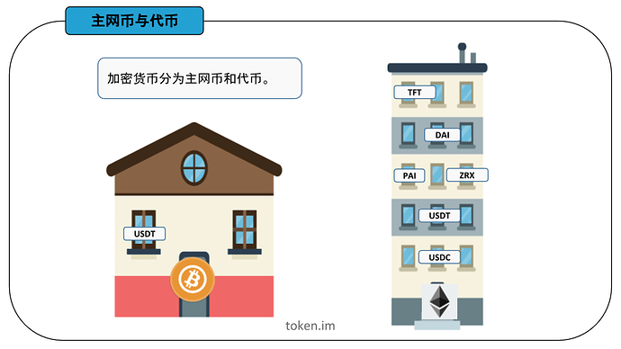

```
比如 USDT 代币，它在比特币钱包、以太坊钱包和波场等钱包里都可以进行存储;
你在交易所提 USDT 时需要进行链名称的选择，有三个选项：ERC-20、Trc-20 和 OMNI。
这三个链名称分别对应着以太坊钱包、波场钱包和比特币钱包。

USDT 是租住在主网币家里的代币，既然是租房子，就得签署租房协议;
不同的房东有不同的要求:
USDT 租住在比特币家里的租房协议叫 Omni，
租住在以太币家里的租房协议叫 ERC-20，
租住在波场币家里的租房协议叫 Trc-20。

若 USDT 提到 BTC 钱包，则选择 OMNI 格式，输入 BTC 钱包地址；
若 USDT 提到 ETH 钱包，则选择 ERC-20 格式，输入 ETH 钱包地址；
若 USDT 提到 TRX 钱包，则选择 Trc20 格式，输入 TRX 钱包地址。
```

**如果你选择的是 ERC-20 格式，但是输入的地址却是比特币钱包或者波场钱包的地址，就会碰到「无效地址」的报错。**

###### 3.5.2.4.3、Tron账户 <a href="#前言摘要" style="font-size:17px; color:green;"><b>🔼</b></a>

* Tron 采用账户模型：
  * 每个账户的唯一标识为地址（address）；
  * 所有对账户的操作都必须使用私钥进行签名；
  * Tron 网络上的一切活动都围绕账户展开。

* 每个账户可拥有的资源包括：
  * TRX（波场币）
  * TRC10 Token
  * 带宽（Bandwidth）
  * 能量（Energy）

* Tron 账户功能：
  * 通过交易可增减 TRX 或 TRC10 Token 余额；
  * 可发布或调用智能合约（包括自己的或他人发布的）；
  * 可申请成为超级代表，参与超级代表选举或进行投票等治理操作。

* 账户类型（两种）：
  * 普通账户（外部账户）：
    * 由持有私钥的人控制；
    * 属于用户个人钱包或交易账户。
  * 合约账户（智能合约）：
    * 是部署在 Tron 网络上的智能合约；
    * 由代码控制，**没有私钥**。

* 所有账户都支持以下操作：
  * 接收、持有和发送 TRX 或其他 tokens；
  * 与智能合约进行交互操作。

* 外部账户的创建流程：
  * 密钥对生成算法与以太坊相同，采用 **ECDSA-secp256k1（椭圆曲线签名算法）**
  * 生成过程：
    * 随机生成一个 64 位十六进制的私钥；
    * 基于私钥生成对应的公钥；
    * 对公钥进行 **Keccak-256 哈希**，取其最后 20 个字节；
    * 在前面添加 `41`，形成 **Hex 格式的 Tron 地址**。

* Tron 地址格式：
  * **Hex 格式地址**：
    * 除了前缀 `41` 外，其余部分与以太坊地址一致；
  * **Base58 格式地址**（更常见）：
    * 对 Hex 地址做 basecheck 编码得到；
    * 所有 Base58 地址以 `T` 开头，是 Tron 钱包和交易所常用的地址形式。

**使用Tronweb进行Hex和Base58格式转换示例**

```javascript
TronWeb.address.toHex("TNPeeaaFB7K9cmo4uQpcU32zGK8G1NYqeL")
> "418840E6C55B9ADA326D211D818C34A994AECED808"

TronWeb.address.fromHex("418840E6C55B9ADA326D211D818C34A994AECED808")
> "TNPeeaaFB7K9cmo4uQpcU32zGK8G1NYqeL"
```

**创建账户的几种方式**

```json
1、使用命令行钱包wallet-cli离线创建账户:

wallet> GenerateAddress
{
    "address": "TU6JdEDQGPus64LTMksvnxF2cv4FQrXPCa",
    "privateKey": "b1ba1db577a36421924a87026cda27523851c6e88123d0a0a1def9a974376176"
}
```

```json
2、使用SDK离线创建账户。以Tronweb为例:

TronWeb.createAccount()
> address:
{
    base58: "TDpBe64DqirkKWj6HWuR1pWgmnhw2wDacE"
    hex: "412A2B9F7641D0750C1E822D0E49EF765C8106524B"
    privateKey: "427139B43028A492E2705BCC9C64172392B8DB59F3BA1AEDAE41C88924960091"
    publicKey:"0404B604296010A55D40000B798EE8454ECCC1F8900E70B1ADF47C9887625D8BAE3866351A6FA0B5370623268410D33D345F63344121455849C9C28F9389ED9731"
}
```

```
3、使用钱包应用生成私钥和地址
```

**激活账户**

```
新创建的账户在链上并不存在，需要激活后，才能通过API查询或者通过区块链浏览器搜索到，可以通过以下两种方式激活账户：

由已有老账户往新账户地址发送任意数量的TRX或者Trc-10代币，完成账户的激活。
使用已有的老账户调用Java-Tron的wallet/createaccount接口创建一个交易，然后签名并广播到网络，也能完成对一个新账户的激活。
激活账户需要支付1TRX的账户创建费用，另外上面两种激活新账户的交易，如果交易发送者账户有足够的质押获得的带宽，那么这笔交易消耗的带宽会从发送者账户质押获得的带宽中扣除，否则，会消耗0.1 TRX来支付带宽费用。

在合约中向一个未激活的账户地址转账TRX或Trc-10代币，也能完成这个账户的激活。这种方式除了正常合约调用需要消耗的带宽和能量外，只会额外消耗25,000 能量，不会消耗1TRX的账户创建费用和0.1TRX的带宽费用。
```

**合约账户**

```
将合约部署到Tron区块链时，得到相应的合约账户地址，该地址由部署合约交易的ID以及发送者账户地址计算所得。合约账户和外部账户的地址格式相同，可以是hex格式或者Base58格式，例如：

Base58: TR7NHqjeKQxGTCi8q8ZY4pL8otSzgjLj6t 
Hex: 41A614F803B6FD780986A42C78EC9C7F77E6DED13C
```

###### 3.5.2.4.4、通证 <a href="#前言摘要" style="font-size:17px; color:green;"><b>🔼</b></a>

* 概念  
  * 通证是区块链生态中一种基于加密技术、共识机制、智能合约与应用目标所构建的链上凭证  
  * 通证集成了多种属性于一体：
    * 货币属性（可交易、支付）
    * 价值属性（可存储、增值）
    * 荣誉属性（如声望积分）
    * 安保属性（控制访问或权限）
    * 确权属性（代表资产或权益的归属）

* 控制与所有权  
  * 通证可以由 **智能合约进行管理与流通**  
  * 也可以由 **持有私钥的钱包地址进行控制和使用**

* 重要性  
  * 通证是区块链体系中的**核心组成部分之一**  
  * 是实现链上激励、治理、交易与资产确权的重要载体

* 通证的分类（目前已广泛应用）：
  * **同质通证（Fungible Token）**：如 ERC-20、TRC-20，等值可互换（如 USDT、UNI 等）
  * **非同质通证（NFT）**：如 ERC-721、TRC-721，每个通证独一无二（如艺术品、游戏道具等）
  * **声望通证 / 荣誉通证**：基于信用积分、用户行为构建，不一定具备交易价值，但具代表性（如 DAO 中的投票权重）

##### 3.5.2.5、数字人民币（e-CNY / Digital RMB） <a href="#前言摘要" style="font-size:17px; color:green;"><b>🔼</b></a>

* 概念  
  * 数字人民币是由中国人民银行发行的法定数字货币，也称为中央银行数字货币（CBDC）  
  * 是人民币的数字化形式，用于替代纸币和硬币  
  * 在电子支付与结算中作为法偿手段使用  

* 特点  
  * 相较于传统电子支付方式，数字人民币具有：
    * 更高的安全性  
    * 可溯源性  
    * 可编程性（如条件支付、智能合约）  
  * 可减少对第三方支付平台的依赖，降低支付成本  
  * 可通过移动设备和数字钱包进行使用与存储  

* 半去中心化特征  
  * 并不完全去中心化，由中国央行进行发行、监管和管理  
  * 交易过程可能采用类似区块链的技术结构，但仍由中央机构监管  
  * 与去中心化加密货币（如比特币）不同，其目标是提高支付效率、替代纸钞，而非去除中央管控  

* 当前状态  
  * 数字人民币正在中国多个城市进行试点与逐步推广  
  * 推广过程中遇到一定的社会、技术与制度阻力  

* 推广阻力分析

  * 基础设施建设  
    * 包括：硬件设备、软件系统、制度规则的建立与实施  
    * 涉及安全支付系统建设、网络安全、欺诈防范等  
    * 新技术对技术能力、安全可靠性的要求高，投入大，周期长  

  * 政策与监管风险  
    * 中国是全球率先试点数字货币的国家  
    * 推出需与现有金融体系（银行、支付平台等）协调政策与监管措施  
    * 包括：反洗钱、KYC、跨系统互操作性等合规要求  

  * 隐私与安全顾虑  
    * 所有交易具备可追溯性  
    * 引发公众对个人隐私保护的担忧与抵触心理  

  * 用户接受度与教育成本  
    * 大多数用户对数字人民币是全新概念  
    * 推广需要大量用户教育与信任建设  
    * 需要官方进行科普宣传以降低认知门槛  

  * 利益相关方阻力  
    * 对第三方支付平台（如支付宝、微信支付）和金融机构形成竞争压力  
    * 相关利益方可能因市场份额和商业利益受损而抵制推广  

  * 商业模式的不确定性  
    * 数字人民币不同于现金、银行卡等既有支付手段  
    * 市场参与者需重新设计商业流程与业务模型，转型成本高  

  * 社会接受度与信任度  
    * 数字人民币作为央行推动的新型企业项目，若缺乏足够信任和社会认同  
    * 上市及广泛应用将面临重大挑战  

  * 前景不确定性  
    * 在全球金融体系中的角色、跨境流通机制、公众反馈等仍需长期观察与评估

#### 3.5.3、加密货币交易所 <a href="#前言摘要" style="font-size:17px; color:green;"><b>🔼</b></a>

* *资料来源*
  * [维基百科/加密货币交易所](https://zh.m.wikipedia.org/zh-hans/%E5%8A%A0%E5%AF%86%E8%B2%A8%E5%B9%A3%E4%BA%A4%E6%98%93%E6%89%80)  
  * [维基百科/Coinbase](https://zh.wikipedia.org/wiki/Coinbase)  
  * [维基百科/Binance](https://en.wikipedia.org/wiki/Binance)  
  * [维基百科/Kraken](https://en.wikipedia.org/wiki/Kraken_(company))  
  * [维基百科/Bitfinex](https://zh.wikipedia.org/zh-hans/Bitfinex)  
  * [维基百科/Huobi](https://en.wikipedia.org/wiki/Huobi)  
  * [维基百科/OKEx](https://en.wikipedia.org/wiki/OKX)

<font color=blue>**加密货币交易所提供了加密货币的交易、存储和管理服务，让用户可以方便地进行数字资产的买卖和交易;**</font>

##### 3.5.3.1、[Coinbase](https://www.coinbase.com/)（比特币基地）<a href="#前言摘要" style="font-size:17px; color:green;"><b>🔼</b></a>

* 该公司成立于2012年。截至2021年3月，Coinbase 是美国🇺🇸交易量最大的加密货币交易所
* 2021年4月13日，Coinbase 股票代码：COIN）在美国纳斯达克交易所上市，成为美国首家上市的加密货币公司

##### 3.5.3.2、[Binance](https://www.binance.com/zh-CN)（币安）<a href="#前言摘要" style="font-size:17px; color:green;"><b>🔼</b></a>

* 2017年，由中国🇨🇳开发者[**赵长鹏**](https://baike.baidu.com/item/%E8%B5%B5%E9%95%BF%E9%B9%8F/22378862)创立，后因为中国大陆政府监管，总部迁出中国大陆
* 该公司推出了两种自行开发的加密货币:币安币 (BNB) 和币安美元 (BUSD);

##### 3.5.3.3、[Kraken <a href="#前言摘要" style="font-size:17px; color:green;"><b>🔼</b></a>](https://www.kraken.com/)

* Kraken 于2011年由加州州立大学萨克拉门托分校的校友 Jesse Powell 与 Thanh Luu 共同创立
* Kraken 是一家总部位于美国的加密货币交易所，它是首批在彭博终端上市的比特币交易所之一

##### 3.5.3.4、[Bitfinex](https://www.bitfinex.com/) <a href="#前言摘要" style="font-size:17px; color:green;"><b>🔼</b></a>

* 由 iFinex Inc 拥有及营运
* 其总部设于香港，注册地区为英属维尔京群岛🇬🇧

##### 3.5.3.5、[Huobi](https://www.huobi.com/)（火币） <a href="#前言摘要" style="font-size:17px; color:green;"><b>🔼</b></a>

* 由[**Leon Li（中文：李林；拼音：Lǐ Lín ）**](https://baike.baidu.com/item/%E6%9D%8E%E6%9E%97/20480262)（清华大学校友）于 2013 年创立于中国🇨🇳
* 目前在香港、韩国、日本和美国设有办事处 在创立火币之前，李在甲骨文担任计算机工程师
* 2018年8月成为香港上市公司
  在中国政府2017年禁止比特币交易之后，火币停止了比特币提款
* 火币中国继续作为区块链咨询和研究平台运营
* 位于东非塞舌尔🇸🇨

##### 3.5.3.6、[OKEx/OKX](https://www.okx.com/cn)（欧易） <a href="#前言摘要" style="font-size:17px; color:green;"><b>🔼</b></a>

```
OKX 前身为 OKEx;
由 Star Xu（徐明星）于 2017 年创立;
OKX 由 OK 集团所有，该集团还拥有加密货币交易所 Okcoin;
全球交易量第二;
位于东非塞舌尔🇸🇨
```

### 3.6、密码货币钱包（又译加密货币钱包）<a href="#前言摘要" style="font-size:17px; color:green;"><b>🔼</b></a>

* *资料来源*
  * [investglass/热与暖与冷：哪个加密货币钱包适合我？](https://www.investglass.com/zh/hot-vs-warm-vs-cold-which-crypto-wallet-is-right-for-me/)  
  * [欧易官网](https://www.okx.com/cn)  
  * [IMToken官网](https://token.im/)  
  * [欧易官网/新手学院](https://www.okx.com/cn/learn)  
  * [权益证明](https://zh.wikipedia.org/wiki/權益證明)  
  * [小科普：助记词和私钥到底是什么?](https://www.odaily.news/post/5140472)

#### 3.6.1、HD钱包 <a href="#前言摘要" style="font-size:17px; color:green;"><b>🔼</b></a>

***HD** = **H**ierarchical **D**eterministic = **分层确定性***

#####  3.6.1.1、简介 <a href="#前言摘要" style="font-size:17px; color:green;"><b>🔼</b></a>

* 在比特币的链上，实际上并没有“账户”的概念  
* 某个用户所持有的比特币，实际上是其控制的一组 **UTXO（未花费交易输出）**  
  * 这些 UTXO 可能属于同一个地址（同一个私钥）  
  * 也可能分布在多个不同地址上（对应多个私钥）  

* 出于隐私保护目的，如果同一用户的所有 UTXO 都来自不同地址  
  * 外部观察者将**很难判断其总持币数量**  
  * 比特币原生就是“去账户、重 UTXO”的体系  

* **HD** 钱包（**H**ierarchical **D**eterministic **W**allet）采用**分层确定性算法**
  * 通过根扩展私钥计算出所有层级的子扩展私钥、公钥与地址  
  * 结构呈现为树状，具备高度灵活性  
  * 每一个扩展密钥可生成：
    * 20 亿个常规子密钥  
    * 20 亿个强化（硬化）子密钥  
  * 每个子密钥又可作为父节点，**继续衍生出 40 亿个密钥**  
  * 整个结构可无限层级扩展，形成庞大的地址树  

* 树状结构虽然灵活，但带来了导航复杂性  
  * 在不同的 **HD** 钱包之间进行资金迁移时，因其**内部路径无限多样**，导航和管理变得困难  
  * 特别是子路径与亚分支结构不同，导致恢复钱包或跨钱包同步数据存在困难  

* **HD** 钱包支持两种子私钥衍生方式：
  * **普通衍生**：可以通过扩展公钥（xpub）计算出对应的子公钥  
  * **硬化衍生（Hardened Derivation）**：更安全，但**无法通过扩展公钥导出子公钥**  

* 通过扩展公钥（xpub）可以：
  * 在**没有扩展私钥的前提下**，计算所有普通子扩展公钥  
  * 实现“观察钱包”功能，仅能查看余额与收款地址，无法进行转账操作

##### 3.6.1.2、一个私钥管理成千上万个地址 <a href="#前言摘要" style="font-size:17px; color:green;"><b>🔼</b></a>

*但是，管理一组成千上万的地址，意味着管理成千上万的私钥，管理起来非常麻烦。*
*能不能只用一个私钥管理成千上万个地址？*
*实际上是可以的。*

```
虽然椭圆曲线算法决定了一个私钥只能对应一个公钥，但是，可以通过某种确定性算法，先确定一个私钥k1，然后计算出k2、k3、k4……等其他私钥;
就相当于只需要管理一个私钥，剩下的私钥可以按需计算出来。
```

*这种根据某种确定性算法，只需要管理一个根私钥，即可实时计算所有"子私钥"的管理方式，称为**HD**钱包。*

##### 3.6.1.3、相关算法 <a href="#前言摘要" style="font-size:17px; color:green;"><b>🔼</b></a>

```
先确定根私钥root，然后根据索引计算每一层的子私钥:

root
│
├─────────────┬─────────────┐
│             │             │
▼             ▼             ▼
k0            k1            k2 ...
│             │             │
├──┬──┐       ├──┬──┐       ├──┬──┐
│  │  │       │  │  │       │  │  │
▼  ▼  ▼       ▼  ▼  ▼       ▼  ▼  ▼
k0 k1 k2 ...  k0 k1 k2 ...  k0 k1 k2 ...
```

*对于任意一个私钥 **k**，总是可以根据索引计算它的下一层私钥 **k<sub>n</sub>***

***k<sub>n</sub>** = hdkey(k,n),即 **HD** 层级实际上是无限的，每一层索引从0～232，约43亿个子key。这种计算被称为衍生（Derivation）*

```
现在问题来了: 如何根据某个私钥计算下一层的子私钥？即函数 hdkey(k, n) 如何实现？

HD 钱包采用的计算子私钥的算法并不是一个简单的 SHA-256，私钥也不是普通的256位 ECDSA 私钥，而是一个扩展的512位私钥，记作 xprv，它通过 SHA-512算法配合 ECC 计算出子扩展私钥，仍然是512位。
通过扩展私钥可计算出用于签名的私钥以及公钥。

简单来说，只要给定一个根扩展私钥（随机512位整数），即可计算其任意索引的子扩展私钥。扩展私钥总是能计算出扩展公钥，记作 xpub:

xprv ────────> xpub
  │              │
  │              │
  │              │
  ▼              ▼
xprv-0 ──────> xpub-0
从 xprv 及其对应的 xpub 可计算出真正用于签名的私钥和公钥。
之所以要设计这种算法，是因为扩展公钥 xpub 也有一个特点，那就是可以直接计算其子层级的扩展公钥:

xpub
│
├───────┬───────┐
│       │       │
▼       ▼       ▼
xpub-0  xpub-1  xpub-2  ...
因为 xpub 只包含公钥，不包含私钥，因此，可以安全地把 xpub 交给第三方（例如，一个观察钱包），它可以根据 xpub 计算子层级的所有地址，然后在比特币的链上监控这些地址的余额，但因为没有私钥，所以只能看，不能花。

因此，HD钱包通过分层确定性算法，实现了以下功能:

只要确定了扩展私钥 xprv，即可根据索引计算下一层的任何扩展私钥;
只要确定了扩展公钥 xpub，即可根据索引计算下一层的任何扩展公钥;
用户只需保存顶层的一个扩展私钥，即可计算出任意一层的任意索引的扩展私钥。
从理论上说，扩展私钥的层数是没有限制的，每一层的数量被限制在0～232，原因是扩展私钥中只有4字节作为索引，因此索引范围是0～232。

通常把根扩展私钥记作 m，子扩展私钥按层级记作m/x/y/z等:

m
│
├──────────────────────┐
│                      │
▼                      ▼
m/0                    m/1 ...
│                      │
├─────┬─────┐          ├─────┬─────┐
│     │     │          │     │     │
▼     ▼     ▼          ▼     ▼     ▼
m/0/0 m/0/1 m/0/2 ...  m/1/0 m/1/1 m/1/2 ...

例如，m/0/2表示从m扩展到m/0（索引为0）再扩展到m/0/2（索引为2）。
```

##### 3.6.1.4、安全性 <a href="#前言摘要" style="font-size:17px; color:green;"><b>🔼</b></a>

```
HD 钱包给私钥管理带来了非常大的方便，因为只需要管理一个根扩展私钥，就可以管理所有层级的所有衍生私钥。
但是 HD 钱包的扩展私钥算法有个潜在的安全性问题:就是如果某个层级的 xprv 泄露了，可反向推导出上层的 xprv，继而推导出整个 HD 扩展私钥体系。

为了避免某个子扩展私钥的泄漏导致上层扩展私钥被反向推导，HD 钱包还有一种硬化的衍生计算方式（Hardened Derivation），它通过算法"切断"了母扩展私钥和子扩展私钥的反向推导。
HD 规范把索引0～231作为普通衍生索引，而索引231～232作为硬化衍生索引，硬化衍生索引通常记作0'、1'、2'……，即索引0'=231，1'=231+1，2'=231+2，以此类推。

因此，m/44'/0表示的子扩展私钥，它的第一层衍生索引44'是硬化衍生，实际索引是231+44=2147483692。从m/44'/0无法反向推导出m/44'。

在只有扩展公钥的情况下，只能计算出普通衍生的子公钥，无法计算出硬化衍生的子扩展公钥，即可计算出的子扩展公钥索引被限制在0～231。
因此，观察钱包能使用的索引是0～231。
```

##### 3.6.1.4、地址监控 <a href="#前言摘要" style="font-size:17px; color:green;"><b>🔼</b></a>

***HD**钱包通过 **Bloom Filter**可以高效监控链上的所有地址，并根据是否是本地管理的地址决定如何计算钱包余额。*

```
一个 HD 钱包管理的是一组自动计算的地址。
以比特币为例，在确定了根扩展私钥m后，得到一组地址为m/44'/0'/0'/0/x，其中x=0~231。

HD 钱包需要在链上监控每个TX的输入和输出，看看上述管理的一组地址是否存在与输入和输出中;
如果作为输入，则钱包余额减少，如果作为输出，则钱包余额增加。

现在问题来了:如何根据TX的输入和输出地址快速判断这些地址中是否存在HD钱包管理的地址？

首先，可用的地址高达231个，这个数太大了，用户不可能用完，
因此，HD 钱包只会预生成前1000个地址（即索引号为0～999）并保存在本地数据库中，如果不够了，再继续扩展1000个，
这样，HD 钱包管理的地址数量不会太大。

其次，要在上千个地址集合中快速判断某个地址是否存在，查询数据库是一个非常低效的方式。以哈希表存储在内存中虽然效率很高，但管理的集合数量太多，占用的内存会非常大。

要做到高效的查询和低空间占用率，可以使用布隆过滤器（Bloom Filter）;
它是由 Burton Howard Bloom 在1970年提出的，其原理是将每个元素通过若干个哈希函数映射成一个位数组的若干个点，将其置1;
检索的时候，先计算给定元素对应位是否全1，如果是全1，则给定元素很可能存在，否则，元素必定不存在。

因此，Bloom Filter 有个重要特点:
就是判断元素时，如果不存在，那么肯定不存在，
如果存在，实际上是以一定概率存在（例如，99%），还需要再次从数据库查询以确定元素真的存在。

Bloom Filter 的缺点就是它无法100%准确判断存在，此外，添加新的元素到 Bloom Filter 很容易，但删除元素就非常困难。构造 Bloom Filter 时，要先预估元素个数并给定存在概率，才能计算所需的内存空间。

Bloom Filter 广泛用于垃圾邮件地址判断，CDN服务等。
Bloom Filter 也非常适合 HD 钱包监控链上每个交易的地址。
```

#### 3.6.2、`BIP`协议 <a href="#前言摘要" style="font-size:17px; color:green;"><b>🔼</b></a>

* *资料来源*
  * [阿里云/开发者社区/Bytom BIP-32协议和BIP-44协议](https://developer.aliyun.com/article/690942)  
  * [bip协议是什么](https://wiki.bsatoshi.com/part-ii/protocol_bip)  
  * [巴比特/比特币Taproot升级终于要来了！一文了解它的过去、现在与未来](https://www.8btc.com/article/6702629)

***BIP** = **B**itcoin **I**mprovement **P**roposal = 比特币改进建议*

##### 3.6.2.1、简介 <a href="#前言摘要" style="font-size:17px; color:green;"><b>🔼</b></a>

```
由 Amir Taaki 于 2011 年在 BIP 0001 中提出，并由 Luke Dash Jr. 在 BIP 0002 中对其进行了扩展;
```

##### 3.6.2.2、`BIP`协议的种类 <a href="#前言摘要" style="font-size:17px; color:green;"><b>🔼</b></a>

*标准类、信息类和进程类。所有 BIP 都会经历同样的提交、审核和激活过程，因此，这三类 BIP 唯一的不同就在于各自要实现的目标*

* 标准类 BIP
  * 提交目的是改变网络协议或其他足以影响到互通性的运营模式或功能
  * 包括交易验证和区块容量参数等内容

* 信息类 BIP
  * 主要解决设计问题，建立通用指南
  * 与标准类 BIP 不同，这类 BIP 通常会提出全新的网络功能

* 进程类 BIP
  * 与标准类类似，但提出的是比特币协议以外的进程更改

##### 3.6.2.3、提交`BIP`标准 <a href="#前言摘要" style="font-size:17px; color:green;"><b>🔼</b></a>

* 草案阶段
  * BIP 作为草案提交给比特币开发邮件列表和 BIP Github 代码仓库

* 提议阶段
  * BIP 包括了一个含有部署 BIP 计划的工作执行方案

* 最终阶段
  * BIP 符合现实世界的采用标准
  * 必须客观地验证这一点

##### 3.6.2.4、已经提案通过的`BIP` <a href="#前言摘要" style="font-size:17px; color:green;"><b>🔼</b></a>

* **BIP 0011**（多重签名输出）

* **BIP 0032**
  * 为了避免管理大量私钥，提出了分层推导方案
  * 也称为 HD（分层确定性）钱包

* **BIP 0044**
  * 是对 **BIP-0032** 的分层增强，规范了路径定义
  * 增加了对多币种和多账户的支持
  * 基于 **BIP-0032** 和 **BIP-0032** 的目的方案定义确定性钱包的逻辑层级
  * 为树状结构中的各层赋予特定含义
  * 同一个种子支持多币种、多账户结构

* **BIP 0039**
  * 通过定义助记词，更方便备份和转移钱包
  * 从单一“种子”生成树状结构，用于管理多组私钥和公钥
  * 支持跨设备迁移与分层权限控制

* **BIP 0152**（致密区块中继）

##### 3.6.2.5、协议原英文地址 <a href="#前言摘要" style="font-size:17px; color:green;"><b>🔼</b></a>

* [**BIP-32 协议**](https://github.com/bitcoin/bips/blob/master/bip-0032.mediawiki#extended-keys)
* [**BIP-44 协议**](https://github.com/bitcoin/bips/blob/master/bip-0044.mediawiki)

##### 3.6.2.6、具体代码实现 <a href="#前言摘要" style="font-size:17px; color:green;"><b>🔼</b></a>

* [**BIP-32/44**](https://github.com/Bytom/bytom/blob/master/blockchain/signers/signers.go)

##### 3.6.2.7、数字货币钱包的私钥 <a href="#前言摘要" style="font-size:17px; color:green;"><b>🔼</b></a>

*私钥 3 连问*

**私钥就是你区块链世界的资产的唯一凭证，拥有了私钥的，便拥有了对应地址上的资产。**

```
你的收币地址是怎么诞生的？
是私钥计算的。

你的交易怎样授权发出去的？
是私钥签名的。

你的资产怎样在钱包恢复的？
是私钥帮忙的。
```

*比特币私钥简介*

```
比特币私钥本质上就是一个随机数，就跟你扔骰子扔出一个数字来是一个东西。
不过比特币的私钥会比较长一些，再具象一点，是一个256位，由0和1组成的数字。
0100101…01010100  (共256位)

那么问题来了，这么多0和1看都看晕了，还怎么备份？

中本聪发明了一种特殊编码（Base58）可以将一大串01010转化为较容易备份的样子。

比如下面这段字符，这就是我们常见的私钥的形态:
KwYHFL7WfhJPkfQkp1LsUwHvy1Pd9KynuxjjVDMZvRSV5D9VJq3v
这样的私钥"相对"来说还是比较容易备份和输入的
注意:私钥一般为5、K、L开头
```

###### 3.6.2.7.1、`Base58` 编码方式 <a href="#前言摘要" style="font-size:17px; color:green;"><b>🔼</b></a>

* *资料来源*
  * [维基百科/Base58](https://zh.wikipedia.org/wiki/Base58)

*`Base58`简介*

```
1、Base58 是用于比特币（BTC）中使用的一种独特的编码方式，主要用于产生 比特币（BTC）的钱包地址;
2、相比Base64，Base58 不使用数字"0"，字母大写"O"，字母大写"I"，和字母小写"l"，以及"+"和"/"符号;

设计 Base58 主要的目的是:
1、避免混淆。在某些字体下，数字0和字母大写O，以及字母大写I和字母小写l会非常相似;
2、不使用"+"和"/"的原因是非字母或数字的字符串作为帐号较难被接受;
3、没有标点符号，通常不会被从中间分行;
4、大部分的软件支持双击选择整个字符串;
```

##### 3.6.2.8、数字货币钱包的助记词 <a href="#前言摘要" style="font-size:17px; color:green;"><b>🔼</b></a>

*助记词的形态*

```
最常见的助记词就是一组12个单词

举例:形如👇🏻
1、health   2、fine       3、profit       4、below 
5、crowd 	 6、wish       7、task         8、gown 
9、mind     10、surge     11、apple       12、max
```

*助记词的作用*

**助记词就是你区块链世界的资产的唯一凭证，拥有了助记词的，便拥有了对应地址上的资产。**

```
你的收币地址是怎么诞生的？
是助记词计算的。

你的交易怎样授权发出去的？
是助记词签名的。

你的资产怎样在钱包恢复的？
是助记词帮忙的。
```

##### 3.6.2.9、"助记词"和"私钥"的关系 <a href="#前言摘要" style="font-size:17px; color:green;"><b>🔼</b></a>

* 助记词和私钥在功能上是一致的

* 助记词本质也是一串随机数（128—256位）
  * 因为随机数和私钥都不方便直接使用，所以比特币社区通过了 BIP39 协议
  * 允许将随机数通过特定编码转化为词库中的单词
  * 比特币改进协议（Bitcoin Improvement Proposals，简称 BIP），为比特币社区提供规范和设计指导

* 助记词不用区分大小写，都是较常见的英文单词
  * 相比私钥更方便记忆和输入
  * 因此助记词钱包已逐渐成为主流

* 助记词钱包的另一个优点：
  * 一组助记词可以派生出多个私钥
  * 每个私钥都可用于不同币种（如 BTC、ETH、LTC、EOS 等）
  * 不需为每个币种单独保存私钥，只需保存助记词即可掌控所有资产

* 助记词的生成依赖以下 BIP 协议：
  * BIP32、BIP39、BIP44
  * 只要遵循这些标准协议，不同钱包之间助记词是可以互通的
  * 但由于钱包安全性不同，不建议混用助记词在不同钱包中

* 恢复助记词时报错“无效的助记词”的原因：
  * 通常是因为抄错了某个单词
  * 助记词来自固定词库，可以尝试在词库中查找相近单词替换

  * 官方词库地址：
    * [**英文词库**](https://github.com/bitcoin/bips/blob/master/bip-0039/english.txt)：https://github.com/bitcoin/bips/blob/master/bip-0039/english.txt
    * [**中文词库**](https://github.com/bitcoin/bips/blob/master/bip-0039/chinese_simplified.txt)：https://github.com/bitcoin/bips/blob/master/bip-0039/chinese_simplified.txt

#### 3.6.3、密码货币钱包的类型 <a href="#前言摘要" style="font-size:17px; color:green;"><b>🔼</b></a>

##### 3.6.3.1、按照去中心化程度 <a href="#前言摘要" style="font-size:17px; color:green;"><b>🔼</b></a>

###### 3.6.3.1.1、全节点钱包 <a href="#前言摘要" style="font-size:17px; color:green;"><b>🔼</b></a>

```
此种钱包需要先进行软件安装，安装后会与整个区块链进行同步，存储整个区块链。
所以全新钱包开始同步时，必须从第一笔资料开始下载，会花上数小时～数十日的时间，并且占用为数不小的存储空间与网络流量。
这样的钱包又称为完整节点。
由于此种钱包能提供所对应的加密货币网络完整区块链与服务，所以可以提升该加密货币网络的完整性与可靠性，因此某些加密货币，会对持有这种钱包的用户进行奖励。
```

###### 3.6.3.1.2、`SPV`钱包 <a href="#前言摘要" style="font-size:17px; color:green;"><b>🔼</b></a>

***S**implified **P**ayment **V**erification wallet* = **简单支付验证钱包** = **轻钱包**

```
与前者比，此种钱包仅存储私钥与结算，不存储整个区块链，所以占用资源很少，较适用于移动设备。
在线钱包（不保管私钥）:一般设计为网页形式，在网站产生私钥后，由个人保管，日后要访问钱包时必须输入私钥，网站不负责替用户保存。
使用概念上类似于SPV钱包的网页版。
使用此类网站，应挑选有信誉的品牌，以及注意是否为仿冒的钓鱼网站。
```

###### 3.6.3.1.3、中心化钱包 <a href="#前言摘要" style="font-size:17px; color:green;"><b>🔼</b></a>

```
在线钱包（保管私钥）:
一般设计为网页形式，同时保管你的私钥;
此类网站风险较高，因为掌握你的私钥，也就等于掌握你该私钥下的加密货币资产;

交易所钱包:
各交易所为了能够出入币，也都会提供对应该币的钱包地址;
此种钱包不会提供私钥给用户，所以一旦存入，就只能依靠交易所的机制来提领;
这同时也算是一种在线钱包;
```

##### 3.6.3.2、按照私钥存储方式 <a href="#前言摘要" style="font-size:17px; color:green;"><b>🔼</b></a>

###### 3.6.3.2.1、冷钱包 <a href="#前言摘要" style="font-size:17px; color:green;"><b>🔼</b></a>

也称 **离线钱包** 或者 **断网钱包 **<a href="#前言摘要" style="font-size:17px; color:green;"><b>🔼</b></a>

```
意指网络不能访问到用户私钥的钱包。
冷钱包通常依靠"冷"设备（不联网的电脑、手机等）确保比特币私钥的安全，运用二维码通信让私钥不触网，避免了被黑客盗取私钥的风险，但是也可能面临物理安全风险（比如电脑丢失，损坏等）。
将私钥存储至不会与网络连线的设备上，包括打印、手抄（纸钱包），甚至自行背诵（脑钱包），以确保存储期间的绝对安全。不过上述钱包在进行交易时，仍必须将私钥输入到一般软件钱包，而最高标准的冷钱包，还必须能进行离线签署，只将签署过的交易发出来。
将私钥存储在额外的特制硬件设备，使用时交易需在硬件内部进行交易签署才提交，只要硬件没有被破解，就绝对安全。
如果此硬件设备完全离线、只提交签署过的交易消息，那同时也是最高标准的冷钱包。
```

###### 3.6.3.2.2、暖钱包 <a href="#前言摘要" style="font-size:17px; color:green;"><b>🔼</b></a>

```
暖钱包是热钱包和冷钱包的混合体。
它们不总是在线，但在需要时可以连接到互联网。
暖钱包通常是硬件钱包，离线存储你的私钥，但当你想转移或交易你的加密货币时可以连接到互联网。

暖钱包提供了比热钱包更高的安全水平，因为它们离线存储私钥。
然而，它们不太方便，因为需要时需要人工干预以连接到互联网。
```

###### 3.6.3.2.3、热钱包 <a href="#前言摘要" style="font-size:17px; color:green;"><b>🔼</b></a>

*也称 **在线钱包** 或者 **联网钱包** （Online Wallet）*

```
也就是网络能够访问到用户私钥的钱包。
热钱包因其联网特性，外人可能通过互联网访问用户的私钥，因此安全性比冷钱包低，但比冷钱包更便利。
另外，无论是使用冷钱包还是热钱包，私钥都是关键所在。
```

##### 3.6.3.3、其他钱包 <a href="#前言摘要" style="font-size:17px; color:green;"><b>🔼</b></a>

###### 3.6.3.3.1、观察钱包 <a href="#前言摘要" style="font-size:17px; color:green;"><b>🔼</b></a>

```
观察钱包本质上是一个观察特定地址链上数据的区块浏览器。

用户只需使用观察钱包导入账户（公钥）或地址即可拥有便捷的使用的体验，通过观察钱包可以查看账户（地址）资产，交易记录等内容。
因此观察钱包是无法直接进行转账等链上操作的,若需要转账可将私钥或助记词导入钱包或搭配冷钱包授权使用。
```

###### 3.6.3.3.2、多签钱包 <a href="#前言摘要" style="font-size:17px; color:green;"><b>🔼</b></a>

```
与多签钱包对应的是单签钱包，我们要往区块链上发送一笔转账操作，需要用钱包生成一个签名，我们自己签好名把交易发送出去，这就是典型的单签钱包，也是我们平时常用的钱包。

多签钱包，顾名思义，就是需要多个人去签名执行某个操作的钱包。
使用多签钱包进行转账，往往需要 >= 1 个人去签名发送交易，转账操作才可以完成。
使用多签钱包时，我们可以指定 m/n 的签名模式，就是 n 个人里面有 m 个人签名即可完成操作。比如 2/3 签名模式，就是 3 个人里面有两个人签名就可以。
ETH/ERC20 (包括 BSC/BEP20 等EVM链）的多签采用轻量智能合约（smart contract）方式。
```

* 适用场景：
  * 用于需要多人管理资产，避免资产被个人挪用
  * 通过多签对资产进行多重加密，增强资产安全性
  * 其他安全应用场景

###### 3.6.3.3.3、插件钱包 <a href="#前言摘要" style="font-size:17px; color:green;"><b>🔼</b></a>

```
插件钱包是指基于浏览器（主要是google chrome）开发的插件钱包；
其包含了一般钱包都基础操作：比如转账，授权调用合约，导入/导出/创建钱包账号等等操作。

浏览器插件钱包是一类轻钱包，和APP一样，不需要同步全节点数据，同时也不会存钱包资料，所有钱包的私钥和密码都由使用者本身持有
```

#### 3.6.4、`MPC`多方计算  <a href="#前言摘要" style="font-size:17px; color:green;"><b>🔼</b></a>

* *资料来源*
  * [MPC 钱包即服务 - Safeheron](https://www.safeheron.com/zh-CN/mpc-wallet)  
  * [钱包2.0时代：MPC钱包 vs 智能合约钱包](https://www.binance.com/zh-CN/news/top/7248497)  
  * [知乎/一文读懂MPC和智能合约钱包](https://zhuanlan.zhihu.com/p/584460842)  
  * [Foresight News/详解MPC 和智能合约钱包的优缺点与面临的挑战](https://foresightnews.pro/article/detail/19288)  
  * [如何比较MPC 钱包提供商: 5大方面 - Qredo](https://www.qredo.com/zh-cn/blog/comparing-mpc-solutions)  
  * [YouTube/MPC钱包原理和实战](https://www.youtube.com/watch?v=Da9dhEK3vg0)  
  * [Web3入口革命：為何MPC錢包比Metamask 等傳統錢包更安全](https://www.blocktempo.com/why-mpc-wallet-safer-and-more-suitable-for-novices-than-traditional-wallets/)

```
多方计算 MPC 是一种加密技术，它允许多方在其私人输入上联合计算一个函数而不向对方透露其输入。
常见的 MPC 多方计算算法包括安全多方计算(Secure Multi-party Computation，SMC)、同态加密(Homomorphic Encryption，HE)等
它是一种对数据进行安全计算的方式，而不向任何人透露数据，包括参与计算的其他各方。

MPC 是一种先进的安全措施，可以大大增强数字资产的安全性。被广泛应用于数据保密性要求较高的场景;
包括:安全数据共享、安全投票、安全金融交易、医疗、智能制造等领域;
在加密货币的背景下，MPC可用于保护钱包和保护私钥，确保数字资产保持安全，即使一方的私钥被破坏;
MPC 可以减少盗窃、欺诈和其他安全漏洞的风险;
MPC可以成为保护你的数字资产的一种有效方式，特别是当你与多方合作或担心你的私钥安全时。

MPC 是一种先进的加密技术，可能需要专门的知识和专长来正确实施。
如果你正在考虑使用 MPC 来保护你的数字资产，你应该向安全专家咨询，或者寻找一个在实施 MPC 解决方案方面有经验的知名服务提供商。
```

#### 3.6.5、数字钱包的一些注意事项 <a href="#前言摘要" style="font-size:17px; color:green;"><b>🔼</b></a>

*丢失私钥与误发送*

```
如果一旦丢失了私钥、或是误将钱币发送到错误的地址，以现今的技术，几乎不可能再把货币取回来，而这一批货币也相当于被消灭了。

不过有一种状况是例外，就是在使用共同加密机制的前提下，误将 A 种货币，发送到了使用中的 B 种币的地址。
由于 A 种币与 B 种币使用同样的加密签名方式，所以只要持有B种币地址的私钥，就能取回同位置的 A 种币。
例如将以太币发送到一个以太坊经典的位置，那就持后者的私钥去以太坊钱包取回即可。

由此可知，如果你在一种货币发生硬分岔、形成两种货币后，曝露自己任一种货币的私钥，都可能会导致同地址上另一种货币的不安全。
```

### 3.7、发行数字货币 <a href="#前言摘要" style="font-size:17px; color:green;"><b>🔼</b></a>

* *资料来源*
  * [Youtube/10分钟发行自己的加密货币，零基础教学 | 2021 （ETH， BTC）](https://www.youtube.com/watch?v=x2ZRyloHyG8)  
  * [发行Trc-20代币教程](https://cn.developers.Tron.network/docs/issuing-Trc20-tokens-tutorial)  
  * [在波场转账时的能量和带宽是什么？](https://imtoken.fans/t/topic/38625)  
  * [手把手教你把资产提到钱包](https://imtoken.fans/t/topic/24171)

#### 3.7.1、遵循的步骤 <a href="#前言摘要" style="font-size:17px; color:green;"><b>🔼</b></a>

* 定义目标：确定你的数字货币的目标、用途和特点。需要明确自己的目标受众、数字货币的发行总量、货币供应机制、数字货币类型
  * 比如基于比特币的货币或基于以太坊的 ERC20 代币等

* 建立团队：成立一个专业团队，包括经验丰富的开发人员、网络安全专家和市场营销人员等，明确各个团队成员职责

* 技术选择：选择合适的区块链平台或技术来构建你的数字货币
  * 常用的区块链平台包括以太坊、EOS、Stellar 等
  * 可以选择使用现有的区块链技术，或者自己搭建一个区块链网络

* 创建代币：在选择的区块链平台上创建你的代币
  * 确定货币的参数：如币名、供应量、挖矿算法、挖矿奖励、白皮书等
  * 编写智能合约源代码，规定代币的发行规则和功能
  * ICO 或发行策略：确定你的数字货币的发行方式
    * 确保发行策略合法合规，并考虑如何吸引投资者
    * 可选择进行 ICO（Initial Coin Offering）或其他策略，如空投或私募
  * 测试源代码（出于安全性考虑），确保数字货币功能和系统可靠
    * 修复代码漏洞、改进结构，确保安全性并提升用户体验
  * 上架交易所，以获取用户并进入交易流通环节

* 宣传和推广：数字货币发布后，需要广泛宣传和推广活动
  * 建立社区、与交易所合作、开展宣传活动
  * 社交媒体推广、新闻发布、演讲、品牌合作等渠道

#### 3.7.2、在波场（Tron）发布属于自己的数字货币（Trc-20代币） <a href="#前言摘要" style="font-size:17px; color:green;"><b>🔼</b></a>

##### 3.7.2.1、[**安装TronLink Chrome插件**](https://chrome.google.com/webstore/detail/Tronlink/ibnejdfjmmkpcnlpebklmnkoeoihofec) <a href="#前言摘要" style="font-size:17px; color:green;"><b>🔼</b></a>

##### 3.7.2.2、准备一个账户用户发行 <a href="#前言摘要" style="font-size:17px; color:green;"><b>🔼</b></a>

* 创建一个波场（Tron）钱包（如TronLink、TronWallet、MathWallet、BitKeep等。或其他支持Tron的钱包）并存入TRX作为Gas
* 可通过 创建账户、导入账户、链接硬件钱包 三种方式。需要确保账户中有1000个以上的TRX

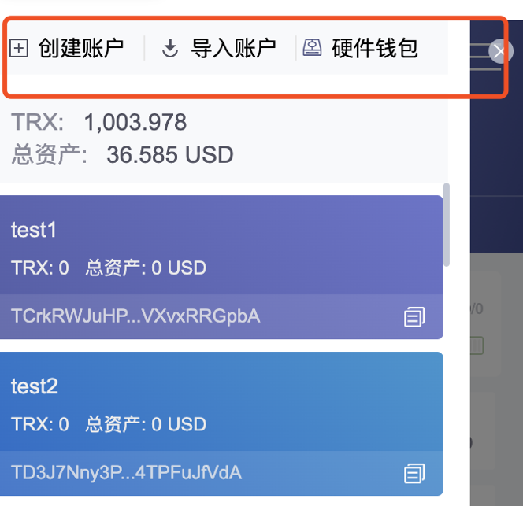

##### 3.7.2.3、准备Trc20合约代码 <a href="#前言摘要" style="font-size:17px; color:green;"><b>🔼</b></a>

*[Trc20合约模版](https://github.com/Tron-Developer-Hub/Trc20-Contract-Template/blob/main/Token.sol)*

```javascript
https://github.com/Tron-Developer-Hub/Trc20-Contract-Template/blob/main/Token.sol
```

修改Token.sol文件，定义 **token名称**、**token符号**、**精度**、**发行量**

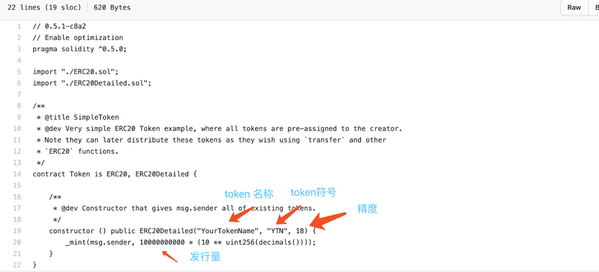

##### 3.7.2.4、部署Trc20合约 <a href="#前言摘要" style="font-size:17px; color:green;"><b>🔼</b></a>

*[使用Tronscan进行部署](https://Tronscan.io/#/contracts/contract-compiler)*

###### 3.7.2.4.1、链接钱包 <a href="#前言摘要" style="font-size:17px; color:green;"><b>🔼</b></a>

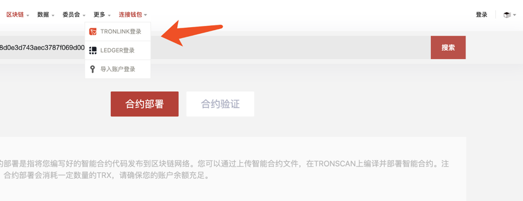

###### 3.7.2.4.2、上传合约代码 <a href="#前言摘要" style="font-size:17px; color:green;"><b>🔼</b></a>

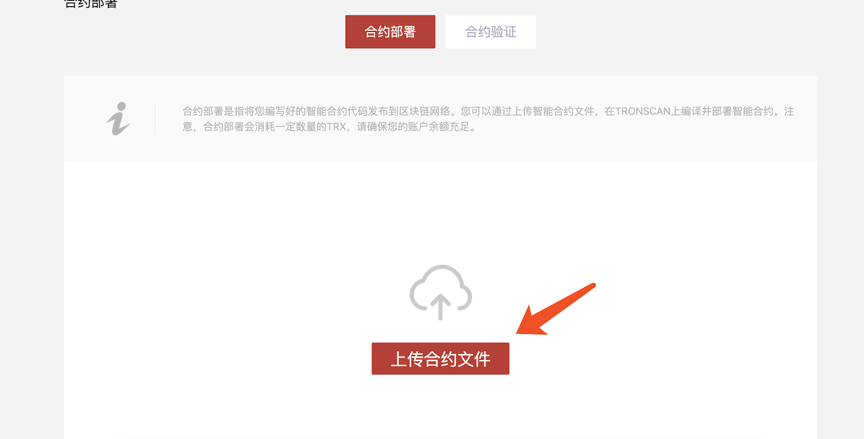

###### 3.7.2.4.3、编译合约（请选择0.5.10版本编译器） <a href="#前言摘要" style="font-size:17px; color:green;"><b>🔼</b></a>

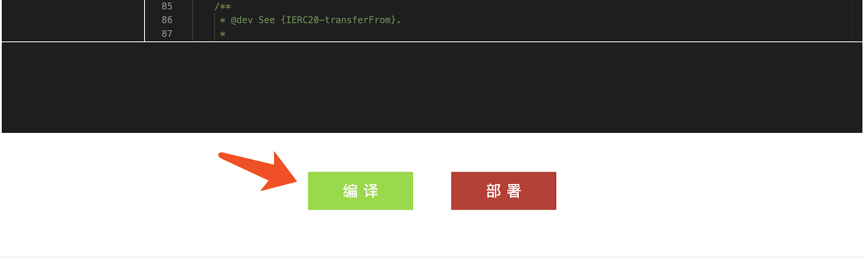

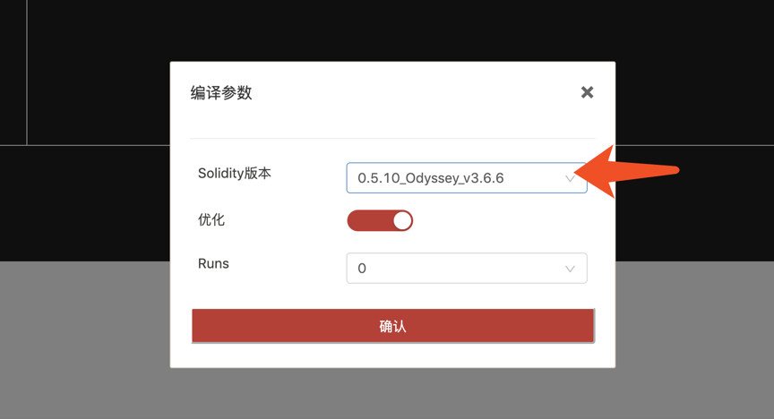

**出现如下提示，表示编译成功**

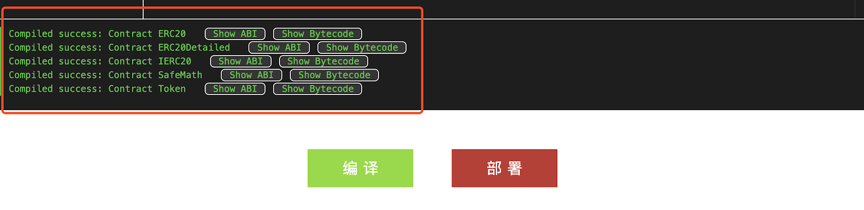

###### 3.7.2.4.4、部署合约 <a href="#前言摘要" style="font-size:17px; color:green;"><b>🔼</b></a>

**请注意一定要选择Token合约，因为Token是主合约**

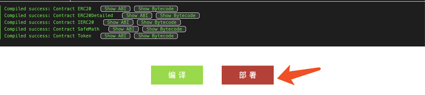

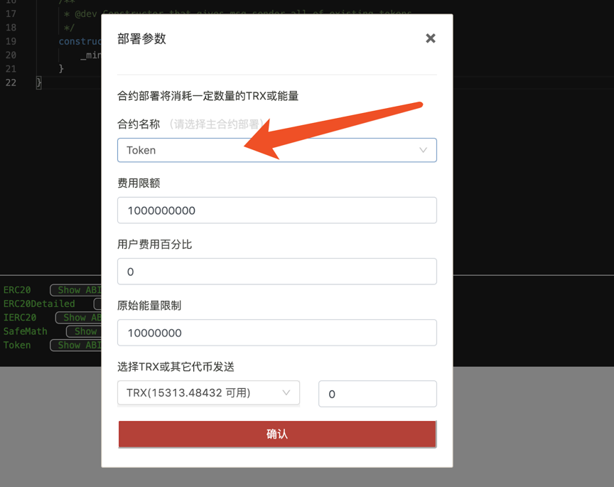

**点击确认进行部署，会弹出Tronlink签名对话框，点接受进行签名**

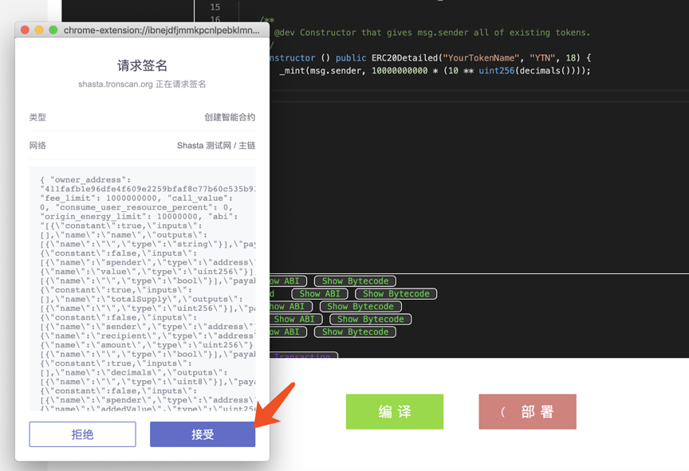

**部署成功，得到合约地址， 请记录下合约地址**

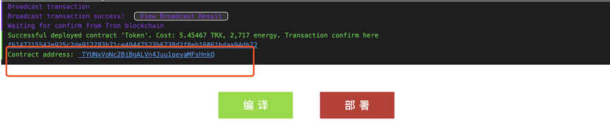

##### 3.7.2.5、录入Trc20通证 <a href="#前言摘要" style="font-size:17px; color:green;"><b>🔼</b></a>

[使用Tronscan进行录入](https://Tronscan.org/#/tokens/create/Type)

###### 3.7.2.5.1、选择通证类型录入 <a href="#前言摘要" style="font-size:17px; color:green;"><b>🔼</b></a>

**选择Trc20通证，点击确定**

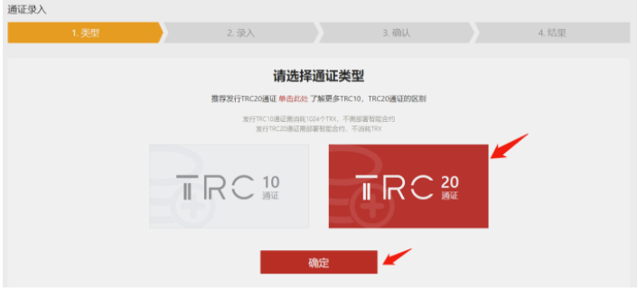

**录入Trc20通证的信息**

```
填写通证的基本信息，合约信息和社交信息。标“*”的内容是必填信息。录入的信息需要和 Trc20合约的信息保持一致。
请注意录入必须用部署者地址登陆。
```

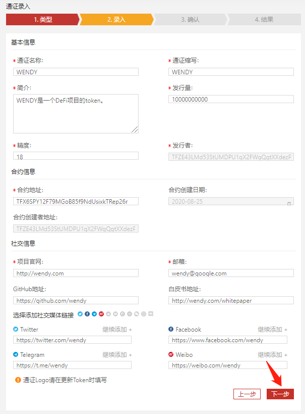

**录入完Trc20通证的信息，点击下一步 : 确认通证信息**

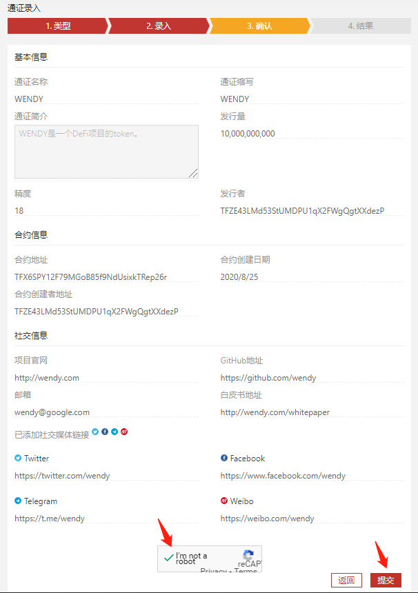

**确认通证信息，勾选I’m not a robot，然后点击提交（注意：此步需要谷歌验证，中国大陆用户可能需要使用VPN才能进入下一步）**

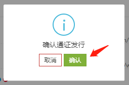

**然后出现确认通证发行提示框，选择确认，会弹出Tronlink签名对话框，点击接受进行签名**

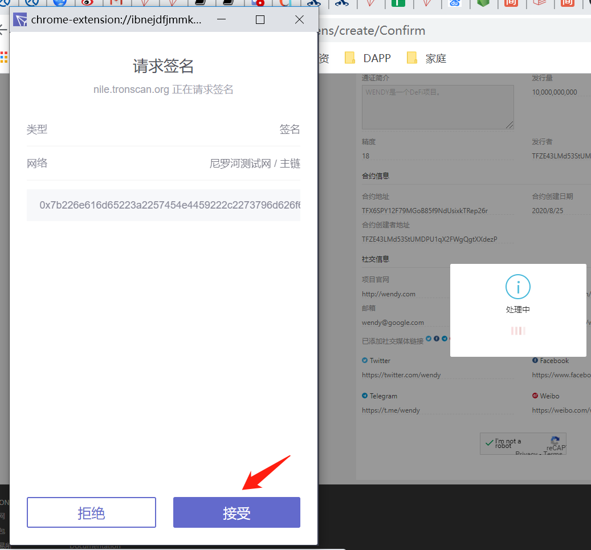

**通证录入成功**

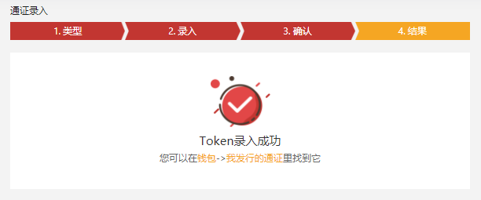

##### 3.7.2.6、添加代币到Tronlink中 <a href="#前言摘要" style="font-size:17px; color:green;"><b>🔼</b></a>

**在资产管理页面中，将前面部署成功后得到的合约地址填写到添加通证 输入框中，会弹出刚才部署的合约，点解开关按钮，添加token到Tronlink中。添加成功后就可以进行转账了。**

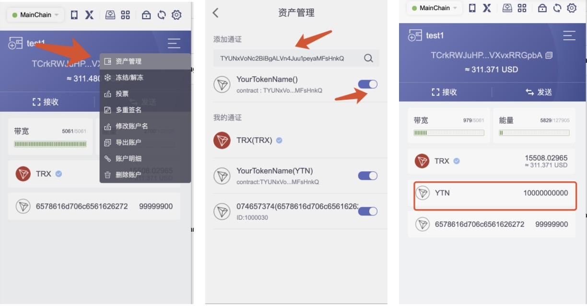

**也可以在Tronscan上搜索到合约主页**

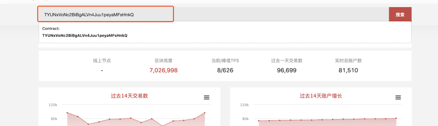

**注：Tronlink插件目前支持主网及Nile测试网添加Token，同时Token需在Tronscan录入成功并且需要2个小时的数据同步。**

##### 3.7.2.7、验证Trc20合约 <a href="#前言摘要" style="font-size:17px; color:green;"><b>🔼</b></a>

*[使用Tronscan进行验证](https://Tronscan.org/#/contracts/verify)*

```
填写合约信息包括合约地址，合约名称、编译器版本，License，是否优化和Runs
合约地址是部署合约时记录下来的合约地址

合约名称是部署的主合约名称，例子中是Token
编译器版本是0.5.10版本
License可以选None
是否优化和Runs保持默认的yes和0
```

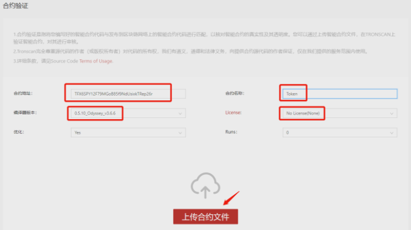

**点击上传合约文件进行验证**

```
点击确认I am not a robot（注意：此步需要谷歌验证，中国大陆用户可能需要使用VPN才能进入下一步）
点击验证并发布, 验证成功会跳转到合约详情页面。
```

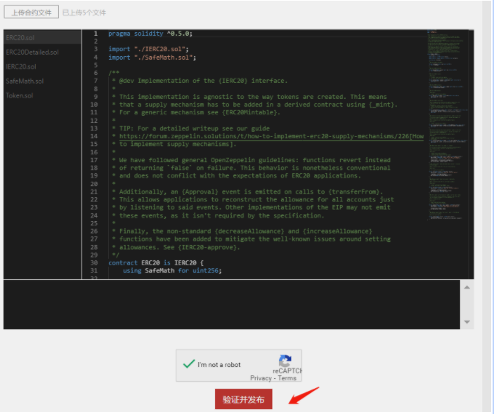

**合约详情页面会显示合约验证成功**

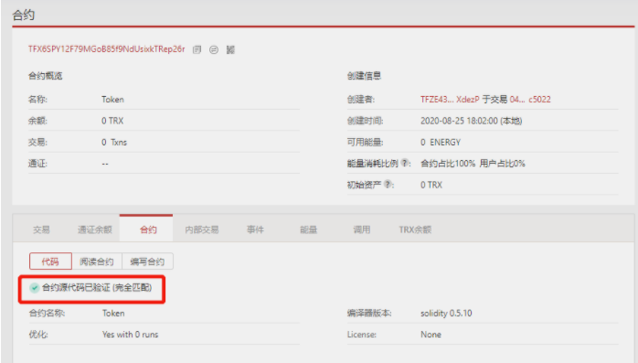

> <font color=red>**需要注意的是，这只是发布数字货币的简单过程，并不包括其他复杂过程，如智能合约编写、白皮书编写、市场推广等。发行数字货币需要花费时间和金钱，并且需要高度的技术知识和市场分析。**</font>

### 3.8、数字货币的减半 <a href="#前言摘要" style="font-size:17px; color:green;"><b>🔼</b></a>

* 比特币的总量只有 2100 万个（永不超发）**lim<sup>n = 0</sup><sub>t → +∞ </sub> BTC<sub>sum</sub>  = 2100万**
  * 从第一个创世区块开始，每 10 分钟产生一个新区块（随之带来 50 个比特币 BTC）
  
  * 每产生 210000 个区块 ≈ 每过大约 4 年时间之后：（区块奖励减半）即，<font color=red>**从第 210001 个区块开始，奖励变为 50 ÷ 2 = 25 个比特币 BTC**</font>
  
  * ```
    假设在比特币减半前，每10分钟生成的比特币数量为X，比特币的总数为S。
    在比特币减半后，每10分钟生成的比特币数量变成了X/2，比特币的总数仍为S。
    那么有如下公式：
    
    S = X + X2 + X2^2 + X2^3 + … + X2^n
    
    其中，n表示比特币减半的次数。根据等比数列求和公式，有：
    
    S = X * (1 - 2^(n+1)) / (1 - 2)
    化简后得到：
    S = 2 * X * (1 - 2^n)
    
    这个公式告诉我们，比特币的总数S是与初始生成速度X和减半次数n有关的。
    当n趋近于无穷大时，S会趋近于2100万个。
    ```

## 4、FAQ <a href="#前言摘要" style="font-size:17px; color:green;"><b>🔼</b></a>

* 如果我有一个钱包，里面都是干净的钱，现在进来一笔有问题的钱，是不是意味着我整个钱包都脏了❓

  | 概念                                | 是否污染       | 原因                                                         |
  | ----------------------------------- | -------------- | ------------------------------------------------------------ |
  | **收到黑 U 的那个地址（地址级别）** | ✅ 会被标记     | 区块链监控系统记录这个地址收过风险资金                       |
  | **你整个钱包（Wallet）**            | ⚠️ 有可能被波及 | 如果这个钱包下的其他地址与该地址存在转账<br/>监控系统可能将其他地址也标记为“高风险” |
  | **这笔黑 U 之外的其他资金**         | ❌ 本身未污染   | 单纯从账本角度，它们是分开的，但取决于你后续如何使用它们     |

  * 区块链风控系统（如 Chainalysis、TRM Labs）的逻辑：

    | 类型               | 描述                                                         | 风险后果                                                     | 举例                                                         |
    | ------------------ | ------------------------------------------------------------ | ------------------------------------------------------------ | ------------------------------------------------------------ |
    | **地址级风险传播** | 某个地址一旦收到黑名单资金<br/>就会被风控系统标记为“污染地址” | 后续从该地址转出的任何资金都会被标记为 tainted（污染资金）   | 地址 A 收到 1 黑 U →<br/> A 向交易所转出 10 白 U →<br/> 全部被交易所风控冻结或要求解释 |
    | **钱包聚类分析**   | 风控系统使用地址行为特征（相互转账、共同私钥、同一助记词）<br/>将多个地址聚类为同一个“钱包实体” | 如果一个地址被污染，其他地址也可能一并被标记为“高风险相关地址” | 地址 A 收到黑 U → <br/>A 给 B 转账 →<br/> 地址 B 被标记为风险地址 → <br/>钱包内所有资产链路被记录 |

  * 迁移资产避免污染传播方法

    | 操作步骤                                     | 是否推荐     | 说明                                         | 目的                       |
    | -------------------------------------------- | ------------ | -------------------------------------------- | -------------------------- |
    | 使用新助记词创建全新钱包                     | ✅ 强烈推荐   | 不共用私钥/助记词，彻底隔离原钱包            | 断绝聚类追踪关系           |
    | 不从污染地址直接转账到新地址                 | ✅ 必须避免   | 一旦转账即被风控系统追踪                     | 防止污染“继承”             |
    | 使用中间钱包进行打散操作                     | ⚠️ 有条件可用 | 中间地址需无风险历史记录                     | 部分清洗路径但非完全安全   |
    | 使用可信交易所提现后再充值新钱包（申明来源） | ⚠️ 有条件操作 | 部分交易所允许资产来源申诉，需资料配合       | 白化过程最接近合规但要求高 |
    | 给交易所或 OTC 说明币来源并分批提取          | ⚠️ 可尝试     | 提供链上转账记录和解释，有些交易所会部分处理 | 降低冻结风险               |
    | 给未污染地址只转入新赚或全新资产             | ✅ 推荐       | 不继承旧资产，重新开始                       | 链上路径纯净，后续好用     |
    
  * 被污染地址的自查方法

    | 检查项         | 工具或平台                                                   | 说明                                       | 推荐操作                           |
    | -------------- | ------------------------------------------------------------ | ------------------------------------------ | ---------------------------------- |
    | 地址是否被标记 | [Chainabuse](https://www.chainabuse.com/)[TRM Labs](https://www.trmlabs.com/)Etherscan（浏览器插件） | 输入地址可查是否有诈骗、被举报、被标记记录 | 不要再使用被标记地址               |
    | 地址标签分析   | Etherscan、BscScan、Tronscan 等区块链浏览器                  | 某些地址带有标签如「Scam」「Phishing」     | 有标签代表链上已公开风险，谨慎处理 |
    | 转账路径风险   | [Breadcrumbs](https://breadcrumbsapp.com/)（路径分析工具）   | 分析地址资金来源与下游路径                 | 若资金来源含风险地址，立即隔离使用 |
    | 风险评分       | [ScoreChain](https://www.scorechain.com/)[CipherTrace](https://ciphertrace.com/) | 给地址/钱包打分（交易所常接入）            | 风险评分高的地址或钱包容易被冻结   |

* 网上有人在收：2黑U 兑换 1白U，收黑U的人，他们是怎么洗白的❓

  | 洗币方式                  | 原理                                                         | 特点                                                         |
  | ------------------------- | ------------------------------------------------------------ | ------------------------------------------------------------ |
  | **混币服务（Mixer）**     | 把大量用户的 USDT 混在一起，打乱地址顺序，再分发             | - 难以追踪<br/>- 有些是骗局或暗网服务<br/>- 手续费高，隐私性强 |
  | **跨链转移**              | 将黑 U 跨链转移至另一条链（如 TRC20 → ERC20 → BEP20），<br/>利用链之间的隔离绕过链上监控系统 | - 有一定成功率<br/>- 金额大容易被链上审计或中心化交易所检测<br/>- 部分桥接平台已接入风控系统 |
  | **OTC 人工搬运**          | 人工找**洗币人**收黑 U（例如 TRC20 黑地址）<br/>→ 对方不再使用该地址上的 U，而是销毁或放进冷钱包<br/>→ 用另一个干净地址（或另一条链）给你发白 U<br/>→ 你的地址收到了“无黑历史”的干净币 | - 手动洗币，成本高<br/>- 常见于小额洗币交易<br/>- 通常是你给 2 枚黑 U，只收回 1 枚白 U<br/>- 剩余作为“清洗费”和对方的利润 |
  | **链下打散 + 白名单转出** | 将黑 U 提现至灰产平台（如博彩/游戏/虚拟商城）<br/>在平台内打散或伪装成正常用户行为，再从平台的白名单地址打出干净 U | - 利用平台作为链下“洗钱通道”<br/>- 通常通过游戏积分、假充值、抽奖等形式打散<br/>- 最终出币地址干净、难以溯源<br/>- 部分博彩平台已配合执法，有法律风险 |


* 冷钱包可以洗黑U❓

  > ❌ **冷钱包本身无法洗黑 U**，但它**可以被用于洗币流程的一部分**
  >
  > * 真正的“洗币”动作依旧发生在链上，涉及地址混淆、跨链转移、混币、打散等操作，而不是靠冷钱包本身完成。
  >
  >   * 黑币本身可能永远变不了白
  >   * 但他通过 **链上分裂路径 + 跨链跳跃 + 假交易打散 + 平台出金**，把这批黑 U 的“价值”慢慢**分批搬运**到干净地址
  >
  > * ❌ 冷钱包 ≠ 洗币工具。冷钱包本身**没有能力“抹除”链上痕迹或洗白资产**
  >
  >   * 它无法匿名发币（签名是链上可溯源的）
  >   * 它无法脱链交易（仍然要链上广播）
  >
  > * | 步骤                     | 说明                                                         |
  >   | ------------------------ | ------------------------------------------------------------ |
  >   | 1️⃣ 洗币人从他人手中收黑 U | 黑地址或被标记的资金                                         |
  >   | 2️⃣ 转入冷钱包地址         | 这个冷钱包从未用过，是干净地址                               |
  >   | 3️⃣ 不再使用这个地址       | 视为“销毁”，因为没有交易记录、不再广播                       |
  >   | 4️⃣ 新钱包发出白 U         | 从另一个未关联的新地址发出干净币<br/>**新钱包发出的白 U，不是原来的那一笔黑 U，而是“另一笔干净 U”**。 |
  >   | ✅ 你收到了白 U           | 在链上看不到与黑 U 的直接联系                                |
  >
  >   ⚠️ 风险提醒
  >
  >   | 问题                   | 原因                                                         |
  >   | ---------------------- | ------------------------------------------------------------ |
  >   | ❌ 洗不干净             | 即使中转到冷钱包，链上依然可以分析地址路径（如 Chainalysis） |
  >   | ❌ 法律仍追踪得到       | 法律机构追踪的是“资金流向 + 行为逻辑”，冷钱包不是掩盖手段    |
  >   | ⚠️ 新地址一旦关联热钱包 | 仍可反向推断出资金来源关系                                   |
  >   | ❗️ 若冷钱包私钥被使用   | 所有交易重新暴露在链上，等于白洗了                           |

* 什么是**TXID**❓

  > * **TXID（Transaction ID）**，全称是 **交易哈希（Transaction Hash）**，是区块链上一笔交易的唯一编号。
  >
  > * 每一笔转账、合约调用、铸币、销毁……都会被区块链系统打上一个「身份证号码」——那就是 TXID。

* 🧨 转错账了，会退回来吗❓

  * 转入了一个**不存在**的地址
  
    | 状况                                          | 会写入区块吗？ | 会退回吗？       | 说明                                                         |
    | --------------------------------------------- | -------------- | ---------------- | ------------------------------------------------------------ |
    | 地址格式合法（例如像 `0x123...`）但没有人控制 | ✅ 会写入       | ❌ 不会退         | 你这笔转账将被永久写入区块链，但没人能动用这笔钱，相当于**“销毁”** |
    | 地址格式非法（如不是合法 0x 开头的地址）      | ❌ 不会写入     | ✅ 会失败，不扣币 | 网络验证阶段就拦下了，不写入区块                             |
  
  * <font color=red>**转错链**</font>（最常见错误）
  
    > 理论上地址一致，但链不同，不能自动找回；是否能找回取决于接收方钱包是否支持多链。
  
    | 场景                                        | 后果                         | 说明                                                         |
    | ------------------------------------------- | ---------------------------- | ------------------------------------------------------------ |
    | 把 `USDT-ERC20` => `USDT-TRC20` 地址        | ❌ 转账成功，但目标地址收不到 | 资产实际上进了一个`其他链地址的黑洞`<br/><font color=red>**要么完全丢失，要么极难找回**</font> |
    | 币安.`USDT（BEP20）`=>以太坊`USDT（BEP20）` | ❌ 转账成功，但目标地址收不到 | 虽然地址长得像，但链不一样，资产不兼容                       |
  
* 随着交易的越来越多，那么这个账单就会越来越长，然后撑爆❓

  * ✅ **不会撑爆用户钱包**

    - 你用的冷钱包（比如 Ledger、MetaMask）并**不会把所有交易都下载到本地**；
    - 钱包只通过节点 **查询与自己相关的交易**，呈现简化视图；
    - 本地显示的交易记录是**从节点动态拉取的数据**，不是存储在你设备上的账本。
  
    ✅ **不会撑爆节点服务器（有机制控制）**
  
    - 节点运行时，会维护全链的历史数据，但：
      - 全节点（Full Node）：保存完整区块和交易；
      - 轻节点（Light Node）：只保存区块头，动态查询；
    - 节点可以做 **归档（archive）**、**快照（snapshot）**、**Pruning（修剪）** 来减小存储压力；
    - 比如以太坊区块大小平均 ~100KB，10年也才几TB，现代硬盘轻松承受。
  
* 如何从零开始**自建一个数字货币交易所**❓

  * 数字货币交易所的形态对比表（共6种）

    | 类型             | 简称                    | 是否托管资产 | 是否链上撮合 | 适合人群            | 代表平台                  | 优点                     | 缺点                   |
    | ---------------- | ----------------------- | ------------ | ------------ | ------------------- | ------------------------- | ------------------------ | ---------------------- |
    | 1️⃣ 中心化交易所   | **CEX**                 | ✅ 是         | ❌ 否         | 企业团队            | Binance / OKX             | 用户体验极佳、交易速度快 | 风控压力大、监管强     |
    | 2️⃣ 去中心化交易所 | **DEX**                 | ❌ 否         | ✅ 是         | 开发者 / DAO        | Uniswap / PancakeSwap     | 无需KYC，自主控制资产    | 用户门槛高、滑点较大   |
    | 3️⃣ 混合型交易所   | **Hybrid**              | ✅ 可选       | ✅+❌ 混合     | 项目方 / 创业团队   | dYdX（v3）                | 撮合中心化+清结算链上    | 架构复杂，需设计撮合链 |
    | 4️⃣ 聚合交易所     | **Aggregator**          | ❌ 否         | ✅（调用DEX） | 钱包 / 聚合平台     | 1inch / Matcha            | 聚合多个DEX流动性        | 无法控制撮合规则       |
    | 5️⃣ 场外交易平台   | **OTC**                 | 可选         | ❌ 否         | 中介机构 / 法币入口 | Huobi OTC / LocalBitcoins | 法币出入金友好，适合大额 | 风险高、欺诈多         |
    | 6️⃣ 白标交易所     | **White-label CEX/DEX** | ✅ 是 / ❌ 否  | ❌ / ✅        | 创业者 / 企业       | HollaEx / OpenDAX         | 快速搭建，无需从零写代码 | 灵活性有限、同质化严重 |

    > **不是只有 CEX 和 DEX 两种架构，但其他的都属于这两种的“技术变体”或“组件组合”**。它们仍然需要代码开发，只是搭建方式不同 —— 有的是组合、调用，有的是重写逻辑。

  * **DEX数字货币交易所搭建全流程**

    | 步骤 | 操作内容                       | 工具/资源                                                    | 说明                                                   |
    | ---- | ------------------------------ | ------------------------------------------------------------ | ------------------------------------------------------ |
    | 1️⃣    | **选择链**                     | Ethereum、BSC、Polygon、Arbitrum、TRON（部分）               | 建议选择支持 EVM 的链，便于开发                        |
    | 2️⃣    | **创建钱包地址**               | MetaMask / TrustWallet                                       | 你作为部署者的身份地址（管理合约）                     |
    | 3️⃣    | **获取测试币**（测试网络部署） | faucet websites                                              | 如 faucet.quicknode.com，获取 ETH/BNB                  |
    | 4️⃣    | **部署 AMM 合约**              | Remix / Hardhat / FoundryUniswap v2/v3 源码                  | 部署核心合约：Factory、Router、WETH                    |
    | 5️⃣    | **部署前端交易界面**           | Uniswap Interface UI（React 项目）https://github.com/Uniswap/interface | 修改配置连接你自己的合约地址                           |
    | 6️⃣    | **添加初始流动性**             | MetaMask 操作 UI                                             | 比如：10 USDT + 0.1 ETH，系统自动形成初始交易对        |
    | 7️⃣    | **本地测试交易功能**           | 使用 DApp 前端页面测试                                       | 确保 swap / add liquidity / remove liquidity 均正常    |
    | 8️⃣    | **上线前端**                   | Vercel / Netlify / 自有服务器 + nginx                        | 配置 HTTPS 和自定义域名                                |
    | 9️⃣    | **发布合约地址信息**           | GitHub / 官网 / 社区 / Telegram                              | 公布代币合约地址、Router 地址，供用户连接使用          |
    | 🔟    | **推广 & 激励机制设计**        | 设计代币、流动性激励、空投活动等                             | 可 fork SushiSwap 的流动性挖矿逻辑，也可以自己设定规则 |

  * **CEX数字货币交易所搭建全流程**

    | 步骤 | 模块名称           | 功能说明                           | 推荐技术 / 工具                                              | 备注                                          |
    | ---- | ------------------ | ---------------------------------- | ------------------------------------------------------------ | --------------------------------------------- |
    | 1️⃣    | **用户系统**       | 注册、登录、身份验证（KYC）        | Node.js / Django / Laravel+ JWT + 邮箱/手机登录              | 可接入 Sumsub / Jumio 等第三方 KYC            |
    | 2️⃣    | **资产钱包系统**   | 生成地址、充值、提币、冷热钱包管理 | BitGo SDK / 自建多签钱包支持 BTC、ETH、TRON、BSC 等          | 建议采用冷热钱包分离方案，避免热钱包持大额    |
    | 3️⃣    | **链上监听服务**   | 实时监听充值、提币上链状态         | Web3.js / ethers.js + Websocket                              | 监听 ERC20、TRC20、BEP20 等链的转账事件       |
    | 4️⃣    | **内部账户系统**   | 记录每个用户的资产余额             | MySQL / PostgreSQL + Redis                                   | 逻辑账户，与链上钱包解耦；精度推荐 BigDecimal |
    | 5️⃣    | **撮合引擎**       | 实时挂单、成交撮合                 | C++ / Rust / Go / Erlang（低延迟）或使用开源撮合内核如 MatchingEngine | 高并发组件核心模块，决定性能                  |
    | 6️⃣    | **交易系统**       | 支持限价单、市价单、撤单           | REST API + WebSocket 实时推送                                | 支持前端下单 / 撤单 / 历史订单等接口          |
    | 7️⃣    | **资金风控系统**   | 防爆仓、限额、黑名单、冻结用户     | Lua 脚本 + Redis + 异步风控队列                              | 自动风控、手动干预，适合合约产品              |
    | 8️⃣    | **提现审核系统**   | 手动或自动审批出金，连接链上钱包   | 后台审批系统 + 多签钱包                                      | 冷钱包出金建议人工 + 多签审批                 |
    | 9️⃣    | **前端系统**       | 用户操作界面（交易、资产、充值等） | Vue / React + REST + WebSocket                               | 响应式前端 + 分区市场行情展示                 |
    | 🔟    | **后台管理系统**   | 管理用户、资产、币种、手续费等     | Vue Admin / Ant Design Pro                                   | 权限分级，支持审核、冻结、运营管理            |
    | 1️⃣1️⃣   | **行情系统**       | 实时深度图、K线、成交数据          | 自研 + KLine Chart（TradingView）                            | 可对接第三方行情 API（CoinMarketCap）         |
    | 1️⃣2️⃣   | **合规与审计模块** | 操作日志、合规记录、防洗钱         | 日志系统 + MongoDB + Elasticsearch                           | 满足监管对链上资金来源/去向审计需求           |

* 如果我的账户没有一分钱的数字货币，对方是转不进来钱的？

  * 你收到了代币不代表你能转出，除非你钱包里也有Gas
  * 转账的时候，直接扣就完了啊（交易所做了内部的转换）
  * **大多数主流交易所都会提供这种“手续费自动转换”或“自动扣除”的服务**，以提升用户体验，让你感知不到 Gas 的存在
  
* **USDT-ERC20** vs **USDT-TRC20**

  > * 🪙 不管是 USDT-ERC20 还是 USDT-TRC20，本质上都是 **Tether 公司** 承诺的 **1:1 美元锚定稳定币**，只是通过 **不同的链技术发出和管理**。
  >
  > * USDT 是目前市占率最大的稳定币，确实有等值储备，但储备方式并非全是“现金”，透明度相对 USDC 等更弱，仍有集中化风险。
  >
  > * **USDT 在不同链（ERC20 / TRC20 / OMNI / SOL）上发行的只是“形式”不同，资产本质相同**，都由 Tether 公司背书，1 USDT = 1 美元（理论上）。
  >
  > * | USDT 类型      | 所在链               | 手续费代币 | 特点                                                         |
  >   | -------------- | -------------------- | ---------- | ------------------------------------------------------------ |
  >   | **USDT-ERC20** | Ethereum             | ETH        | 最早支持 USDT 的链，安全性高、生态成熟，但手续费贵、速度慢   |
  >   | **USDT-TRC20** | TRON                 | TRX        | 手续费极低（几分钱），速度快，被多数交易所用于低成本提币     |
  >   | **USDT-OMNI**  | Bitcoin（OMNI 协议） | BTC        | 最原始版本的 USDT，安全但转账慢、手续费高，兼容性差，已基本被淘汰 |
  >   | **USDT-SPL**   | Solana               | SOL        | 手续费极低，速度极快，适用于 Solana 生态，但支持它的钱包和平台相对较少 |
  >   | **USDT-BEP20** | BSC（币安智能链）    | BNB        | 手续费低，速度快，币安生态专用；部分平台不支持直接充提，使用需注意链选择 |
  
* [**Tether**](https://tether.to/en/transparency/?tab=usdt)  如何承诺「1 USDT = 1 美元」❓

  * [**Tether**](https://tether.to/en/transparency/?tab=usdt) 并没有完全意义上的「审计（Audit）」，但它提供的是：**会计师事务所出具的“鉴证报告”（Attestation Report）**，每季度一次。目前负责的是 BDO（全球第五大会计公司）

  * 报告内容包括：

    - 总发行量
    - 总储备资产
    - 储备明细（现金、国债、加密货币等）
    - 净利润与资产负债

  * | 储备资产类型                 | 占比情况（2024 报告） | 存储位置/方式        |
    | ---------------------------- | --------------------- | -------------------- |
    | **现金与银行存款**           | 一小部分（<10%）      | 美国和海外银行账户   |
    | **美国国债（T-Bills）**      | 最大占比（超 60%）    | 美国短期国债市场     |
    | **回购协议（Repo）**         | 约 10%                | 与大型金融机构签订   |
    | **公司债券、贵金属、比特币** | 少部分（<5%）         | 作为多样化储备资产   |
    | **风险投资/其他**            | 很小部分（<1%）       | 部分被质疑“不够流动” |

* ❄️ 冷钱包不接网，如何参与区块链的共识❓

  > * **冷钱包**本身**不参与区块链共识过程**，它只是**离线保存私钥**，**并离线签名交易**，**真正的广播和共识由在线节点（如矿工或验证者）完成**。
  > * 冷钱包入款，冷钱包是做加法（获利方），出款钱包是做减法。所以只需要出款钱包做广播到账即可
  > * 冷钱包对外出款，就必须验证签名，除非签名（助记词）泄露。否则验签失败，无法出款
  > * ```
  >   ┌──────────────┐        ┌────────────────┐
  >   │ 发送方(热或冷) │  --->  │  交易广播到网络  │  --->  网络共识完成  --->  收款方(冷钱包)
  >   └──────────────┘        └────────────────┘
  >                   
  >   ┌────────────┐         (离线签名)           ┌────────────────┐
  >   │ 冷钱包设备   │ --USB/QR-->  已签名交易  --> │ 联网设备广播     │ --> 网络共识
  >   └────────────┘                             └────────────────┘
  >   ```
  > * ## 🏦 举个例子：你是银行账户持有人
  >
  >   - 你人在山里没信号（= 冷钱包）
  >   - 别人通过手机银行往你账户打了 10 万块
  >   - 银行记账系统完成了交易
  >   - 你啥都不用操作，钱就到你账户了

* 如何赚取Gas❓

  > * **成为该区块链的“打包者 / 出块者 / 验证者 / 超级代表”**。也就是：为网络提供服务的人，才有资格收取 Gas
  >
  > * 不同区块链对赚 GAS的条件不同
  >
  > * 🌱 权益证明类（PoS/DPoS）
  >
  >   * | 区块链                | 共识机制 | GAS 收入方式            | 谁来赚 GAS？                | 成为节点的条件           | 节点职责           | 收益来源                       |
  >     | --------------------- | -------- | ----------------------- | --------------------------- | ------------------------ | ------------------ | ------------------------------ |
  >     | 以太坊（ETH）         | PoS      | 抵押 ETH 做验证者       | 验证者节点（需质押 32 ETH） | 准备 32 个 ETH           | 运行节点、接收交易 | 获得手续费（GAS）+少量出块奖励 |
  >     | TRON（TRX）           | DPoS     | 参与出块，赚 TRX 手续费 | 超级代表（27 个）           | 竞选成为超级代表         | 接收交易、打包区块 | 获得 TRX 手续费                |
  >     | Cosmos / Solana / BNB | 多样     | 成为节点/验证者         | 验证者或节点（需质押）      | 需质押一定代币、运行节点 | 持续在线、参与共识 | 获得网络交易 GAS 或区块奖励    |
  >
  > * 📌**在 工作量证明（PoW） 下，如果你不是第一个算出正确哈希的人，不管你多努力、多接近，都是白干**。所以才强调算力、电费、矿池、效率 —— 输就全输。例如：比特币（BTC）
  >
  >   * | 要求     | 说明                               |
  >     | -------- | ---------------------------------- |
  >     | 买矿机   | ASIC 或显卡（GPU）                 |
  >     | 有低电价 | 否则成本太高                       |
  >     | 加入矿池 | 单独挖太难，需要集体分收益         |
  >     | 运行矿机 | 参与网络计算，出块即获奖励和手续费 |

* 如何竞选成为 TRON 超级代表（1/27 ）❓

  * 🧱 准备阶段

    | 步骤       | 内容                                                         |
    | ---------- | ------------------------------------------------------------ |
    | 1️⃣ 技术准备 | 部署 24 小时在线的稳定节点服务器，建议使用海外云主机（如 AWS、Google Cloud） |
    | 2️⃣ 财力支持 | 初期需自持或联合社区筹集数百万 TRX 用于投票排名              |
    | 3️⃣ 资质要求 | 拥有有效 TRON 地址（T开头），并运行全节点程序                |
    | 4️⃣ 官方登记 | 提交候选人资料（Logo、介绍、官网链接等）到 TRON 官网或 GitHub |
    | 5️⃣ 宣传渠道 | 建立社交媒体（Twitter、Telegram、微博）等进行拉票宣传        |

  * 🖥️ 节点部署

    | 项目     | 内容                                                        |
    | -------- | ----------------------------------------------------------- |
    | 节点类型 | 部署 FullNode + SRNode 或 FullNode + SolidityNode           |
    | 节点源码 | 使用官方节点程序：https://github.com/tronprotocol/java-tron |
    | 同步状态 | 必须始终与主网保持同步，确保不掉块、不掉线                  |
    | 环境要求 | 8 核 CPU / 16GB 内存 / 500GB SSD（推荐配置）                |

  * 🧾 注册为候选人

    | 项目     | 内容                                                    |
    | -------- | ------------------------------------------------------- |
    | 注册方式 | 通过 Java-Tron 客户端或 TronGrid API 提交候选人注册交易 |
    | 需要操作 | 冻结 TRX，获得带宽资源，用于广播注册交易                |
    | 示例命令 | `registerSR --address YOUR_ADDRESS --url YOUR_URL`      |

  * 📊 拉票与排名机制

    | 项目     | 内容                                                 |
    | -------- | ---------------------------------------------------- |
    | 投票方式 | 用户冻结 TRX 获得票数，可投票支持 SR 候选人          |
    | 排名刷新 | 每 6 小时更新一次排名                                |
    | 当选条件 | 排名前 27 名即可成为超级代表；第 28~127 名为候补代表 |
    | 奖励机制 | 超级代表参与出块，每轮获得区块奖励和交易手续费       |

  * 💰 盈利与激励

    | 收益来源   | 内容                                             |
    | ---------- | ------------------------------------------------ |
    | 区块奖励   | 出块获得固定数量 TRX 奖励                        |
    | 交易手续费 | 所有打包交易的手续费归当前出块节点               |
    | 投票返利   | 可将部分收益返还投票者以吸引更多支持（常见做法） |

  * 🔁 持续运营

    | 内容       | 说明                                       |
    | ---------- | ------------------------------------------ |
    | 节点稳定性 | 节点掉线、漏块将会被自动降权，甚至丢失资格 |
    | 社群运营   | 持续在社群中宣传拉票，维护良好形象         |
    | 透明机制   | 公示收益分配比例，建立社区信任             |
    | 更新维护   | 保持节点版本为官方最新版本，防止兼容问题   |

  * ✅ 总结流程

    | 阶段           | 说明                             |
    | -------------- | -------------------------------- |
    | 🧱 搭建节点     | 安装并同步 TRON 全节点           |
    | 📝 注册候选人   | 提交候选人信息，成为 SR 候选人   |
    | 📣 拉票宣传     | 通过社区、媒体等手段拉票         |
    | 📈 晋升前 27 名 | 成为超级代表，开始出块           |
    | 💵 收益管理     | 赚取手续费和奖励，并合理分配返利 |